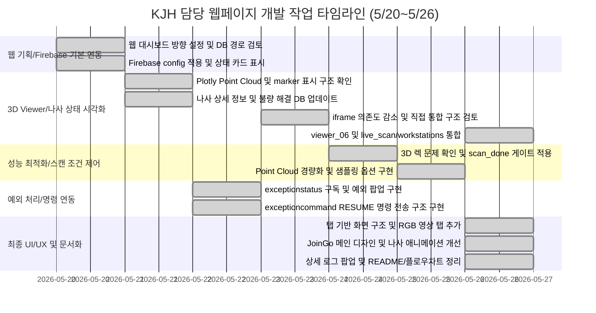

# 📋 KJH 담당 작업 타임라인 및 기여 정리

> **기간**: 2026년 5월 20일 ~ 2026년 5월 26일  
> **역할**: Web / Integration, Firebase Realtime Database 연동, 3D Scan Viewer 통합, RGB 영상 탭 및 예외 상황 처리 GUI 구현  
> **주의**: JoinGo 웹 대시보드는 단순 모니터링 화면에서 출발해 Firebase DB, 3D Scan 결과, 나사별 상세 로그, 예외 상태, RGB 영상 탭을 하나로 통합하는 방향으로 확장되었다. 특히 실시간 3D Point Cloud 렌더링으로 인한 웹 렉 문제를 `3d_scan_done` 완료 신호, 캡처형 3D 데이터 로드, 선택형 샘플링 레이트 구조로 완화하였다.

---

<h2>KJH 담당 작업 타임라인 (웹 기획 및 Firebase 기본 연동)</h2>

<table>
  <thead>
    <tr>
      <th nowrap>작업명</th>
      <th nowrap>날짜</th>
      <th nowrap>담당자</th>
      <th nowrap>파트</th>
      <th nowrap>단계</th>
      <th nowrap>완료 여부</th>
    </tr>
  </thead>
  <tbody>
    <tr><td nowrap>JoinGo 웹 대시보드 개발 방향 설정</td><td nowrap>5월 20일</td><td nowrap>KJH</td><td nowrap>Web / Integration</td><td nowrap>기획</td><td nowrap>완료</td></tr>
    <tr><td nowrap>Firebase Realtime Database와 웹 GUI 연동 방식 검토</td><td nowrap>5월 20일</td><td nowrap>KJH</td><td nowrap>Web / DB 연동</td><td nowrap>구조 검토</td><td nowrap>완료</td></tr>
    <tr><td nowrap>검사 결과를 웹 화면에서 실시간으로 표시하기 위한 DB 경로 검토</td><td nowrap>5월 20일</td><td nowrap>KJH</td><td nowrap>Web / DB 연동</td><td nowrap>데이터 구조 확인</td><td nowrap>완료</td></tr>
    <tr><td nowrap>초기 JoinGo 모니터링 웹페이지 UI 제작</td><td nowrap>5월 20일</td><td nowrap>KJH</td><td nowrap>Web UI</td><td nowrap>초기 구현</td><td nowrap>완료</td></tr>
    <tr><td nowrap>Firebase config 적용 및 Realtime Database 읽기 기능 구현</td><td nowrap>5월 20일</td><td nowrap>KJH</td><td nowrap>Firebase / Web</td><td nowrap>DB 연결</td><td nowrap>완료</td></tr>
    <tr><td nowrap>검사 상태, 나사 상태, 불량 로그를 웹 카드 형태로 표시</td><td nowrap>5월 20일</td><td nowrap>KJH</td><td nowrap>Web UI</td><td nowrap>상태 표시</td><td nowrap>완료</td></tr>
    <tr><td nowrap>웹에서 Firebase로 명령을 전송하는 구조 검토</td><td nowrap>5월 20일</td><td nowrap>KJH</td><td nowrap>Web / Command</td><td nowrap>명령 연동</td><td nowrap>완료</td></tr>
  </tbody>
</table>

---

<h2>KJH 담당 작업 타임라인 (3D Scan Viewer 및 나사 상태 시각화)</h2>

<table>
  <thead>
    <tr>
      <th nowrap>작업명</th>
      <th nowrap>날짜</th>
      <th nowrap>담당자</th>
      <th nowrap>파트</th>
      <th nowrap>단계</th>
      <th nowrap>완료 여부</th>
    </tr>
  </thead>
  <tbody>
    <tr><td nowrap>viewer HTML을 메인 웹에 통합하는 방식 검토</td><td nowrap>5월 21일</td><td nowrap>KJH</td><td nowrap>Web / 3D Viewer</td><td nowrap>통합 검토</td><td nowrap>완료</td></tr>
    <tr><td nowrap>Plotly 기반 3D Point Cloud 표시 구조 확인</td><td nowrap>5월 21일</td><td nowrap>KJH</td><td nowrap>3D Scan / Web</td><td nowrap>렌더링 구조 분석</td><td nowrap>완료</td></tr>
    <tr><td nowrap>3D 작업대 배경과 나사 marker를 웹에서 함께 표시</td><td nowrap>5월 21일</td><td nowrap>KJH</td><td nowrap>3D Scan / Web</td><td nowrap>3D 렌더링</td><td nowrap>완료</td></tr>
    <tr><td nowrap>나사 상태 normal / defect에 따라 초록색·빨간색 marker로 구분 표시</td><td nowrap>5월 21일</td><td nowrap>KJH</td><td nowrap>3D Scan / Web</td><td nowrap>상태 시각화</td><td nowrap>완료</td></tr>
    <tr><td nowrap>나사 선택 시 상세 정보 표시 구조 설계</td><td nowrap>5월 21일</td><td nowrap>KJH</td><td nowrap>Web UI</td><td nowrap>상세 로그 설계</td><td nowrap>완료</td></tr>
    <tr><td nowrap>불량 나사 해결 완료 버튼으로 DB status 값을 normal로 갱신</td><td nowrap>5월 21일</td><td nowrap>KJH</td><td nowrap>Web / DB 쓰기</td><td nowrap>상태 업데이트</td><td nowrap>완료</td></tr>
    <tr><td nowrap>3D Scan 결과와 웹 화면을 직접 통합하는 방식으로 iframe 의존도 감소</td><td nowrap>5월 23일</td><td nowrap>KJH</td><td nowrap>Web / 3D Viewer</td><td nowrap>구조 개선</td><td nowrap>완료</td></tr>
    <tr><td nowrap>viewer_06 구조 반영 및 live_scan/workstations 기준으로 웹 통합</td><td nowrap>5월 26일</td><td nowrap>KJH</td><td nowrap>Web / 3D Viewer</td><td nowrap>viewer 업데이트</td><td nowrap>완료</td></tr>
    <tr><td nowrap>작업대별 section_name, timestamp, background_url, screws 데이터 로드 구조 반영</td><td nowrap>5월 26일</td><td nowrap>KJH</td><td nowrap>Web / DB 연동</td><td nowrap>데이터 구조 반영</td><td nowrap>완료</td></tr>
    <tr><td nowrap>작업대 선택 드롭다운 기능 유지 및 최신 작업대 자동 선택 처리</td><td nowrap>5월 26일</td><td nowrap>KJH</td><td nowrap>Web UI</td><td nowrap>작업대 선택</td><td nowrap>완료</td></tr>
    <tr><td nowrap>나사 인덱스를 화면에서 1번부터 표시하도록 수정</td><td nowrap>5월 26일</td><td nowrap>KJH</td><td nowrap>Web UI / 3D Viewer</td><td nowrap>표시 번호 보정</td><td nowrap>완료</td></tr>
    <tr><td nowrap>DB key는 유지하고 화면 표시 번호만 1번부터 시작하도록 분리 처리</td><td nowrap>5월 26일</td><td nowrap>KJH</td><td nowrap>Web / DB 호환성</td><td nowrap>호환성 유지</td><td nowrap>완료</td></tr>
  </tbody>
</table>

---

<h2>KJH 담당 작업 타임라인 (성능 최적화 및 스캔 조건 제어)</h2>

<table>
  <thead>
    <tr>
      <th nowrap>작업명</th>
      <th nowrap>날짜</th>
      <th nowrap>담당자</th>
      <th nowrap>파트</th>
      <th nowrap>단계</th>
      <th nowrap>완료 여부</th>
    </tr>
  </thead>
  <tbody>
    <tr><td nowrap>3D Scan 실시간 렌더링으로 인한 웹 렉 문제 확인</td><td nowrap>5월 24일</td><td nowrap>KJH</td><td nowrap>Web / 성능 개선</td><td nowrap>문제 분석</td><td nowrap>완료</td></tr>
    <tr><td nowrap>3d_scan_done 완료 신호 기반 렌더링 방식으로 변경</td><td nowrap>5월 24일</td><td nowrap>KJH</td><td nowrap>Web / 성능 개선</td><td nowrap>렌더링 게이트 적용</td><td nowrap>완료</td></tr>
    <tr><td nowrap>스캔 중에는 3D 화면을 갱신하지 않고 완료 후 한 번만 결과 로드하도록 수정</td><td nowrap>5월 24일</td><td nowrap>KJH</td><td nowrap>3D Scan / Web</td><td nowrap>렌더링 최적화</td><td nowrap>완료</td></tr>
    <tr><td nowrap>3D 스캔 미완료 상태에서 작업대 및 샘플링 선택을 막는 조건 추가</td><td nowrap>5월 24일</td><td nowrap>KJH</td><td nowrap>Web UX</td><td nowrap>사용 조건 제어</td><td nowrap>완료</td></tr>
    <tr><td nowrap>스캔 미완료 시 3D 스캔중 팝업 로그 표시</td><td nowrap>5월 24일</td><td nowrap>KJH</td><td nowrap>Web UX</td><td nowrap>상태 안내</td><td nowrap>완료</td></tr>
    <tr><td nowrap>Point Cloud 색상 제거를 통한 1차 경량화 적용</td><td nowrap>5월 25일</td><td nowrap>KJH</td><td nowrap>Web / 성능 개선</td><td nowrap>렌더링 경량화</td><td nowrap>완료</td></tr>
    <tr><td nowrap>색상 제거 후 가독성 문제 확인 및 색상 샘플링 방식으로 롤백</td><td nowrap>5월 25일</td><td nowrap>KJH</td><td nowrap>Web / 3D Viewer</td><td nowrap>시각화 보완</td><td nowrap>완료</td></tr>
    <tr><td nowrap>Point Cloud 포인트 수를 선택적으로 제한하는 샘플링 기능 추가</td><td nowrap>5월 25일</td><td nowrap>KJH</td><td nowrap>Web / 성능 개선</td><td nowrap>샘플링 기능</td><td nowrap>완료</td></tr>
    <tr><td nowrap>배경 포인트 수 선택 옵션을 1만점부터 5만점까지 1만 단위로 구성</td><td nowrap>5월 25일</td><td nowrap>KJH</td><td nowrap>Web UI / 3D Viewer</td><td nowrap>옵션 UI 구현</td><td nowrap>완료</td></tr>
  </tbody>
</table>

---

<h2>KJH 담당 작업 타임라인 (예외 상황 처리 및 로봇 명령 연동)</h2>

<table>
  <thead>
    <tr>
      <th nowrap>작업명</th>
      <th nowrap>날짜</th>
      <th nowrap>담당자</th>
      <th nowrap>파트</th>
      <th nowrap>단계</th>
      <th nowrap>완료 여부</th>
    </tr>
  </thead>
  <tbody>
    <tr><td nowrap>예외 상황 처리 GUI 기능 기획</td><td nowrap>5월 22일</td><td nowrap>KJH</td><td nowrap>Web / Exception</td><td nowrap>기능 기획</td><td nowrap>완료</td></tr>
    <tr><td nowrap>비상정지, 일시정지, 안전정지 상태를 웹에서 표시하는 구조 추가</td><td nowrap>5월 22일</td><td nowrap>KJH</td><td nowrap>Web / Exception</td><td nowrap>예외 상태 표시</td><td nowrap>완료</td></tr>
    <tr><td nowrap>exceptionstatus/current 경로를 통해 현재 예외 상태 구독</td><td nowrap>5월 22일</td><td nowrap>KJH</td><td nowrap>Firebase / Exception</td><td nowrap>DB 읽기</td><td nowrap>완료</td></tr>
    <tr><td nowrap>예외 상황 발생 시 팝업 알림 표시</td><td nowrap>5월 22일</td><td nowrap>KJH</td><td nowrap>Web UI / Exception</td><td nowrap>팝업 구현</td><td nowrap>완료</td></tr>
    <tr><td nowrap>조치 완료 후 exceptioncommand에 RESUME 명령을 전송하는 기능 구현</td><td nowrap>5월 22일</td><td nowrap>KJH</td><td nowrap>Web / Command</td><td nowrap>재개 신호 전송</td><td nowrap>완료</td></tr>
    <tr><td nowrap>exceptionstatus/history에 예외 발생 및 재개 이력 저장 구조 반영</td><td nowrap>5월 22일</td><td nowrap>KJH</td><td nowrap>Firebase / Log</td><td nowrap>이력 기록</td><td nowrap>완료</td></tr>
    <tr><td nowrap>DB export 기반 웹 연동 데이터 선별</td><td nowrap>5월 23일</td><td nowrap>KJH</td><td nowrap>Web / DB 설계</td><td nowrap>데이터 선별</td><td nowrap>완료</td></tr>
    <tr><td nowrap>웹에서 직접 사용하지 않는 legacy, external_exports, raw stream 데이터 제외</td><td nowrap>5월 23일</td><td nowrap>KJH</td><td nowrap>Web / DB 설계</td><td nowrap>데이터 정리</td><td nowrap>완료</td></tr>
    <tr><td nowrap>inspections, events, exceptionstatus, exceptioncommand 중심의 웹 연동 구조 정리</td><td nowrap>5월 23일</td><td nowrap>KJH</td><td nowrap>Web / DB 설계</td><td nowrap>연동 구조 정리</td><td nowrap>완료</td></tr>
  </tbody>
</table>

---

<h2>KJH 담당 작업 타임라인 (최종 UI/UX, RGB 탭 및 문서화)</h2>

<table>
  <thead>
    <tr>
      <th nowrap>작업명</th>
      <th nowrap>날짜</th>
      <th nowrap>담당자</th>
      <th nowrap>파트</th>
      <th nowrap>단계</th>
      <th nowrap>완료 여부</th>
    </tr>
  </thead>
  <tbody>
    <tr><td nowrap>실시간 RGB 영상 탭 구조 기획</td><td nowrap>5월 26일</td><td nowrap>KJH</td><td nowrap>Web / RGB Stream</td><td nowrap>기능 기획</td><td nowrap>완료</td></tr>
    <tr><td nowrap>RGB Stream URL을 통해 웹에서 영상을 선택적으로 표시하는 구조 추가</td><td nowrap>5월 26일</td><td nowrap>KJH</td><td nowrap>Web / RGB Stream</td><td nowrap>탭 구조 추가</td><td nowrap>완료</td></tr>
    <tr><td nowrap>3D Scan 화면과 RGB 영상 화면을 상단 탭으로 분리</td><td nowrap>5월 26일</td><td nowrap>KJH</td><td nowrap>Web UI / UX</td><td nowrap>화면 구조 개선</td><td nowrap>완료</td></tr>
    <tr><td nowrap>메인 화면에 모든 기능을 배치하지 않고 탭 기반 화면 전환 구조로 재설계</td><td nowrap>5월 26일</td><td nowrap>KJH</td><td nowrap>Web UI / UX</td><td nowrap>메인 화면 개선</td><td nowrap>완료</td></tr>
    <tr><td nowrap>메인 화면 문구를 체결 공정의 점검, 대응 자동화 시스템 : JoinGo로 변경</td><td nowrap>5월 26일</td><td nowrap>KJH</td><td nowrap>Web Design</td><td nowrap>카피 수정</td><td nowrap>완료</td></tr>
    <tr><td nowrap>JoinGo 로고와 중앙 상단 탭 중심의 화면 구성으로 디자인 개선</td><td nowrap>5월 26일</td><td nowrap>KJH</td><td nowrap>Web Design</td><td nowrap>레이아웃 개선</td><td nowrap>완료</td></tr>
    <tr><td nowrap>메인 화면 하단 지표 카드를 제거하여 화면 단순화</td><td nowrap>5월 26일</td><td nowrap>KJH</td><td nowrap>Web Design</td><td nowrap>메인 정리</td><td nowrap>완료</td></tr>
    <tr><td nowrap>나사 조임/풀림 백그라운드 애니메이션 제작</td><td nowrap>5월 26일</td><td nowrap>KJH</td><td nowrap>Web Animation</td><td nowrap>메인 애니메이션</td><td nowrap>완료</td></tr>
    <tr><td nowrap>나사 4개를 규칙적으로 배열하고 독립 시퀀스로 회전하도록 수정</td><td nowrap>5월 26일</td><td nowrap>KJH</td><td nowrap>Web Animation</td><td nowrap>애니메이션 개선</td><td nowrap>완료</td></tr>
    <tr><td nowrap>풀림 상태에서는 불량감지, 조임 중에는 조치중, 완전 체결 시 정상체결 말풍선 표시</td><td nowrap>5월 26일</td><td nowrap>KJH</td><td nowrap>Web Animation</td><td nowrap>상태 말풍선</td><td nowrap>완료</td></tr>
    <tr><td nowrap>정상체결에서 불량감지로 전환될 때 나사가 풀리는 방향으로 회전하도록 수정</td><td nowrap>5월 26일</td><td nowrap>KJH</td><td nowrap>Web Animation</td><td nowrap>회전 방향 수정</td><td nowrap>완료</td></tr>
    <tr><td nowrap>나사 클릭 시 우측 패널 대신 별도 상세 로그 팝업 표시</td><td nowrap>5월 26일</td><td nowrap>KJH</td><td nowrap>Web UI / Log</td><td nowrap>팝업 개선</td><td nowrap>완료</td></tr>
    <tr><td nowrap>나사 상세 팝업에 좌표, 상태, 시간, raw log 정보를 표시</td><td nowrap>5월 26일</td><td nowrap>KJH</td><td nowrap>Web UI / Log</td><td nowrap>로그 표시</td><td nowrap>완료</td></tr>
    <tr><td nowrap>불량 나사 상세 팝업에서 해결 완료 처리 가능하도록 기능 유지</td><td nowrap>5월 26일</td><td nowrap>KJH</td><td nowrap>Web / DB 쓰기</td><td nowrap>불량 처리</td><td nowrap>완료</td></tr>
    <tr><td nowrap>JoinGo Web Dashboard 동작 플로우차트 제작</td><td nowrap>5월 26일</td><td nowrap>KJH</td><td nowrap>문서화 / Web</td><td nowrap>플로우차트</td><td nowrap>완료</td></tr>
    <tr><td nowrap>draw.io 붙여넣기용 mxGraph XML 형식 플로우차트 작성</td><td nowrap>5월 26일</td><td nowrap>KJH</td><td nowrap>문서화 / Web</td><td nowrap>자료 제작</td><td nowrap>완료</td></tr>
    <tr><td nowrap>웹페이지 개발 README 작성</td><td nowrap>5월 26일</td><td nowrap>KJH</td><td nowrap>문서화 / README</td><td nowrap>문서화</td><td nowrap>완료</td></tr>
  </tbody>
</table>

---

## 📊 타임라인



---

## 🔑 핵심 전환점

| # | 전환점 | 관련 내용 | 날짜 |
|---|--------|----------|------|
| 1 | 단순 모니터링 웹에서 실시간 관제 웹으로 전환 | Firebase 검사 상태, 나사 상태, 불량 로그를 카드 형태로 표시하고 DB 읽기 구조를 구축 | 5월 20일 |
| 2 | 3D Viewer 통합 시작 | Plotly 기반 Point Cloud와 나사 marker를 웹에서 함께 표시하며 3D Scan 결과 확인 기능 확보 | 5월 21일 |
| 3 | 나사별 상세 로그 및 상태 갱신 도입 | 나사 클릭 시 좌표·상태·시간·raw log를 확인하고, 불량 해결 완료 시 DB status를 normal로 갱신 | 5월 21일 |
| 4 | 예외 상황 처리 GUI 추가 | 비상정지, 일시정지, 안전정지 상태를 DB로 감지하고 팝업 및 RESUME 명령 전송 구조를 구현 | 5월 22일 |
| 5 | 실시간 3D 렌더링 병목 완화 | 스캔 중 지속 갱신을 막고 `3d_scan_done` 완료 이후 캡처형 결과만 선택 로드하도록 개선 | 5월 24일 |
| 6 | 샘플링 레이트 기반 성능 제어 | Point Cloud 배경 포인트 수를 1만~5만점 단위로 선택하여 가시성과 반응성 사이의 균형을 조절 | 5월 25일 |
| 7 | live_scan/workstations 기준 통합 | viewer_06 구조를 반영해 작업대별 section_name, timestamp, background_url, screws 데이터를 로드 | 5월 26일 |
| 8 | 최종 탭 기반 UI/UX 정리 | Main, 3D Scan, RGB 영상 탭으로 화면을 분리하고 JoinGo 로고·상단 탭·나사 애니메이션 중심의 디자인 적용 | 5월 26일 |

---

## 🛠️ 주요 구현 기능

| 기능 | 설명 | 사용 DB 경로 | 상태 |
| --- | --- | --- | --- |
| 작업대 선택 | `live_scan/workstations` 하위 작업대를 드롭다운으로 선택 | `live_scan/workstations` | 완료 |
| 3D Scan 완료 게이트 | 스캔 완료 신호가 true일 때만 3D 결과 로드 | `live_scan/3d_scan_done` | 완료 |
| Point Cloud 렌더링 | `background_url`의 3D 배경 데이터를 Plotly로 표시 | `live_scan/workstations/{workstation}/background_url` | 완료 |
| 샘플링 레이트 선택 | 배경 포인트 수를 1만~5만점 단위로 제한 | 클라이언트 옵션 | 완료 |
| 나사 marker 표시 | normal은 초록, defect는 빨강 marker로 표시 | `live_scan/workstations/{workstation}/screws` | 완료 |
| 나사 번호 보정 | DB key와 무관하게 화면에는 나사 1번부터 표시 | 클라이언트 표시 로직 | 완료 |
| 상세 로그 팝업 | 나사 클릭 시 좌표, 상태, 시간, raw log 표시 | `live_scan/workstations/{workstation}/screws/{screw}` | 완료 |
| 불량 해결 처리 | 해결 완료 클릭 시 해당 screw status를 normal로 업데이트 | `live_scan/workstations/{workstation}/screws/{screw}/status` | 완료 |
| RGB 영상 탭 | 추후 RGB Stream URL 수신을 위한 탭 구조 구성 | `live_scan/rgb_stream/url` | 기본 구조 완료 |
| 예외 상황 감지 | 비상정지, 일시정지, 안전정지 상황을 웹 팝업으로 표시 | `exceptionstatus/current` | 완료 |
| 재개 신호 전송 | 조치 완료 후 RESUME 명령을 DB로 전송 | `exceptioncommand` | 완료 |
| 예외 이력 기록 | 예외 발생 및 재개 요청 기록 저장 | `exceptionstatus/history` | 완료 |

---

## 🗂️ 최종 웹 구조

```text
JoinGo Web Dashboard
├─ Main 화면
│  ├─ JoinGo 로고
│  ├─ 체결 공정 자동화 메시지
│  └─ 나사 조임/풀림 백그라운드 애니메이션
│
├─ 3D Scan 확인 탭
│  ├─ 3d_scan_done 완료 신호 확인
│  ├─ 작업대 선택
│  ├─ 샘플링 레이트 선택
│  ├─ Point Cloud 렌더링
│  ├─ 나사 marker 표시
│  └─ 나사 상세 로그 팝업
│
├─ RGB 영상 확인 탭
│  ├─ RGB Stream URL 표시 영역
│  └─ 향후 실시간 영상 연동 대기 구조
│
└─ 예외 상황 처리
   ├─ exceptionstatus/current 구독
   ├─ 예외 팝업 표시
   ├─ 조치 완료 버튼
   └─ exceptioncommand RESUME 전송
```

---

## 🚀 실행 방법

파일이 있는 폴더에서 아래 명령어를 실행한다.

```bash
python -m http.server 5500
```

브라우저에서 아래 주소로 접속한다.

```text
http://localhost:5500/joingo_modern_tab_dashboard_v7_ko.html
```

---

## 🧾 사용 DB 경로 요약

| DB 경로 | 용도 | 읽기/쓰기 |
| --- | --- | --- |
| `live_scan/3d_scan_done` | 3D 스캔 완료 여부 판단 | 읽기 |
| `live_scan/workstations` | 작업대 목록 및 3D 검사 데이터 수신 | 읽기 |
| `live_scan/workstations/{workstation}/background_url` | Point Cloud 배경 데이터 URL | 읽기 |
| `live_scan/workstations/{workstation}/screws` | 나사별 위치, 상태, 시간 정보 | 읽기 |
| `live_scan/workstations/{workstation}/screws/{screw}/status` | 불량 해결 완료 시 normal로 변경 | 쓰기 |
| `live_scan/rgb_stream/url` | RGB 실시간 영상 주소 | 읽기 |
| `exceptionstatus/current` | 현재 예외 상황 확인 | 읽기/쓰기 |
| `exceptionstatus/history` | 예외 발생 및 재개 이력 기록 | 읽기/쓰기 |
| `exceptioncommand` | 웹에서 로봇/서버로 재개 명령 전송 | 쓰기 |

---

## 🧩 담당 역할 요약

KJH는 협동2 프로젝트에서 **Web / Integration** 파트를 담당하여 Firebase Realtime Database, 3D Scan Viewer, RGB 영상 탭, 예외 상황 처리 GUI를 하나의 JoinGo 웹 대시보드로 통합하였다.

5월 20일에는 JoinGo 웹 대시보드의 개발 방향을 설정하고, Firebase Realtime Database와 웹 GUI를 연결하는 기본 구조를 검토하였다. 이후 검사 상태, 나사 상태, 불량 로그를 카드 형태로 표시하는 초기 모니터링 UI를 구현하고, 웹에서 Firebase로 명령을 전송할 수 있는 방향을 정리하였다.

5월 21일에는 viewer HTML과 Plotly 기반 3D Point Cloud 표시 구조를 분석하고, 3D 작업대 배경과 나사 marker를 함께 표시하는 구조를 만들었다. normal / defect 상태를 색상으로 구분하고, 나사 클릭 시 상세 정보와 불량 해결 기능을 제공하는 나사 단위 인터페이스를 설계하였다.

5월 22~23일에는 예외 상황 처리 GUI와 DB 연동 범위를 정리하였다. `exceptionstatus/current`를 구독하여 비상정지, 일시정지, 안전정지 상황을 감지하고, 조치 완료 후 `exceptioncommand`에 `RESUME` 명령을 전송할 수 있도록 구성하였다. 또한 웹에서 직접 사용하지 않는 legacy, external_exports, raw stream 데이터를 제외하고 실제 웹 연동에 필요한 DB 경로를 선별하였다.

5월 24,25일에는 실시간 3D Scan 렌더링으로 인한 웹 렉 문제를 해결하기 위해 구조를 개선하였다. 스캔 중에는 3D 화면을 계속 갱신하지 않고, `3d_scan_done` 완료 신호가 true가 된 이후에만 캡처형 3D 결과를 로드하도록 변경하였다. 또한 Point Cloud 포인트 수를 1만~5만점 단위로 선택할 수 있는 샘플링 레이트 기능을 추가해 가시성과 성능 사이의 균형을 사용자가 직접 조절할 수 있도록 하였다.

5월 26일에는 viewer_06 구조와 `live_scan/workstations` 경로를 기준으로 작업대별 3D 스캔 결과를 통합하고, 나사 인덱스가 화면에서 1번부터 표시되도록 수정하였다. 최종 UI는 Main, 3D Scan, RGB 영상 탭으로 분리하였으며, JoinGo 로고와 체결 공정 자동화 메시지, 나사 조임/풀림 백그라운드 애니메이션을 중심으로 프로젝트 목적이 직관적으로 드러나도록 디자인을 정리하였다.

---

## ✅ 최종 정리

KJH의 주요 기여는 JoinGo 프로젝트의 로봇·비전·DB 결과를 작업자가 확인하고 제어할 수 있는 **웹 기반 통합 관제 인터페이스**로 연결한 것이다.

초기 웹은 Firebase 검사 결과를 표시하는 단순 모니터링 구조였지만, 최종적으로는 작업대별 3D Scan 결과 선택, Point Cloud 샘플링, 나사별 marker 표시, 상세 로그 팝업, 불량 해결 처리, 예외 상황 대응, RGB 영상 탭까지 포함하는 통합 대시보드로 확장되었다.

특히 실시간 Point Cloud 전체 렌더링으로 인한 웹 병목을 `3d_scan_done` 게이트와 선택형 샘플링 레이트로 완화하여, 3D 데이터의 가시성을 유지하면서도 웹 반응성을 확보하였다. 이를 통해 JoinGo 웹페이지는 단순 시각화 화면을 넘어 로봇 검사 결과 확인, 상태 동기화, 예외 대응, 후속 조치까지 이어지는 **자동 나사 체결 상태 점검 및 대응화 시스템의 운영 인터페이스**로 완성되었다.
