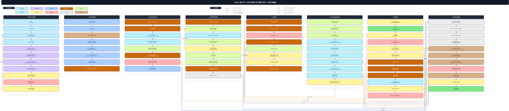
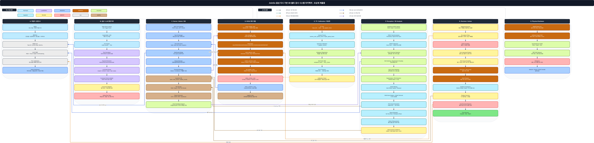
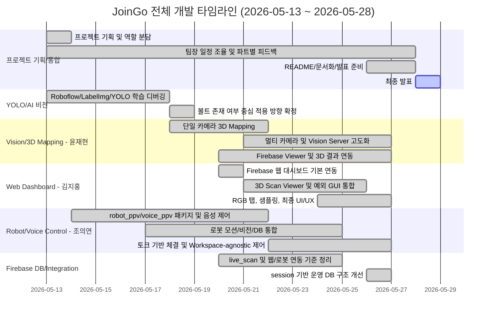
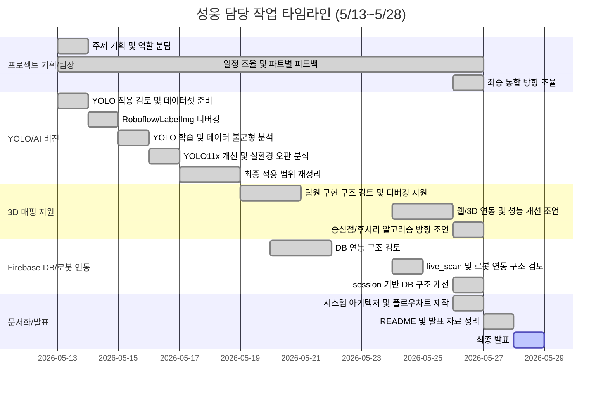
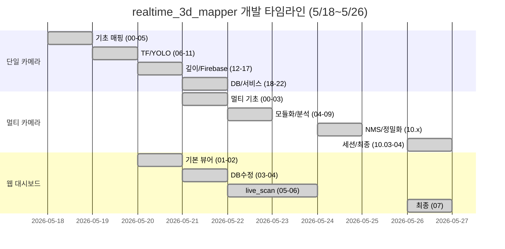
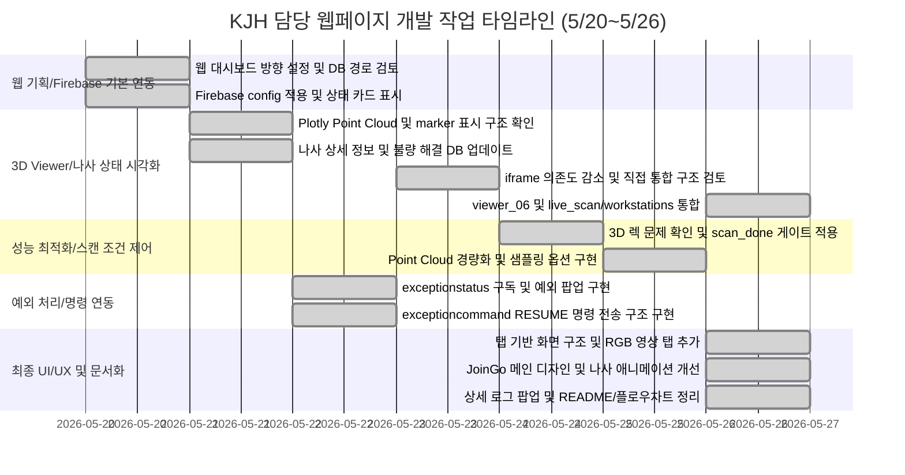
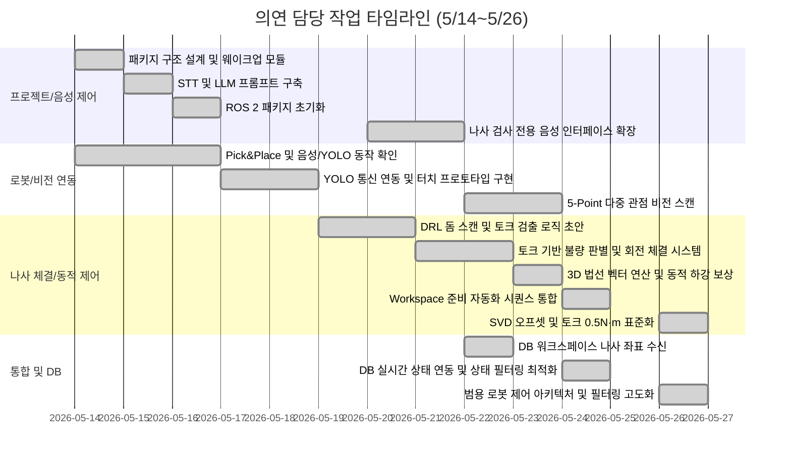

# JoinGo

<p align="center">
  <b>Scan-First 기반 공간 적응형 로봇 검사 자동화 플랫폼</b><br>
  AI Computer Vision · ROS 2 Humble · Doosan M0609 · RealSense · Firebase · Web Dashboard · VR/Digital Twin Ready
</p>

<p align="center">
  
  
  
  
  
  
</p>

<p align="center">
  <a href="#0-프로젝트-한-줄-요약">요약</a> ·
  <a href="#3-주요-기능">주요 기능</a> ·
  <a href="#4-시스템-설계">시스템 설계</a> ·
  <a href="#8-팀원별-주요-담당-영역">팀 역할</a> ·
  <a href="#9-개발-타임라인">개발 타임라인</a> ·
  <a href="#12-설치-및-실행">실행 방법</a>
</p>

---

## 0. 프로젝트 한 줄 요약

**JoinGo**는 **Doosan M0609 협동로봇**, **Intel RealSense RGB-D 카메라**, **YOLO 기반 볼트 검출**, **Point Cloud 기반 3D 공간 인식**, **Firebase 운영 DB**, **웹 대시보드**, **VR/디지털 트윈 확장 구조**를 연동하여, 로봇이 작업공간을 먼저 스캔한 뒤 현재 설비 기준으로 볼트 위치와 검사 결과를 구조화된 데이터로 저장하는 **Scan-First 기반 로봇 검사 자동화 플랫폼**입니다.

```text
로봇 배치
→ 작업공간 스캔
→ YOLO 볼트 검출
→ PointCloud 기반 3D 좌표화
→ Firebase session DB 저장
→ Web Dashboard / Robot Control / VR·Digital Twin 확장
```

---

## 1. 프로젝트 개요

기존 제조 검사 방식은 작업자가 직접 볼트, 나사, 부품 체결 상태를 확인하는 경우가 많습니다. 이 방식은 반복 검사 인력이 계속 필요하고, 작업자의 피로도와 숙련도에 따라 검사 품질이 달라질 수 있습니다.

JoinGo는 이러한 문제를 해결하기 위해 **로봇이 현재 작업공간을 먼저 인식하고**, 그 결과를 바탕으로 검사 대상의 위치와 상태를 구조화하는 시스템을 목표로 합니다.

| 핵심 목표 | 설명 |
|---|---|
| 공간 적응형 검사 | 고정 설비 기준이 아니라 현재 작업공간을 스캔한 뒤 검사 기준 구성 |
| 볼트 위치 검출 | YOLO Detection 기반으로 볼트 존재 여부와 bbox 검출 |
| 3D 좌표화 | RGB-D / PointCloud를 이용해 2D 검출 결과를 3D 공간 정보와 연결 |
| 운영 DB화 | 검사 결과를 site, session, workstation, capture, marker 단위로 저장 |
| 통합 활용 | Web Dashboard, Robot Control, VR/Digital Twin에서 동일 데이터 기준 사용 |

---

## 2. 핵심 컨셉: Scan-First

### 2.1 기존 고정형 검사 방식의 한계

| 기존 방식 | 한계 |
|---|---|
| 카메라와 설비 위치가 고정됨 | 작업대 위치가 바뀌면 재설정 필요 |
| 검사 기준이 특정 설비에 종속됨 | 다른 설비로 확장하기 어려움 |
| 결과가 이미지 또는 수기 기록 중심 | 불량 위치와 작업 문맥 추적이 어려움 |
| 외부 시스템과 데이터 공유가 어려움 | 디지털 트윈, 로봇 제어, API 연동에 추가 작업 필요 |

### 2.2 JoinGo 방식

| JoinGo Scan-First 구조 | 효과 |
|---|---|
| 작업 전 공간을 먼저 스캔 | 현재 설비 기준으로 검사 기준 생성 |
| 작업대 단위로 검사 결과 분리 | 여러 작업대, 여러 설비로 확장 가능 |
| marker 단위로 볼트 위치 저장 | 불량 위치 추적과 후속 로봇 작업 가능 |
| session / workstation / capture 구조화 | 외부 회사와 협업할 때 데이터 해석이 쉬움 |

```text
로봇을 설비 앞에 배치
→ RealSense RGB-D 데이터 수집
→ PointCloud 기반 작업공간 구성
→ YOLO 볼트 검출
→ 3D marker 생성
→ Firebase DB 저장
→ Web / Robot / VR·Digital Twin 연동
```

---

## 3. 주요 기능

### 3.1 YOLO 기반 볼트 위치 및 존재 여부 검출

최종 YOLO 운영 구조는 **good / ng 체결 상태 분류가 아니라 볼트 존재 여부와 위치 검출**입니다.

초기에는 체결 상태를 `good / ng`로 판단하는 구조도 검토했지만, 실제 환경에서는 조명, 각도, 금속 반사, 거리 변화에 따라 상태 분류가 흔들릴 수 있었습니다. 따라서 최종 운영 기준에서는 **볼트 위치와 존재 여부를 안정적으로 검출하는 Detection-only 구조**로 정리했습니다.

```text
RealSense RGB Image
→ YOLO Detector
→ Bolt bbox 생성
→ Confidence 생성
→ Marker 변환
→ Firebase DB 저장
```

| 데이터 | 설명 |
|---|---|
| `bbox` | YOLO가 검출한 볼트 bounding box |
| `confidence` | 볼트 검출 신뢰도 |
| `detected` | 볼트 검출 여부 |
| `marker_id` | `screw_0`, `screw_1` 형태의 볼트/나사 식별자 |
| `position` | 2D 또는 3D 좌표 |
| `capture_id` | 어떤 검사 결과에서 생성된 marker인지 추적 |

### 3.2 PointCloud 기반 3D 공간 인식

Intel RealSense D435i 계열 RGB-D 카메라를 이용하여 RGB 이미지와 Depth 데이터를 수집하고, 이를 PointCloud 형태로 변환하여 작업공간을 3D로 표현합니다.

| 역할 | 설명 |
|---|---|
| 작업공간 스캔 | 작업대와 검사 대상 위치를 3D 공간으로 구성 |
| 2D-3D 연결 | YOLO bbox와 Depth 데이터를 결합하여 3D 좌표 후보 생성 |
| 웹 시각화 | Plotly 기반 3D Viewer에서 작업공간과 marker 확인 |
| 로봇 연동 | 로봇 제어에 필요한 좌표 후보 및 상태 정보 제공 |

> 3D Mapping / realtime mapper 파트는 **윤재현**이 주도적으로 구현했으며, 성웅은 팀장으로서 구조 검토, 디버깅 조언, 웹/DB/검사 로직과의 통합 방향 피드백을 수행했습니다.

### 3.3 Firebase 기반 운영 DB 저장

검사 결과는 다음과 같이 계층적으로 저장합니다.

```text
inspections
└── site_joingo_lab_001
    └── sessions
        └── session_YYYYMMDD_HHMMSS
            ├── metadata
            ├── summary
            └── workstations
                └── workstation_01
                    └── captures
                        └── capture_YYYYMMDD_HHMMSS
                            ├── metadata
                            ├── summary
                            ├── markers
                            ├── transform_snapshot
                            └── storage_refs
```

| 계층 | 의미 |
|---|---|
| `site` | 검사 현장 또는 공장 단위 |
| `session` | 검사 시작부터 종료까지의 하나의 검사 흐름 |
| `workstation` | 작업대 또는 설비 단위 |
| `capture` | 촬영 1회 또는 검사 결과 1회 |
| `marker` | 볼트/나사 하나의 검출 결과 |

### 3.4 index 기반 빠른 조회

Firebase Realtime Database는 SQL처럼 복잡한 조건 검색에 강하지 않기 때문에, 자주 필요한 조회를 위해 별도 index 구조를 구성했습니다.

```text
indexes
└── site_joingo_lab_001
    ├── latest
    ├── capture_lookup
    ├── captures_by_date
    ├── captures_by_workstation
    └── defects_by_status
```

| index | 목적 |
|---|---|
| `latest` | 최신 session, workstation, capture를 빠르게 조회 |
| `capture_lookup` | capture_id만으로 원본 session 경로 역추적 |
| `captures_by_date` | 날짜별 검사 결과 조회 |
| `captures_by_workstation` | 작업대별 검사 결과 조회 |
| `defects_by_status` | 미해결 불량 또는 후속 작업 대상 조회 |

### 3.5 웹 대시보드

웹 대시보드는 Firebase의 검사 결과를 읽어 상태를 표시하고, 3D Scan 결과와 나사 marker를 시각화합니다.

| 기능 | 설명 |
|---|---|
| 실시간 검사 상태 표시 | `live_scan/workstations` 기준 검사 결과 확인 |
| 3D Viewer | PointCloud 배경과 screw marker 표시 |
| 상태 표시 | normal / defect 상태에 따라 marker 구분 |
| 작업대 선택 | 여러 workstation 데이터 선택 가능 |
| 성능 최적화 | 스캔 완료 후 3D 데이터 로드, 샘플링 옵션 적용 |
| 예외 처리 | 비상정지, 일시정지, 안전정지 상태 표시 및 RESUME 명령 전송 |
| RGB 탭 | RGB Stream URL 기반 영상 확인 구조 |

> KJH 웹 대시보드 파트는 **김지홍**이 담당했습니다.

### 3.6 로봇 제어 및 음성 명령 연동

로봇 제어 파트는 Firebase에 저장된 marker 좌표와 검사 상태를 기반으로 후속 작업을 수행할 수 있도록 구성됩니다. 음성 명령은 Wake word, STT, LLM 기반 keyword extraction 구조를 통해 로봇 제어 노드와 연동됩니다.

```text
Wake word
→ STT
→ LLM Keyword Extraction
→ 작업 명령 해석
→ Robot Control Node
→ Vision Trigger / DB 기반 후속 작업
```

| 기능 | 설명 |
|---|---|
| M0609 제어 | Doosan M0609 기반 로봇 동작 수행 |
| OnRobot RG2 제어 | Modbus 기반 Gripper 동작 제어 |
| 토크 기반 체결 판단 | 외부 토크 센서 피드백 기반 정상/불량 판단 |
| 법선 벡터 기반 자세 계산 | 작업면 방향에 따른 접근 자세 계산 |
| DB 기반 작업 대상 조회 | `robots/current_session_id`, `current_capture_id` 등을 기준으로 현재 작업 대상 확인 |
| 음성 명령 | Wake word → STT → LLM keyword → robot command 흐름 구성 |

---

## 4. 시스템 설계

### 4.1 시스템 아키텍처

아래 그림은 JoinGo의 전체 시스템 아키텍처입니다.



| 계층 | 구성 요소 | 역할 | 핵심 데이터 |
|---|---|---|---|
| Sensor / Robot | RealSense D435i, Doosan M0609, OnRobot RG2 | 작업공간 촬영 및 로봇 후속 작업 | RGB, Depth, Robot Pose |
| Vision AI | YOLO Detector | 볼트 위치 및 존재 여부 검출 | bbox, confidence |
| 3D Processing | PointCloud, 좌표 변환 | 2D bbox를 3D 좌표와 연결 | x, y, z, transform |
| Data Layer | Firebase RTDB, Storage, indexes | 검사 결과 및 산출물 저장 | session, capture, marker |
| Service Layer | API, GUI, robot pointer, twin_state | 외부 조회 및 상태 동기화 | latest, current_capture |
| External Consumers | Web Dashboard, Robot Control, VR/Digital Twin Platform | 검사 결과 확인 및 후속 활용 | marker, summary, pointer |

### 4.2 플로우 차트

아래 그림은 JoinGo의 전체 실행 플로우차트입니다.



```text
작업공간 촬영
→ RGB-D 데이터 획득
→ YOLO Detector로 볼트 검출
→ bbox / confidence 생성
→ 3D 좌표 매핑
→ normal / defect marker 생성
→ Firebase Storage에 background JS 업로드
→ Firebase RTDB에 session / workstation / capture 저장
→ live_scan, indexes, twin_state, robots, events 갱신
→ 웹 대시보드 및 로봇 제어에서 동일 데이터 조회
```

### 4.3 VR / 디지털 트윈 확장 구조

JoinGo는 PointCloud와 marker 데이터를 함께 구조화하여 저장하기 때문에, 추후 VR 환경 또는 외부 디지털 트윈 플랫폼에서 작업공간과 검사 상태를 3D로 재현할 수 있습니다.

```text
RealSense RGB-D 데이터
→ PointCloud 생성
→ 볼트 marker 좌표 생성
→ Firebase DB / Storage 저장
→ Web 3D Viewer 또는 VR Viewer에서 시각화
```

| 확장 항목 | 설명 |
|---|---|
| Web 3D Viewer | 웹에서 작업공간과 검사 결과를 3D로 확인 |
| Digital Twin | 실제 작업공간의 검사 상태를 가상 공간에 동기화 |
| VR Viewer | VR 환경에서 작업공간, 볼트 위치, 검사 결과를 몰입형으로 확인 |
| Remote Inspection | 현장에 가지 않고 원격으로 검사 결과 확인 |
| External Export | 외부 디지털 트윈 회사와 데이터 구조 공유 가능 |

---

## 5. 폴더 구조

```text
JoinGo
├── CEY
│   ├── robot_ppv
│   │   ├── robot_ppv
│   │   │   ├── onrobot.py
│   │   │   └── robot_control_test_fin_9_3.py
│   │   ├── resource
│   │   │   └── T_gripper2camera.npy
│   │   ├── package.xml
│   │   └── setup.py
│   ├── voice_ppv
│   │   ├── voice_ppv
│   │   │   ├── MicController.py
│   │   │   ├── get_keyword_screw2.py
│   │   │   ├── stt.py
│   │   │   └── wakeup_word.py
│   │   ├── resource
│   │   │   ├── hello_rokey_8332_32.tflite
│   │   │   └── hey_jarvis.tflite
│   │   ├── package.xml
│   │   └── setup.py
│   ├── DEBUGGING.md
│   └── README.md
├── KJH
│   ├── joingo_modern_tab_dashboard_v6_ko.html
│   ├── explore_environment_plane_normal.py
│   └── README.md
├── YJH
│   ├── common
│   │   ├── db_paths.py
│   │   ├── firebase_client.py
│   │   └── settings.py
│   ├── resource
│   │   └── hyupdong2_yolo11x_realtest_corrected_best.pt
│   ├── realtime_3d_mapper_multi_10_03_04__.py
│   ├── viewer_06.html
│   └── README.md
├── YSW
│   └── README.md
├── docs
│   └── images
│       ├── flow_chart.png
│       └── system_architecture.png
├── requirements.txt
├── .gitignore
└── README.md
```

---

## 6. 주요 파일 설명

| 파일 | 담당 | 설명 |
|---|---|---|
| `YJH/realtime_3d_mapper_multi_10_03_04__.py` | 윤재현 | RealSense, YOLO, PointCloud, Firebase, session DB를 통합한 Vision Server Node |
| `YJH/common/settings.py` | 윤재현 / 성웅 검토 | 회사, 사이트, 로봇, 카메라, Firebase 환경변수 관리 |
| `YJH/common/db_paths.py` | 성웅 / 윤재현 | Firebase RTDB / Storage 경로 생성 유틸리티 |
| `YJH/common/firebase_client.py` | 윤재현 / 성웅 검토 | Firebase Admin SDK 초기화 및 DB/Storage reference 생성 |
| `YJH/viewer_06.html` | 윤재현 | Firebase 기반 3D 검사 결과 Viewer |
| `KJH/joingo_modern_tab_dashboard_v6_ko.html` | 김지홍 | 통합 웹 대시보드 UI |
| `KJH/explore_environment_plane_normal.py` | 김지홍 | 음성 명령 기반 작업환경 탐색 및 YOLO 결과 저장 실험 코드 |
| `CEY/voice_ppv/voice_ppv/get_keyword_screw2.py` | 조의연 | Wake word, STT, 키워드 추출 서비스 노드 |
| `CEY/robot_ppv/robot_ppv/robot_control_test_fin_9_3.py` | 조의연 | Firebase 좌표 기반 로봇 제어 및 그리퍼 동작 코드 |
| `CEY/robot_ppv/robot_ppv/onrobot.py` | 조의연 | OnRobot RG2 Gripper 제어 코드 |
| `docs/images/system_architecture.png` | 성웅 | 시스템 아키텍처 이미지 |
| `docs/images/flow_chart.png` | 성웅 | 전체 동작 플로우차트 이미지 |

---

## 7. ROS 2 인터페이스

### 7.1 Vision Server Node

| 항목 | 내용 |
|---|---|
| 노드명 | `vision_server_node` |
| 주요 담당 | 윤재현 |
| 역할 | RealSense, YOLO, 3D Mapping, Firebase 저장 통합 |

구독 토픽:

| 토픽 | 타입 | 설명 |
|---|---|---|
| `/camera/camera/depth/color/points` | `sensor_msgs/msg/PointCloud2` | RealSense PointCloud |
| `/camera/camera/color/image_raw` | `sensor_msgs/msg/Image` | RGB 이미지 |
| `/camera/camera/aligned_depth_to_color/image_raw` | `sensor_msgs/msg/Image` | Color 기준 정렬 Depth |
| `/camera/camera/color/camera_info` | `sensor_msgs/msg/CameraInfo` | 카메라 내부 파라미터 |

서비스:

| 서비스 | 타입 | 설명 |
|---|---|---|
| `/vision_inspect` | `std_srvs/srv/Trigger` | 현재 프레임 기준 검사 실행 |
| `/start_new_session` | `std_srvs/srv/Trigger` | 새 검사 세션 시작 |

### 7.2 Voice / Robot Control

| 인터페이스 | 타입 | 설명 |
|---|---|---|
| `/get_keyword` | `std_srvs/srv/Trigger` | 음성 명령 결과 키워드 반환 |
| `/vision_inspect` | `std_srvs/srv/Trigger` | 로봇 제어 노드에서 비전 검사 호출 |
| Firebase `robots/current_*` | DB pointer | 현재 로봇 작업 대상 session/workstation/capture 지정 |

---

## 8. 팀원별 주요 담당 영역

| 담당 | 폴더/파트 | 주요 역할 |
|---|---|---|
| 윤성웅 | Project Lead / DB / YOLO / Docs | 팀장, 프로젝트 기획, 일정 조율, YOLO 디버깅, Firebase DB 구조 개선, 로봇/DB 연동 검토, 시스템 아키텍처/플로우차트 제작 |
| 윤재현 | `YJH`, `realtime_3d_mapper`, `viewer` | RealSense 기반 3D Mapping, PointCloud 처리, Vision Server, Firebase 연동, 3D viewer 및 realtime 계열 코드 담당 |
| 조의연 | `CEY/robot_ppv`, `CEY/voice_ppv` | 로봇 제어, 음성 명령, OnRobot RG2, 토크 기반 체결, DB 기반 후속 작업 연동 |
| 김지홍 | `KJH` | Web Dashboard, Firebase 실시간 화면, 3D Scan Viewer, RGB 탭, 예외 상황 GUI, UI/UX 담당 |
| YSW | `YSW` | 프로젝트 보조 문서 및 팀 구성 영역 |

---

## 9. 개발 타임라인 및 팀원별 전체 기여 내역

이 섹션은 팀원별로 작성된 작업 타임라인과 기여 정리를 **전체 반영**한 영역입니다.  
요약만 넣지 않고, 성웅 / 윤재현 / 김지홍 / 조의연의 상세 변경 이력, 담당 작업 표, Mermaid 타임라인, 핵심 전환점, 역할 요약까지 포함했습니다.

> 담당자 표기 기준  
> - `realtime_3d_mapper`, `realtime_3d_mapper_multi`, `viewer` 계열 Vision / 3D Mapping 파트: **윤재현**  
> - `KJH` Web Dashboard / 3D Scan Viewer / RGB 탭 / 예외 GUI 파트: **김지홍**  
> - `CEY/robot_ppv`, `CEY/voice_ppv` 로봇 제어 / 음성 제어 파트: **조의연**  
> - 프로젝트 기획, 팀장 역할, YOLO 디버깅, Firebase DB 구조 개선, 통합 검토, 시스템 아키텍처/플로우차트: **윤성웅**

### 9.1 전체 개발 요약 타임라인



### 9.2 팀원별 담당 요약

| 이름 | 담당 영역 | 주요 기여 |
|---|---|---|
| 윤성웅 | Project Lead / YOLO Debugging / Firebase DB / Docs | 프로젝트 기획, 일정 조율, 파트별 검토 및 피드백, YOLO 디버깅, Firebase session DB 구조 개선, 로봇/DB 연동 검토, 시스템 아키텍처·플로우차트 제작 |
| 윤재현 | `YJH`, `realtime_3d_mapper`, Vision Server, 3D Mapping, Viewer | RealSense 기반 단일·멀티 카메라 3D Mapping, PointCloud 처리, YOLO-3D 연동, Firebase Storage/DB 연동, viewer 계열 코드 개선 |
| 김지홍 | `KJH`, Web Dashboard, 3D Scan Viewer, RGB 탭, 예외 GUI | Firebase 웹 대시보드, 3D Scan Viewer 통합, PointCloud 샘플링, RGB 영상 탭, 예외 상황 처리 GUI, UI/UX 디자인 |
| 조의연 | `CEY/robot_ppv`, `CEY/voice_ppv`, Robot Control, Voice Control | M0609 로봇 제어, LLM 음성 명령, Hand-Eye 좌표 변환, Grip & Tighten, 토크 기반 체결, DB 기반 후속 작업 연동 |

### 9.3 팀원별 상세 작업 타임라인 전체

<details open>
<summary><b>윤성웅 상세 타임라인 및 기여 정리</b></summary>

# 📋 성웅 담당 작업 타임라인 및 기여 정리

> **기간**: 2026년 5월 13일 ~ 2026년 5월 28일  
> **역할**: 팀장 / 프로젝트 기획 / 일정 조율 / 파트별 검토 및 피드백 / AI·비전 디버깅 / Firebase DB 구조 개선 / 로봇·DB 연동 검토 / 시스템 아키텍처·플로우차트 제작  
> **주의**: 3D 매핑 파트는 팀원이 주도적으로 구현했으며, 성웅은 팀장으로서 구조 검토, 디버깅 조언, 웹·DB·검사 로직과의 통합 방향 피드백을 수행함

---

<h2>성웅 담당 작업 타임라인 (프로젝트 기획 및 팀장 역할)</h2>

<table>
  <thead>
    <tr>
      <th nowrap>작업명</th>
      <th nowrap>날짜</th>
      <th nowrap>담당자</th>
      <th nowrap>파트</th>
      <th nowrap>단계</th>
      <th nowrap>완료 여부</th>
    </tr>
  </thead>
  <tbody>
    <tr><td nowrap>협동2 프로젝트 전체 주제 기획 및 시스템 방향 설정</td><td nowrap>5월 13일</td><td nowrap>성웅</td><td nowrap>팀장/프로젝트 기획</td><td nowrap>기획</td><td nowrap>완료</td></tr>
    <tr><td nowrap>스마트팩토리형 볼트 검사 자동화 시스템 기획</td><td nowrap>5월 13일</td><td nowrap>성웅</td><td nowrap>팀장/프로젝트 기획</td><td nowrap>기획</td><td nowrap>완료</td></tr>
    <tr><td nowrap>팀원별 역할 분담 및 개발 파트 조율</td><td nowrap>5월 13일</td><td nowrap>성웅</td><td nowrap>팀장/통합 관리</td><td nowrap>역할 분담</td><td nowrap>완료</td></tr>
    <tr><td nowrap>전체 개발 일정 조율 및 작업 우선순위 정리</td><td nowrap>5월 13일</td><td nowrap>성웅</td><td nowrap>팀장/일정 관리</td><td nowrap>일정 조율</td><td nowrap>완료</td></tr>
    <tr><td nowrap>앱/웹/서버/DB/비전/로봇 파트 간 연동 구조 검토</td><td nowrap>5월 13일</td><td nowrap>성웅</td><td nowrap>팀장/통합 설계</td><td nowrap>구조 검토</td><td nowrap>완료</td></tr>
    <tr><td nowrap>팀원별 구현 방향 검토 및 개발 피드백 진행</td><td nowrap>5월 13일</td><td nowrap>성웅</td><td nowrap>팀장/코드 리뷰</td><td nowrap>검토/피드백</td><td nowrap>완료</td></tr>
    <tr><td nowrap>팀원별 구현 파트 충돌 여부 확인 및 수정 방향 피드백</td><td nowrap>5월 26일</td><td nowrap>성웅</td><td nowrap>팀장/통합 관리</td><td nowrap>코드 리뷰</td><td nowrap>완료</td></tr>
    <tr><td nowrap>전체 파트 진행 상황 검토 및 최종 통합 방향 조율</td><td nowrap>5월 26일</td><td nowrap>성웅</td><td nowrap>팀장/통합 관리</td><td nowrap>최종 점검</td><td nowrap>완료</td></tr>
    <tr><td nowrap>팀장 역할, 프로젝트 기획, 일정 조율, 파트별 검토 및 피드백 내용 README 반영</td><td nowrap>5월 27일</td><td nowrap>성웅</td><td nowrap>팀장/문서화</td><td nowrap>역할 정리</td><td nowrap>완료</td></tr>
  </tbody>
</table>

---

<h2>성웅 담당 작업 타임라인 (YOLO 및 AI 비전 디버깅)</h2>

<table>
  <thead>
    <tr>
      <th nowrap>작업명</th>
      <th nowrap>날짜</th>
      <th nowrap>담당자</th>
      <th nowrap>파트</th>
      <th nowrap>단계</th>
      <th nowrap>완료 여부</th>
    </tr>
  </thead>
  <tbody>
    <tr><td nowrap>비전 검사 시스템에서 YOLO 적용 가능성 검토</td><td nowrap>5월 13일</td><td nowrap>성웅</td><td nowrap>AI/비전</td><td nowrap>모델 검토</td><td nowrap>완료</td></tr>
    <tr><td nowrap>Roboflow 기반 데이터셋 구성 및 초기 학습 방향 검토</td><td nowrap>5월 13일</td><td nowrap>성웅</td><td nowrap>AI/비전</td><td nowrap>데이터셋 준비</td><td nowrap>완료</td></tr>
    <tr><td nowrap>Roboflow credit 및 모델 업로드 문제 분석</td><td nowrap>5월 14일</td><td nowrap>성웅</td><td nowrap>AI/비전</td><td nowrap>디버깅</td><td nowrap>완료</td></tr>
    <tr><td nowrap>로컬 LabelImg 기반 라벨링 환경 구축 방향 정리</td><td nowrap>5월 14일</td><td nowrap>성웅</td><td nowrap>AI/비전</td><td nowrap>라벨링 환경</td><td nowrap>완료</td></tr>
    <tr><td nowrap>LabelImg 실행 오류 및 PyQt float 타입 오류 해결 방향 정리</td><td nowrap>5월 14일</td><td nowrap>성웅</td><td nowrap>AI/비전</td><td nowrap>디버깅</td><td nowrap>완료</td></tr>
    <tr><td nowrap>YOLOv8n 초기 학습 결과 분석</td><td nowrap>5월 15일</td><td nowrap>성웅</td><td nowrap>AI/비전</td><td nowrap>모델 학습</td><td nowrap>완료</td></tr>
    <tr><td nowrap>good/ng 데이터 불균형 문제 분석</td><td nowrap>5월 15일</td><td nowrap>성웅</td><td nowrap>AI/비전</td><td nowrap>데이터 분석</td><td nowrap>완료</td></tr>
    <tr><td nowrap>추가 good 데이터 반영 및 데이터셋 균형 개선 방향 정리</td><td nowrap>5월 15일</td><td nowrap>성웅</td><td nowrap>AI/비전</td><td nowrap>데이터셋 개선</td><td nowrap>완료</td></tr>
    <tr><td nowrap>YOLOv8n에서 YOLO11x img960으로 모델 개선 방향 검토</td><td nowrap>5월 16일</td><td nowrap>성웅</td><td nowrap>AI/비전</td><td nowrap>모델 개선</td><td nowrap>완료</td></tr>
    <tr><td nowrap>실제 환경에서 YOLO 오판 문제 분석</td><td nowrap>5월 16일</td><td nowrap>성웅</td><td nowrap>AI/비전</td><td nowrap>실환경 디버깅</td><td nowrap>완료</td></tr>
    <tr><td nowrap>한 객체에 good/ng 박스가 동시에 뜨는 문제 분석</td><td nowrap>5월 16일</td><td nowrap>성웅</td><td nowrap>AI/비전</td><td nowrap>실환경 디버깅</td><td nowrap>완료</td></tr>
    <tr><td nowrap>agnostic_nms 적용을 통한 중복 클래스 박스 완화 방향 정리</td><td nowrap>5월 16일</td><td nowrap>성웅</td><td nowrap>AI/비전</td><td nowrap>추론 옵션 개선</td><td nowrap>완료</td></tr>
    <tr><td nowrap>detector + classifier 2단계 구조 검토</td><td nowrap>5월 17일</td><td nowrap>성웅</td><td nowrap>AI/비전</td><td nowrap>모델 구조 검토</td><td nowrap>완료</td></tr>
    <tr><td nowrap>good/ng 분류 방식의 한계 판단 및 적용 범위 재정리</td><td nowrap>5월 17일</td><td nowrap>성웅</td><td nowrap>AI/비전</td><td nowrap>기술 의사결정</td><td nowrap>완료</td></tr>
    <tr><td nowrap>최종 YOLO 사용 목적을 볼트 존재 여부 및 위치 확인 중심으로 조정</td><td nowrap>5월 18일</td><td nowrap>성웅</td><td nowrap>AI/비전</td><td nowrap>적용 방향 확정</td><td nowrap>완료</td></tr>
    <tr><td nowrap>RealSense 기반 실시간 YOLO 모델 로딩 및 동작 로그 확인</td><td nowrap>5월 18일</td><td nowrap>성웅</td><td nowrap>AI/비전</td><td nowrap>실행 테스트</td><td nowrap>완료</td></tr>
    <tr><td nowrap>YOLO 및 Firebase DB 디버깅 내용을 README 작업 타임라인에 반영</td><td nowrap>5월 27일</td><td nowrap>성웅</td><td nowrap>문서화/디버깅 정리</td><td nowrap>내용 반영</td><td nowrap>완료</td></tr>
  </tbody>
</table>

---

<h2>성웅 담당 작업 타임라인 (3D 매핑 지원 및 통합 검토)</h2>

<table>
  <thead>
    <tr>
      <th nowrap>작업명</th>
      <th nowrap>날짜</th>
      <th nowrap>담당자</th>
      <th nowrap>파트</th>
      <th nowrap>단계</th>
      <th nowrap>완료 여부</th>
    </tr>
  </thead>
  <tbody>
    <tr><td nowrap>팀원 3D 매핑 구현 과정 구조 검토 및 디버깅 조언</td><td nowrap>5월 19일</td><td nowrap>성웅</td><td nowrap>팀장/3D 매핑 지원</td><td nowrap>구조 검토</td><td nowrap>완료</td></tr>
    <tr><td nowrap>RealSense 기반 3D 작업 공간 생성 과정 확인 및 문제 원인 분석 지원</td><td nowrap>5월 19일</td><td nowrap>성웅</td><td nowrap>팀장/3D 매핑 지원</td><td nowrap>디버깅 지원</td><td nowrap>완료</td></tr>
    <tr><td nowrap>볼트 위치 검출 결과가 3D 화면에 반영되는 흐름 검토</td><td nowrap>5월 20일</td><td nowrap>성웅</td><td nowrap>팀장/비전-3D 연동 지원</td><td nowrap>통합 검토</td><td nowrap>완료</td></tr>
    <tr><td nowrap>높이 기반 볼트 상태 측정 방식 적용 방향 검토</td><td nowrap>5월 20일</td><td nowrap>성웅</td><td nowrap>비전/알고리즘</td><td nowrap>검사 로직 검토</td><td nowrap>완료</td></tr>
    <tr><td nowrap>live_scan/workstations 기반 실시간 3D 검사 화면 연동 구조 검토</td><td nowrap>5월 24일</td><td nowrap>성웅</td><td nowrap>팀장/웹-3D 연동 지원</td><td nowrap>통합 검토</td><td nowrap>완료</td></tr>
    <tr><td nowrap>팀원 3D 렌더링 화면에서 발생한 표시 문제 확인 및 수정 방향 조언</td><td nowrap>5월 24일</td><td nowrap>성웅</td><td nowrap>팀장/웹-3D 연동 지원</td><td nowrap>디버깅 지원</td><td nowrap>완료</td></tr>
    <tr><td nowrap>PointCloud 웹 시각화 렉 문제에 대한 원인 분석 및 최적화 방향 조언</td><td nowrap>5월 25일</td><td nowrap>성웅</td><td nowrap>팀장/3D 매핑 지원</td><td nowrap>성능 개선 조언</td><td nowrap>완료</td></tr>
    <tr><td nowrap>Plotly 기반 3D 렌더링 부하 감소 방향 검토 및 팀원 피드백</td><td nowrap>5월 25일</td><td nowrap>성웅</td><td nowrap>팀장/웹-3D 연동 지원</td><td nowrap>피드백</td><td nowrap>완료</td></tr>
    <tr><td nowrap>나사 중심점 검출 정확도 개선 방향 정리</td><td nowrap>5월 26일</td><td nowrap>성웅</td><td nowrap>비전/3D 매핑</td><td nowrap>알고리즘 개선 검토</td><td nowrap>완료</td></tr>
    <tr><td nowrap>나사 불량 판단 기준 수정 및 높이 기반 검사 로직 보완 방향 정리</td><td nowrap>5월 26일</td><td nowrap>성웅</td><td nowrap>비전/알고리즘</td><td nowrap>검사 로직 개선</td><td nowrap>완료</td></tr>
    <tr><td nowrap>3D 맵에서 나사 영역과 작업대 영역이 구분되도록 후처리 방향 조언</td><td nowrap>5월 26일</td><td nowrap>성웅</td><td nowrap>팀장/3D 매핑 지원</td><td nowrap>알고리즘 조언</td><td nowrap>완료</td></tr>
    <tr><td nowrap>3D 매핑 파트 기여 내용을 팀원 구현 지원 및 디버깅 조언 중심으로 수정</td><td nowrap>5월 27일</td><td nowrap>성웅</td><td nowrap>팀장/3D 매핑 지원</td><td nowrap>기여도 정리</td><td nowrap>완료</td></tr>
  </tbody>
</table>

---

<h2>성웅 담당 작업 타임라인 (Firebase DB 및 로봇 연동 구조)</h2>

<table>
  <thead>
    <tr>
      <th nowrap>작업명</th>
      <th nowrap>날짜</th>
      <th nowrap>담당자</th>
      <th nowrap>파트</th>
      <th nowrap>단계</th>
      <th nowrap>완료 여부</th>
    </tr>
  </thead>
  <tbody>
    <tr><td nowrap>검사 결과 Firebase Realtime Database 저장 구조 연동 검토</td><td nowrap>5월 20일</td><td nowrap>성웅</td><td nowrap>Firebase/DB</td><td nowrap>DB 연동</td><td nowrap>완료</td></tr>
    <tr><td nowrap>Firebase 검사 결과와 웹 화면 연동 구조 확인</td><td nowrap>5월 20일</td><td nowrap>성웅</td><td nowrap>웹/DB 연동</td><td nowrap>통합 테스트</td><td nowrap>완료</td></tr>
    <tr><td nowrap>KJH 웹 화면의 실시간 검사 데이터 기준 검토</td><td nowrap>5월 21일</td><td nowrap>성웅</td><td nowrap>웹/DB 연동</td><td nowrap>구조 검토</td><td nowrap>완료</td></tr>
    <tr><td nowrap>실시간 화면은 live_scan 기준으로 처리하도록 방향 정리</td><td nowrap>5월 21일</td><td nowrap>성웅</td><td nowrap>웹/DB 연동</td><td nowrap>데이터 기준 정리</td><td nowrap>완료</td></tr>
    <tr><td nowrap>검사 이력 화면은 indexes → sessions 기준으로 조회하도록 방향 정리</td><td nowrap>5월 21일</td><td nowrap>성웅</td><td nowrap>웹/DB 연동</td><td nowrap>데이터 기준 정리</td><td nowrap>완료</td></tr>
    <tr><td nowrap>defect / defective / ng / failed 상태값을 모두 불량으로 처리하는 조건 정리</td><td nowrap>5월 21일</td><td nowrap>성웅</td><td nowrap>웹/DB 연동</td><td nowrap>상태값 정규화</td><td nowrap>완료</td></tr>
    <tr><td nowrap>DB 필드를 추가하지 않고 기존 구조를 유지하는 수정 방향 조율</td><td nowrap>5월 21일</td><td nowrap>성웅</td><td nowrap>팀장/DB 조율</td><td nowrap>코드 수정 방향</td><td nowrap>완료</td></tr>
    <tr><td nowrap>로봇 제어와 연동하기 위한 실시간 DB 구조 live_scan 추가 방향 정리</td><td nowrap>5월 24일</td><td nowrap>성웅</td><td nowrap>로봇/DB 연동</td><td nowrap>실시간 DB</td><td nowrap>완료</td></tr>
    <tr><td nowrap>Firebase DB 구조를 captures 중심에서 session 기반 구조로 재설계</td><td nowrap>5월 26일</td><td nowrap>성웅</td><td nowrap>Firebase/DB</td><td nowrap>DB 구조 개선</td><td nowrap>완료</td></tr>
    <tr><td nowrap>inspections/{site_id}/sessions/{session_id}/workstations/{workstation_id}/captures 구조 적용</td><td nowrap>5월 26일</td><td nowrap>성웅</td><td nowrap>Firebase/DB</td><td nowrap>DB 구조 개선</td><td nowrap>완료</td></tr>
    <tr><td nowrap>session_id를 실제 검사 시작 시점 기준으로 생성하도록 수정</td><td nowrap>5월 26일</td><td nowrap>성웅</td><td nowrap>Firebase/DB</td><td nowrap>세션 관리</td><td nowrap>완료</td></tr>
    <tr><td nowrap>ensure_session_started 로직 추가 및 세션 누적 관리 구조 정리</td><td nowrap>5월 26일</td><td nowrap>성웅</td><td nowrap>Firebase/DB</td><td nowrap>세션 관리</td><td nowrap>완료</td></tr>
    <tr><td nowrap>session_total_captures / session_total_markers / normal_count / defect_count 누적 구조 추가</td><td nowrap>5월 26일</td><td nowrap>성웅</td><td nowrap>Firebase/DB</td><td nowrap>통계 관리</td><td nowrap>완료</td></tr>
    <tr><td nowrap>workstation_id 자동 생성 및 작업대별 capture 분리 저장 구조 적용</td><td nowrap>5월 26일</td><td nowrap>성웅</td><td nowrap>Firebase/DB</td><td nowrap>작업대 관리</td><td nowrap>완료</td></tr>
    <tr><td nowrap>capture metadata에 session_id / workstation_id / robot_id / camera_id 포함</td><td nowrap>5월 26일</td><td nowrap>성웅</td><td nowrap>Firebase/DB</td><td nowrap>메타데이터 개선</td><td nowrap>완료</td></tr>
    <tr><td nowrap>기존 flat captures 경로 mirror 저장 유지로 구형 GUI 호환성 확보</td><td nowrap>5월 26일</td><td nowrap>성웅</td><td nowrap>Firebase/DB</td><td nowrap>하위 호환성</td><td nowrap>완료</td></tr>
    <tr><td nowrap>Firebase Storage 경로를 session/workstation/capture 기준으로 변경</td><td nowrap>5월 26일</td><td nowrap>성웅</td><td nowrap>Firebase Storage</td><td nowrap>파일 경로 개선</td><td nowrap>완료</td></tr>
    <tr><td nowrap>indexes/latest, capture_lookup, captures_by_date, captures_by_workstation 구조 추가</td><td nowrap>5월 26일</td><td nowrap>성웅</td><td nowrap>Firebase/DB</td><td nowrap>조회 최적화</td><td nowrap>완료</td></tr>
    <tr><td nowrap>indexes/defects_by_status/unresolved 구조 추가</td><td nowrap>5월 26일</td><td nowrap>성웅</td><td nowrap>Firebase/DB</td><td nowrap>불량 추적</td><td nowrap>완료</td></tr>
    <tr><td nowrap>sites/latest_session_id 및 latest_capture_id 업데이트 구조 추가</td><td nowrap>5월 26일</td><td nowrap>성웅</td><td nowrap>Firebase/DB</td><td nowrap>사이트 상태 관리</td><td nowrap>완료</td></tr>
    <tr><td nowrap>robots/current_session_id / current_workstation_id / current_capture_id 업데이트 구조 추가</td><td nowrap>5월 26일</td><td nowrap>성웅</td><td nowrap>로봇/DB 연동</td><td nowrap>로봇 상태 연동</td><td nowrap>완료</td></tr>
    <tr><td nowrap>twin_state/current_session 및 current_inspection 업데이트 구조 추가</td><td nowrap>5월 26일</td><td nowrap>성웅</td><td nowrap>디지털트윈/DB</td><td nowrap>최신 상태 표시</td><td nowrap>완료</td></tr>
    <tr><td nowrap>Firebase DB 연결 및 Storage bucket 연결 상태 확인</td><td nowrap>5월 26일</td><td nowrap>성웅</td><td nowrap>Firebase/DB</td><td nowrap>디버깅</td><td nowrap>완료</td></tr>
    <tr><td nowrap>markers None 저장 문제 원인 분석 및 YOLO 감지 결과 0개 케이스 확인</td><td nowrap>5월 26일</td><td nowrap>성웅</td><td nowrap>Firebase/DB</td><td nowrap>디버깅</td><td nowrap>완료</td></tr>
    <tr><td nowrap>session 구조 적용 중 SyntaxError 발생 후 Git restore로 정상 버전 복구</td><td nowrap>5월 26일</td><td nowrap>성웅</td><td nowrap>코드 통합/DB</td><td nowrap>디버깅</td><td nowrap>완료</td></tr>
    <tr><td nowrap>py_compile / import 테스트 / 경로 생성 테스트로 DB 코드 정적 검증</td><td nowrap>5월 26일</td><td nowrap>성웅</td><td nowrap>코드 통합/DB</td><td nowrap>검증</td><td nowrap>완료</td></tr>
    <tr><td nowrap>GUI/API/Robot이 session 구조를 우선 조회하고 flat 구조를 fallback으로 사용하도록 방향 정리</td><td nowrap>5월 26일</td><td nowrap>성웅</td><td nowrap>통합 관리/DB</td><td nowrap>호환성 설계</td><td nowrap>완료</td></tr>
    <tr><td nowrap>DATABASE_STRUCTURE.md 및 API_USAGE.md 문서화 방향 정리</td><td nowrap>5월 26일</td><td nowrap>성웅</td><td nowrap>문서화/DB</td><td nowrap>문서화</td><td nowrap>완료</td></tr>
    <tr><td nowrap>external_exports 및 legacy fallback 구조 검토</td><td nowrap>5월 26일</td><td nowrap>성웅</td><td nowrap>Firebase/DB</td><td nowrap>확장 구조 검토</td><td nowrap>완료</td></tr>
  </tbody>
</table>

---

<h2>성웅 담당 작업 타임라인 (문서화, GitHub, 발표 준비)</h2>

<table>
  <thead>
    <tr>
      <th nowrap>작업명</th>
      <th nowrap>날짜</th>
      <th nowrap>담당자</th>
      <th nowrap>파트</th>
      <th nowrap>단계</th>
      <th nowrap>완료 여부</th>
    </tr>
  </thead>
  <tbody>
    <tr><td nowrap>협동2 시스템 아키텍처 자료 제작</td><td nowrap>5월 26일</td><td nowrap>성웅</td><td nowrap>문서화/설계 자료</td><td nowrap>시스템 구조 시각화</td><td nowrap>완료</td></tr>
    <tr><td nowrap>협동2 전체 동작 흐름 플로우차트 제작</td><td nowrap>5월 26일</td><td nowrap>성웅</td><td nowrap>문서화/설계 자료</td><td nowrap>프로세스 시각화</td><td nowrap>완료</td></tr>
    <tr><td nowrap>시스템 아키텍처와 플로우차트의 선 배치, 박스 구조, 흐름 방향 정리</td><td nowrap>5월 26일</td><td nowrap>성웅</td><td nowrap>문서화/설계 자료</td><td nowrap>자료 보완</td><td nowrap>완료</td></tr>
    <tr><td nowrap>발표용 공통 구조와 각자 PPT 제작 방향 조율</td><td nowrap>5월 26일</td><td nowrap>성웅</td><td nowrap>팀장/발표 조율</td><td nowrap>발표 자료 조율</td><td nowrap>완료</td></tr>
    <tr><td nowrap>팀원별 폴더 구조 CEY / KJH / YJH / YSW 확인 및 통합 기준 정리</td><td nowrap>5월 26일</td><td nowrap>성웅</td><td nowrap>팀장/GitHub</td><td nowrap>협업 관리</td><td nowrap>완료</td></tr>
    <tr><td nowrap>GitHub collaborator main push 권한 및 VS Code push 오류 해결 지원</td><td nowrap>5월 26일</td><td nowrap>성웅</td><td nowrap>팀장/GitHub</td><td nowrap>협업 관리</td><td nowrap>완료</td></tr>
    <tr><td nowrap>GitHub README용 성웅 담당 작업 타임라인 최종 정리</td><td nowrap>5월 27일</td><td nowrap>성웅</td><td nowrap>GitHub/문서화</td><td nowrap>README 정리</td><td nowrap>완료</td></tr>
    <tr><td nowrap>GitHub README 표 형식 수정 및 표시 오류 개선</td><td nowrap>5월 27일</td><td nowrap>성웅</td><td nowrap>GitHub/문서화</td><td nowrap>문서 표시 개선</td><td nowrap>완료</td></tr>
    <tr><td nowrap>최종 발표 전 시스템 아키텍처, 플로우차트, DB 구조, YOLO 디버깅 내용 점검</td><td nowrap>5월 27일</td><td nowrap>성웅</td><td nowrap>발표 준비/최종 점검</td><td nowrap>발표 준비</td><td nowrap>완료</td></tr>
    <tr><td nowrap>최종 발표 자료 흐름 및 팀원별 발표 내용 조율</td><td nowrap>5월 27일</td><td nowrap>성웅</td><td nowrap>팀장/발표 조율</td><td nowrap>발표 리허설 준비</td><td nowrap>완료</td></tr>
    <tr><td nowrap>협동2 최종 발표 진행 및 시스템 구현 내용 설명</td><td nowrap>5월 28일</td><td nowrap>성웅</td><td nowrap>최종 발표</td><td nowrap>발표</td><td nowrap>예정</td></tr>
    <tr><td nowrap>YOLO 기반 볼트 인식, Firebase DB 구조 개선, 로봇/DB 연동 구조 발표</td><td nowrap>5월 28일</td><td nowrap>성웅</td><td nowrap>최종 발표/기술 설명</td><td nowrap>기술 발표</td><td nowrap>예정</td></tr>
    <tr><td nowrap>시스템 아키텍처 및 플로우차트 기반 전체 시스템 흐름 발표</td><td nowrap>5월 28일</td><td nowrap>성웅</td><td nowrap>최종 발표/시스템 설명</td><td nowrap>구조 발표</td><td nowrap>예정</td></tr>
    <tr><td nowrap>최종 발표 질의응답 대응 및 프로젝트 기여 내용 설명</td><td nowrap>5월 28일</td><td nowrap>성웅</td><td nowrap>최종 발표/Q&A</td><td nowrap>질의응답</td><td nowrap>예정</td></tr>
  </tbody>
</table>

---

## 📊 타임라인



---

## 🔑 핵심 전환점

| # | 전환점 | 관련 내용 | 날짜 |
|---|--------|----------|------|
| 1 | 프로젝트 방향 설정 | 스마트팩토리형 볼트 검사 자동화 시스템으로 기획 | 5월 13일 |
| 2 | 팀장 역할 확정 | 역할 분담, 일정 조율, 전체 파트 검토 및 피드백 담당 | 5월 13일 |
| 3 | Roboflow → 로컬 라벨링 전환 | Roboflow credit 및 업로드 문제로 LabelImg 기반 로컬 라벨링 방향 정리 | 5월 14일 |
| 4 | YOLOv8n → YOLO11x 검토 | 정확도 개선을 위해 YOLO11x img960 기반 모델 개선 방향 검토 | 5월 16일 |
| 5 | good/ng 분류 범위 재정리 | 실환경 오판 문제로 최종 사용 목적을 볼트 존재 여부 및 위치 확인 중심으로 조정 | 5월 18일 |
| 6 | 3D 매핑 기여 범위 정리 | 팀원 주도 구현 파트로 명시하고, 성웅은 구조 검토 및 디버깅 조언 중심으로 정리 | 5월 19~27일 |
| 7 | 웹/DB 데이터 기준 정리 | live_scan은 실시간 화면, indexes → sessions는 검사 이력 화면 기준으로 정리 | 5월 21일 |
| 8 | Firebase DB 구조 개선 | captures 중심 구조에서 sessions/workstations/captures/markers 구조로 재설계 | 5월 26일 |
| 9 | 조회 최적화 구조 추가 | latest, capture_lookup, captures_by_date, captures_by_workstation, defects_by_status 추가 | 5월 26일 |
| 10 | 문서화 및 발표 구조 정리 | 시스템 아키텍처, 플로우차트, README, 발표 흐름 정리 | 5월 26~27일 |

---

## 🧩 담당 역할 요약

성웅은 협동2 프로젝트에서 팀장 역할을 맡아 전체 프로젝트 기획, 일정 조율, 역할 분담, 파트별 구현 방향 검토 및 피드백을 담당하였다.

직접 담당한 주요 기술 파트는 YOLO 기반 볼트 인식 디버깅, Firebase DB 구조 개선, 로봇/DB 연동 구조 검토, 시스템 아키텍처 및 플로우차트 제작이다.

3D 매핑 파트는 팀원이 주도적으로 구현하였고, 성웅은 구현 과정을 확인하면서 구조 검토, 디버깅 조언, 웹/DB/검사 로직과의 통합 방향 피드백을 수행하였다.

PPT는 팀원별로 각자 제작하되, 발표용 공통 구조와 시스템 흐름 정리는 성웅이 조율하였다.

YOLO는 초기에는 good/ng 분류까지 검토했으나, 실제 환경 오판 문제와 프로젝트 적용 범위를 고려하여 최종적으로는 볼트 존재 여부 및 위치 확인 중심으로 활용하였다.

---

## ✅ 최종 정리

성웅의 주요 기여는 단일 기능 구현에만 한정되지 않고, 프로젝트 전체 방향 설정, 팀원별 파트 조율, 기술 선택 검토, 디버깅 방향 제시, DB 구조 개선, 발표 구조화까지 포함한다.

특히 YOLO 디버깅 과정에서는 Roboflow, LabelImg, 데이터셋 불균형, 실환경 오판 문제를 검토했고, Firebase DB 작업에서는 단순 저장 구조를 session 기반 운영 구조로 개선하였다.

또한 팀원이 주도한 3D 매핑 파트에 대해서는 구현 과정에서 발생한 문제를 함께 확인하고, 웹/DB/검사 로직과 연결될 수 있도록 구조 검토와 디버깅 조언을 수행하였다.

</details>

<details>
<summary><b>윤재현 상세 타임라인 및 realtime_3d_mapper / viewer 변경 이력</b></summary>

# 📋 realtime_3d_mapper & viewer 전체 버전 변경 이력

> **기간**: 2026년 5월 18일 ~ 5월 26일 (5/23, 5/25 제외)  
> **대상 파일**: `realtime/realtime_3d_mapper_*.py`, `realtime/realtime_3d_mapper_multi_*.py`, `html/viewer_*.html`

---

<h2>윤재현 담당 작업 타임라인 (단일 카메라 버전)</h2>

<table>
  <thead>
    <tr>
      <th nowrap>작업명</th>
      <th nowrap>날짜</th>
      <th nowrap>담당자</th>
      <th nowrap>파트</th>
      <th nowrap>단계</th>
      <th nowrap>완료 여부</th>
    </tr>
  </thead>
  <tbody>
    <tr><td nowrap>realtime_3d_mapper_00.py - 최초 버전. Open3D + JointState 기반 실시간 3D 매핑. 수동 FK 수식으로 카메라 위치 계산. 키보드 'S' PCD 저장</td><td nowrap>5월 18일</td><td nowrap>윤재현</td><td nowrap>단일 카메라 비전</td><td nowrap>3D 매핑 기초</td><td nowrap>완료</td></tr>
    <tr><td nowrap>realtime_3d_mapper_01.py - **Plotly HTML 뷰어 저장 추가**. PCD + HTML 동시 저장. 웹용 1cm 다운샘플링. 어두운 배경 테마</td><td nowrap>5월 18일</td><td nowrap>윤재현</td><td nowrap>단일 카메라 비전</td><td nowrap>시각화 개선</td><td nowrap>완료</td></tr>
    <tr><td nowrap>realtime_3d_mapper_02.py - **ICP 정합 알고리즘 추가**. 기구학 초기값 + ICP 미세 보정. 탐색 반경 3cm, 최대 30회 반복</td><td nowrap>5월 18일</td><td nowrap>윤재현</td><td nowrap>단일 카메라 비전</td><td nowrap>정밀도 개선</td><td nowrap>완료</td></tr>
    <tr><td nowrap>realtime_3d_mapper_03.py - **Open3D 완전 제거**, 순수 NumPy. Foxglove/RViz용 `/accumulated_map` 퍼블리시 추가</td><td nowrap>5월 18일</td><td nowrap>윤재현</td><td nowrap>단일 카메라 비전</td><td nowrap>경량화</td><td nowrap>완료</td></tr>
    <tr><td nowrap>realtime_3d_mapper_04.py - **단일 프레임 스냅샷 방식 도입**. 거리 필터(0.2~1.2m). Voxel 3mm 초정밀</td><td nowrap>5월 18일</td><td nowrap>윤재현</td><td nowrap>단일 카메라 비전</td><td nowrap>스냅샷 모드</td><td nowrap>완료</td></tr>
    <tr><td nowrap>realtime_3d_mapper_05.py - **터미널 's' 키로 다중 누적 스냅샷**. 정지→캡처→누적→통합 저장. `tty.setcbreak` 비동기 키입력</td><td nowrap>5월 18일</td><td nowrap>윤재현</td><td nowrap>단일 카메라 비전</td><td nowrap>누적 매핑</td><td nowrap>완료</td></tr>
    <tr><td nowrap>realtime_3d_mapper_06.py - **수동 FK → ROS 2 TF2 전환**. `tf2_ros.Buffer` + `TransformListener`. JointState 구독 제거</td><td nowrap>5월 19일</td><td nowrap>윤재현</td><td nowrap>단일 카메라 비전</td><td nowrap>좌표계 개선</td><td nowrap>완료</td></tr>
    <tr><td nowrap>realtime_3d_mapper_07.py - **두산 서비스 API(GetCurrentPosx) 도입**. 비동기 X/Y/Z/A/B/C 취득. 카메라 광학 회전 보정</td><td nowrap>5월 19일</td><td nowrap>윤재현</td><td nowrap>단일 카메라 비전</td><td nowrap>서비스 기반</td><td nowrap>완료</td></tr>
    <tr><td nowrap>realtime_3d_mapper_08.py - **StaticTransformBroadcaster 도입**. link_6→camera_link 정적 TF 자동 퍼블리시. Threading 키보드</td><td nowrap>5월 19일</td><td nowrap>윤재현</td><td nowrap>단일 카메라 비전</td><td nowrap>TF 자동화</td><td nowrap>완료</td></tr>
    <tr><td nowrap>realtime_3d_mapper_09.py - **카메라 장착 회전각 보정** (Quaternion -0.5,-0.5,-0.5,0.5). Voxel 2mm HTML 해상도 향상</td><td nowrap>5월 19일</td><td nowrap>윤재현</td><td nowrap>단일 카메라 비전</td><td nowrap>축 보정</td><td nowrap>완료</td></tr>
    <tr><td nowrap>realtime_3d_mapper_10.py - **YOLO 물체 감지 통합 (최초)**. 2D Image 구독. YOLO→바운딩 박스→3D 스케일링→base_link 변환</td><td nowrap>5월 19일</td><td nowrap>윤재현</td><td nowrap>단일 카메라 비전</td><td nowrap>AI 통합 시작</td><td nowrap>완료</td></tr>
    <tr><td nowrap>realtime_3d_mapper_11.py - **스마트 주변 탐색 알고리즘** (11×11). NaN 도넛 현상 해결. 가장 가까운 표면점 자동 선택</td><td nowrap>5월 19일</td><td nowrap>윤재현</td><td nowrap>단일 카메라 비전</td><td nowrap>YOLO 정밀도</td><td nowrap>완료</td></tr>
    <tr><td nowrap>realtime_3d_mapper_12.py - **Aligned Depth + Pinhole 기반 정밀 좌표**. `aligned_depth_to_color` 구독. fx/fy/cx/cy 활용. 시차 보정</td><td nowrap>5월 20일</td><td nowrap>윤재현</td><td nowrap>단일 카메라 비전</td><td nowrap>깊이 정밀화</td><td nowrap>완료</td></tr>
    <tr><td nowrap>realtime_3d_mapper_13.py - **YOLO 모델을 good/ng 판정으로 교체**. 녹색/빨간색 분류. 단차 검출 개념 등장</td><td nowrap>5월 20일</td><td nowrap>윤재현</td><td nowrap>단일 카메라 비전</td><td nowrap>검사 판정</td><td nowrap>완료</td></tr>
    <tr><td nowrap>realtime_3d_mapper_14.py - 나사 체결 단차 정밀 측정. 3D 표면 vs 나사 머리 높이차(mm) 산출</td><td nowrap>5월 20일</td><td nowrap>윤재현</td><td nowrap>단일 카메라 비전</td><td nowrap>단차 측정</td><td nowrap>완료</td></tr>
    <tr><td nowrap>realtime_3d_mapper_15.py - 단차 기반 자동 판정 (임계값 good/ng). 깊이 차이 수치로 판정 전환</td><td nowrap>5월 20일</td><td nowrap>윤재현</td><td nowrap>단일 카메라 비전</td><td nowrap>자동 판정</td><td nowrap>완료</td></tr>
    <tr><td nowrap>realtime_3d_mapper_16.py - 판정 결과 정리 및 콘솔 출력 포맷 개선. 코드 경량화</td><td nowrap>5월 20일</td><td nowrap>윤재현</td><td nowrap>단일 카메라 비전</td><td nowrap>리팩토링</td><td nowrap>완료</td></tr>
    <tr><td nowrap>realtime_3d_mapper_17.py - **Firebase Storage 업로드 추가**. HTML 결과 자동 업로드. Firebase Admin SDK 초기화</td><td nowrap>5월 20일</td><td nowrap>윤재현</td><td nowrap>단일 카메라 비전</td><td nowrap>클라우드 연동</td><td nowrap>완료</td></tr>
    <tr><td nowrap>realtime_3d_mapper_18.py - Firebase 업로드 헬퍼 함수 분리. 에러 핸들링 강화</td><td nowrap>5월 21일</td><td nowrap>윤재현</td><td nowrap>단일 카메라 비전</td><td nowrap>Firebase 개선</td><td nowrap>완료</td></tr>
    <tr><td nowrap>realtime_3d_mapper_19__.py - Firebase 설정 변수 정리. 코드 안정화</td><td nowrap>5월 21일</td><td nowrap>윤재현</td><td nowrap>단일 카메라 비전</td><td nowrap>안정화</td><td nowrap>완료</td></tr>
    <tr><td nowrap>realtime_3d_mapper_20__.py - **Firebase Realtime DB 연동**. Storage + DB 동시 사용. 검사 카운트 DB 자동 관리. JS 배경 업로드</td><td nowrap>5월 21일</td><td nowrap>윤재현</td><td nowrap>단일 카메라 비전</td><td nowrap>DB 통합</td><td nowrap>완료</td></tr>
    <tr><td nowrap>realtime_3d_mapper_21__.py - Firebase 키 경로를 로컬 개발환경으로 변경</td><td nowrap>5월 21일</td><td nowrap>윤재현</td><td nowrap>단일 카메라 비전</td><td nowrap>환경 설정</td><td nowrap>완료</td></tr>
    <tr><td nowrap>realtime_3d_mapper_22.py - **ROS 2 서비스(SrvDepthPosition) 아키텍처 전환**. 키보드 제거 → 서비스 호출로 검사 시작</td><td nowrap>5월 21일</td><td nowrap>윤재현</td><td nowrap>단일 카메라 비전</td><td nowrap>서비스 아키텍처</td><td nowrap>완료</td></tr>
  </tbody>
</table>

---

<h2>윤재현 담당 작업 타임라인 (멀티 카메라 및 통합 버전)</h2>

<table>
  <thead>
    <tr>
      <th nowrap>작업명</th>
      <th nowrap>날짜</th>
      <th nowrap>담당자</th>
      <th nowrap>파트</th>
      <th nowrap>단계</th>
      <th nowrap>완료 여부</th>
    </tr>
  </thead>
  <tbody>
    <tr><td nowrap>multi_00.py - **멀티 카메라 지원 최초 버전**. 단일→멀티 아키텍처 전환</td><td nowrap>5월 21일</td><td nowrap>윤재현</td><td nowrap>멀티 카메라 비전</td><td nowrap>멀티 기초</td><td nowrap>완료</td></tr>
    <tr><td nowrap>multi_01.py - 멀티 카메라 간 좌표계 통합 로직 보강</td><td nowrap>5월 21일</td><td nowrap>윤재현</td><td nowrap>멀티 카메라 비전</td><td nowrap>좌표 통합</td><td nowrap>완료</td></tr>
    <tr><td nowrap>multi_02.py - 멀티 카메라 데이터 동기화 개선. 안정성 향상</td><td nowrap>5월 21일</td><td nowrap>윤재현</td><td nowrap>멀티 카메라 비전</td><td nowrap>동기화</td><td nowrap>완료</td></tr>
    <tr><td nowrap>multi_03.py - 멀티 환경에서 YOLO 감지 통합 및 좌표 병합</td><td nowrap>5월 21일</td><td nowrap>윤재현</td><td nowrap>멀티 카메라 비전</td><td nowrap>YOLO 멀티</td><td nowrap>완료</td></tr>
    <tr><td nowrap>multi_04_00.py - 나사 단차 + RANSAC 평면 피팅 알고리즘 도입</td><td nowrap>5월 22일</td><td nowrap>윤재현</td><td nowrap>멀티 카메라 비전</td><td nowrap>단차 분석</td><td nowrap>완료</td></tr>
    <tr><td nowrap>multi_04_01.py - **공통 모듈(common/) 도입**. `settings`, `db_paths`, `firebase_client` 분리</td><td nowrap>5월 22일</td><td nowrap>윤재현</td><td nowrap>멀티 카메라 비전</td><td nowrap>모듈화</td><td nowrap>완료</td></tr>
    <tr><td nowrap>multi_05.py - **Trigger 서비스 기반 전환**. `/vision_inspect` 서비스. VisionServerNode 클래스</td><td nowrap>5월 22일</td><td nowrap>윤재현</td><td nowrap>멀티 카메라 비전</td><td nowrap>서비스 전환</td><td nowrap>완료</td></tr>
    <tr><td nowrap>multi_06.py - common 모듈 + Trigger 서비스 통합. `get_db_reference` 유틸리티</td><td nowrap>5월 22일</td><td nowrap>윤재현</td><td nowrap>멀티 카메라 비전</td><td nowrap>통합 안정화</td><td nowrap>완료</td></tr>
    <tr><td nowrap>multi_07.py - **나사 분석 대폭 강화**. `analyze_screw_with_retry`, `calculate_target_pose`, `fit_plane_ransac`</td><td nowrap>5월 22일</td><td nowrap>윤재현</td><td nowrap>멀티 카메라 비전</td><td nowrap>분석 고도화</td><td nowrap>완료</td></tr>
    <tr><td nowrap>multi_08.py - **Firebase DB 구조 대폭 확장**. 5개 모듈화 DB 함수. `live_scan/workstations` 실시간 통신</td><td nowrap>5월 22일</td><td nowrap>윤재현</td><td nowrap>멀티 카메라 비전</td><td nowrap>DB 구조화</td><td nowrap>완료</td></tr>
    <tr><td nowrap>multi_09.py - `live_screws_data` 키 포맷 통일 (`screw_00`). 레거시/신규 DB 동시 기록 안정화</td><td nowrap>5월 22일</td><td nowrap>윤재현</td><td nowrap>멀티 카메라 비전</td><td nowrap>DB 안정화</td><td nowrap>완료</td></tr>
    <tr><td nowrap>multi_10_00.py - 코드 정리 및 안정화. multi_09 기반 리팩토링</td><td nowrap>5월 24일</td><td nowrap>윤재현</td><td nowrap>멀티 카메라 비전</td><td nowrap>정리</td><td nowrap>완료</td></tr>
    <tr><td nowrap>multi_10_01.py - **중복 바운딩 박스 문제 인식**. 다중 클래스 겹침 현상 발견</td><td nowrap>5월 24일</td><td nowrap>윤재현</td><td nowrap>멀티 카메라 비전</td><td nowrap>버그 인식</td><td nowrap>완료</td></tr>
    <tr><td nowrap>multi_10_02.py - **NMS/IoU 기반 중복 바운딩 박스 필터링 추가**. 신뢰도 높은 박스만 유지</td><td nowrap>5월 24일</td><td nowrap>윤재현</td><td nowrap>멀티 카메라 비전</td><td nowrap>중복 제거</td><td nowrap>완료</td></tr>
    <tr><td nowrap>multi_10_03_00.py - **나사 중심점 정밀화**. `get_robust_screw_center` — 컬러 마스킹, Connected Components, HSV</td><td nowrap>5월 24일</td><td nowrap>윤재현</td><td nowrap>멀티 카메라 비전</td><td nowrap>중심점 정밀화</td><td nowrap>완료</td></tr>
    <tr><td nowrap>multi_10_03_01.py - 중심점 안정화. `screw_id` 1-based 변경 (`screw_1`, `screw_2`)</td><td nowrap>5월 24일</td><td nowrap>윤재현</td><td nowrap>멀티 카메라 비전</td><td nowrap>번호 체계</td><td nowrap>완료</td></tr>
    <tr><td nowrap>multi_10_03_02.py - `live_scan` 초기화 개선 — 세션 시작 시 이전 데이터 자동 삭제</td><td nowrap>5월 26일</td><td nowrap>윤재현</td><td nowrap>멀티 카메라 비전</td><td nowrap>DB 초기화</td><td nowrap>완료</td></tr>
    <tr><td nowrap>multi_10_03_03.py - **멀티 카메라 콜백 리팩토링** + **세션 리셋 서비스** (`/start_new_session`)</td><td nowrap>5월 26일</td><td nowrap>윤재현</td><td nowrap>멀티 카메라 비전</td><td nowrap>멀티 카메라</td><td nowrap>완료</td></tr>
    <tr><td nowrap>multi_10_03_04__.py - multi_10_03_03과 동일. 백업/안정화 버전</td><td nowrap>5월 26일</td><td nowrap>윤재현</td><td nowrap>멀티 카메라 비전</td><td nowrap>백업</td><td nowrap>완료</td></tr>
    <tr><td nowrap>multi_10_04.py - **중심점 알고리즘 변경** → `get_highest_point_in_bbox`. 단순화된 중심점 로직</td><td nowrap>5월 26일</td><td nowrap>윤재현</td><td nowrap>멀티 카메라 비전</td><td nowrap>중심점 단순화</td><td nowrap>완료</td></tr>
  </tbody>
</table>

---

<h2>윤재현 담당 작업 타임라인 (Firebase 웹 관제 대시보드)</h2>

<table>
  <thead>
    <tr>
      <th nowrap>작업명</th>
      <th nowrap>날짜</th>
      <th nowrap>담당자</th>
      <th nowrap>파트</th>
      <th nowrap>단계</th>
      <th nowrap>완료 여부</th>
    </tr>
  </thead>
  <tbody>
    <tr><td nowrap>viewer_01.html - **최초 웹 대시보드**. Plotly + Firebase. `linestatus` 구독. 나사 3D Scatter3d 렌더링</td><td nowrap>5월 20일</td><td nowrap>윤재현</td><td nowrap>웹 관제 대시보드</td><td nowrap>대시보드 기초</td><td nowrap>완료</td></tr>
    <tr><td nowrap>viewer_02.html - **3D 회전 기능 추가**. 카메라 앵글 설정. 나사 상태 클릭 시 DB 업데이트</td><td nowrap>5월 20일</td><td nowrap>윤재현</td><td nowrap>웹 관제 대시보드</td><td nowrap>3D 인터랙션</td><td nowrap>완료</td></tr>
    <tr><td nowrap>viewer_03.html - Firebase DB 주소 asia-southeast1 리전 교체. 3D 초기 앵글 설정</td><td nowrap>5월 21일</td><td nowrap>윤재현</td><td nowrap>웹 관제 대시보드</td><td nowrap>DB 연결 수정</td><td nowrap>완료</td></tr>
    <tr><td nowrap>viewer_04.html - 나사 상태 토글 — 클릭 시 `linestatus` DB 직접 업데이트. UI 조정</td><td nowrap>5월 21일</td><td nowrap>윤재현</td><td nowrap>웹 관제 대시보드</td><td nowrap>상태 토글</td><td nowrap>완료</td></tr>
    <tr><td nowrap>viewer_05.html - **DB 경로 `linestatus` → `live_scan/workstations` 전환**. Firebase 전체 config</td><td nowrap>5월 22일</td><td nowrap>윤재현</td><td nowrap>웹 관제 대시보드</td><td nowrap>live_scan 전환</td><td nowrap>완료</td></tr>
    <tr><td nowrap>viewer_06.html - **대폭 UI 개편** (371줄). 좌측 3D + 우측 패널. JS 배경 동적 로드. 반응형 디자인</td><td nowrap>5월 24일</td><td nowrap>윤재현</td><td nowrap>웹 관제 대시보드</td><td nowrap>통합 대시보드</td><td nowrap>완료</td></tr>
    <tr><td nowrap>viewer_07.html - viewer_06 기반 안정화. 렌더링 버그 수정. 최종 배포 버전</td><td nowrap>5월 26일</td><td nowrap>윤재현</td><td nowrap>웹 관제 대시보드</td><td nowrap>안정화</td><td nowrap>완료</td></tr>
  </tbody>
</table>

## 📊 타임라인



---

## 🔑 핵심 전환점

| # | 전환점 | 관련 버전 | 날짜 |
|---|--------|----------|------|
| 1 | Open3D → 순수 NumPy 전환 | `mapper_03` → `mapper_04` | 5월 18일 |
| 2 | 수동 FK → ROS 2 TF2 전환 | `mapper_06` | 5월 19일 |
| 3 | YOLO 물체 감지 최초 도입 | `mapper_10` | 5월 19일 |
| 4 | Pinhole 카메라 모델 도입 | `mapper_12` | 5월 20일 |
| 5 | Firebase 클라우드 연동 | `mapper_17` | 5월 20일 |
| 6 | 서비스 아키텍처 전환 | `mapper_22` / `multi_05` | 5월 21~22일 |
| 7 | 공통 모듈(common/) 분리 | `multi_04_01` | 5월 22일 |
| 8 | 멀티 모듈 DB 구조화 | `multi_08` | 5월 22일 |
| 9 | NMS 중복 제거 도입 | `multi_10_02` | 5월 24일 |
| 10 | 나사 중심점 정밀화 | `multi_10_03_00` | 5월 24일 |

</details>

<details>
<summary><b>김지홍(KJH) 상세 타임라인 및 Web Dashboard 기여 정리</b></summary>

# 📋 김지홍(KJH) 담당 작업 타임라인 및 기여 정리

> **기간**: 2026년 5월 20일 ~ 2026년 5월 26일  
> **역할**: Web / Integration, Firebase Realtime Database 연동, 3D Scan Viewer 통합, RGB 영상 탭 및 예외 상황 처리 GUI 구현  
> **주의**: JoinGo 웹 대시보드는 단순 모니터링 화면에서 출발해 Firebase DB, 3D Scan 결과, 나사별 상세 로그, 예외 상태, RGB 영상 탭을 하나로 통합하는 방향으로 확장되었다. 특히 실시간 3D Point Cloud 렌더링으로 인한 웹 렉 문제를 `3d_scan_done` 완료 신호, 캡처형 3D 데이터 로드, 선택형 샘플링 레이트 구조로 완화하였다.

---

<h2>김지홍(KJH) 담당 작업 타임라인 (웹 기획 및 Firebase 기본 연동)</h2>

<table>
  <thead>
    <tr>
      <th nowrap>작업명</th>
      <th nowrap>날짜</th>
      <th nowrap>담당자</th>
      <th nowrap>파트</th>
      <th nowrap>단계</th>
      <th nowrap>완료 여부</th>
    </tr>
  </thead>
  <tbody>
    <tr><td nowrap>JoinGo 웹 대시보드 개발 방향 설정</td><td nowrap>5월 20일</td><td nowrap>김지홍</td><td nowrap>Web / Integration</td><td nowrap>기획</td><td nowrap>완료</td></tr>
    <tr><td nowrap>Firebase Realtime Database와 웹 GUI 연동 방식 검토</td><td nowrap>5월 20일</td><td nowrap>김지홍</td><td nowrap>Web / DB 연동</td><td nowrap>구조 검토</td><td nowrap>완료</td></tr>
    <tr><td nowrap>검사 결과를 웹 화면에서 실시간으로 표시하기 위한 DB 경로 검토</td><td nowrap>5월 20일</td><td nowrap>김지홍</td><td nowrap>Web / DB 연동</td><td nowrap>데이터 구조 확인</td><td nowrap>완료</td></tr>
    <tr><td nowrap>초기 JoinGo 모니터링 웹페이지 UI 제작</td><td nowrap>5월 20일</td><td nowrap>김지홍</td><td nowrap>Web UI</td><td nowrap>초기 구현</td><td nowrap>완료</td></tr>
    <tr><td nowrap>Firebase config 적용 및 Realtime Database 읽기 기능 구현</td><td nowrap>5월 20일</td><td nowrap>김지홍</td><td nowrap>Firebase / Web</td><td nowrap>DB 연결</td><td nowrap>완료</td></tr>
    <tr><td nowrap>검사 상태, 나사 상태, 불량 로그를 웹 카드 형태로 표시</td><td nowrap>5월 20일</td><td nowrap>김지홍</td><td nowrap>Web UI</td><td nowrap>상태 표시</td><td nowrap>완료</td></tr>
    <tr><td nowrap>웹에서 Firebase로 명령을 전송하는 구조 검토</td><td nowrap>5월 20일</td><td nowrap>김지홍</td><td nowrap>Web / Command</td><td nowrap>명령 연동</td><td nowrap>완료</td></tr>
  </tbody>
</table>

---

<h2>김지홍(KJH) 담당 작업 타임라인 (3D Scan Viewer 및 나사 상태 시각화)</h2>

<table>
  <thead>
    <tr>
      <th nowrap>작업명</th>
      <th nowrap>날짜</th>
      <th nowrap>담당자</th>
      <th nowrap>파트</th>
      <th nowrap>단계</th>
      <th nowrap>완료 여부</th>
    </tr>
  </thead>
  <tbody>
    <tr><td nowrap>viewer HTML을 메인 웹에 통합하는 방식 검토</td><td nowrap>5월 21일</td><td nowrap>김지홍</td><td nowrap>Web / 3D Viewer</td><td nowrap>통합 검토</td><td nowrap>완료</td></tr>
    <tr><td nowrap>Plotly 기반 3D Point Cloud 표시 구조 확인</td><td nowrap>5월 21일</td><td nowrap>김지홍</td><td nowrap>3D Scan / Web</td><td nowrap>렌더링 구조 분석</td><td nowrap>완료</td></tr>
    <tr><td nowrap>3D 작업대 배경과 나사 marker를 웹에서 함께 표시</td><td nowrap>5월 21일</td><td nowrap>김지홍</td><td nowrap>3D Scan / Web</td><td nowrap>3D 렌더링</td><td nowrap>완료</td></tr>
    <tr><td nowrap>나사 상태 normal / defect에 따라 초록색·빨간색 marker로 구분 표시</td><td nowrap>5월 21일</td><td nowrap>김지홍</td><td nowrap>3D Scan / Web</td><td nowrap>상태 시각화</td><td nowrap>완료</td></tr>
    <tr><td nowrap>나사 선택 시 상세 정보 표시 구조 설계</td><td nowrap>5월 21일</td><td nowrap>김지홍</td><td nowrap>Web UI</td><td nowrap>상세 로그 설계</td><td nowrap>완료</td></tr>
    <tr><td nowrap>불량 나사 해결 완료 버튼으로 DB status 값을 normal로 갱신</td><td nowrap>5월 21일</td><td nowrap>김지홍</td><td nowrap>Web / DB 쓰기</td><td nowrap>상태 업데이트</td><td nowrap>완료</td></tr>
    <tr><td nowrap>3D Scan 결과와 웹 화면을 직접 통합하는 방식으로 iframe 의존도 감소</td><td nowrap>5월 23일</td><td nowrap>김지홍</td><td nowrap>Web / 3D Viewer</td><td nowrap>구조 개선</td><td nowrap>완료</td></tr>
    <tr><td nowrap>viewer_06 구조 반영 및 live_scan/workstations 기준으로 웹 통합</td><td nowrap>5월 26일</td><td nowrap>김지홍</td><td nowrap>Web / 3D Viewer</td><td nowrap>viewer 업데이트</td><td nowrap>완료</td></tr>
    <tr><td nowrap>작업대별 section_name, timestamp, background_url, screws 데이터 로드 구조 반영</td><td nowrap>5월 26일</td><td nowrap>김지홍</td><td nowrap>Web / DB 연동</td><td nowrap>데이터 구조 반영</td><td nowrap>완료</td></tr>
    <tr><td nowrap>작업대 선택 드롭다운 기능 유지 및 최신 작업대 자동 선택 처리</td><td nowrap>5월 26일</td><td nowrap>김지홍</td><td nowrap>Web UI</td><td nowrap>작업대 선택</td><td nowrap>완료</td></tr>
    <tr><td nowrap>나사 인덱스를 화면에서 1번부터 표시하도록 수정</td><td nowrap>5월 26일</td><td nowrap>김지홍</td><td nowrap>Web UI / 3D Viewer</td><td nowrap>표시 번호 보정</td><td nowrap>완료</td></tr>
    <tr><td nowrap>DB key는 유지하고 화면 표시 번호만 1번부터 시작하도록 분리 처리</td><td nowrap>5월 26일</td><td nowrap>김지홍</td><td nowrap>Web / DB 호환성</td><td nowrap>호환성 유지</td><td nowrap>완료</td></tr>
  </tbody>
</table>

---

<h2>김지홍(KJH) 담당 작업 타임라인 (성능 최적화 및 스캔 조건 제어)</h2>

<table>
  <thead>
    <tr>
      <th nowrap>작업명</th>
      <th nowrap>날짜</th>
      <th nowrap>담당자</th>
      <th nowrap>파트</th>
      <th nowrap>단계</th>
      <th nowrap>완료 여부</th>
    </tr>
  </thead>
  <tbody>
    <tr><td nowrap>3D Scan 실시간 렌더링으로 인한 웹 렉 문제 확인</td><td nowrap>5월 24일</td><td nowrap>김지홍</td><td nowrap>Web / 성능 개선</td><td nowrap>문제 분석</td><td nowrap>완료</td></tr>
    <tr><td nowrap>3d_scan_done 완료 신호 기반 렌더링 방식으로 변경</td><td nowrap>5월 24일</td><td nowrap>김지홍</td><td nowrap>Web / 성능 개선</td><td nowrap>렌더링 게이트 적용</td><td nowrap>완료</td></tr>
    <tr><td nowrap>스캔 중에는 3D 화면을 갱신하지 않고 완료 후 한 번만 결과 로드하도록 수정</td><td nowrap>5월 24일</td><td nowrap>김지홍</td><td nowrap>3D Scan / Web</td><td nowrap>렌더링 최적화</td><td nowrap>완료</td></tr>
    <tr><td nowrap>3D 스캔 미완료 상태에서 작업대 및 샘플링 선택을 막는 조건 추가</td><td nowrap>5월 24일</td><td nowrap>김지홍</td><td nowrap>Web UX</td><td nowrap>사용 조건 제어</td><td nowrap>완료</td></tr>
    <tr><td nowrap>스캔 미완료 시 3D 스캔중 팝업 로그 표시</td><td nowrap>5월 24일</td><td nowrap>김지홍</td><td nowrap>Web UX</td><td nowrap>상태 안내</td><td nowrap>완료</td></tr>
    <tr><td nowrap>Point Cloud 색상 제거를 통한 1차 경량화 적용</td><td nowrap>5월 25일</td><td nowrap>김지홍</td><td nowrap>Web / 성능 개선</td><td nowrap>렌더링 경량화</td><td nowrap>완료</td></tr>
    <tr><td nowrap>색상 제거 후 가독성 문제 확인 및 색상 샘플링 방식으로 롤백</td><td nowrap>5월 25일</td><td nowrap>김지홍</td><td nowrap>Web / 3D Viewer</td><td nowrap>시각화 보완</td><td nowrap>완료</td></tr>
    <tr><td nowrap>Point Cloud 포인트 수를 선택적으로 제한하는 샘플링 기능 추가</td><td nowrap>5월 25일</td><td nowrap>김지홍</td><td nowrap>Web / 성능 개선</td><td nowrap>샘플링 기능</td><td nowrap>완료</td></tr>
    <tr><td nowrap>배경 포인트 수 선택 옵션을 1만점부터 5만점까지 1만 단위로 구성</td><td nowrap>5월 25일</td><td nowrap>김지홍</td><td nowrap>Web UI / 3D Viewer</td><td nowrap>옵션 UI 구현</td><td nowrap>완료</td></tr>
  </tbody>
</table>

---

<h2>김지홍(KJH) 담당 작업 타임라인 (예외 상황 처리 및 로봇 명령 연동)</h2>

<table>
  <thead>
    <tr>
      <th nowrap>작업명</th>
      <th nowrap>날짜</th>
      <th nowrap>담당자</th>
      <th nowrap>파트</th>
      <th nowrap>단계</th>
      <th nowrap>완료 여부</th>
    </tr>
  </thead>
  <tbody>
    <tr><td nowrap>예외 상황 처리 GUI 기능 기획</td><td nowrap>5월 22일</td><td nowrap>김지홍</td><td nowrap>Web / Exception</td><td nowrap>기능 기획</td><td nowrap>완료</td></tr>
    <tr><td nowrap>비상정지, 일시정지, 안전정지 상태를 웹에서 표시하는 구조 추가</td><td nowrap>5월 22일</td><td nowrap>김지홍</td><td nowrap>Web / Exception</td><td nowrap>예외 상태 표시</td><td nowrap>완료</td></tr>
    <tr><td nowrap>exceptionstatus/current 경로를 통해 현재 예외 상태 구독</td><td nowrap>5월 22일</td><td nowrap>김지홍</td><td nowrap>Firebase / Exception</td><td nowrap>DB 읽기</td><td nowrap>완료</td></tr>
    <tr><td nowrap>예외 상황 발생 시 팝업 알림 표시</td><td nowrap>5월 22일</td><td nowrap>김지홍</td><td nowrap>Web UI / Exception</td><td nowrap>팝업 구현</td><td nowrap>완료</td></tr>
    <tr><td nowrap>조치 완료 후 exceptioncommand에 RESUME 명령을 전송하는 기능 구현</td><td nowrap>5월 22일</td><td nowrap>김지홍</td><td nowrap>Web / Command</td><td nowrap>재개 신호 전송</td><td nowrap>완료</td></tr>
    <tr><td nowrap>exceptionstatus/history에 예외 발생 및 재개 이력 저장 구조 반영</td><td nowrap>5월 22일</td><td nowrap>김지홍</td><td nowrap>Firebase / Log</td><td nowrap>이력 기록</td><td nowrap>완료</td></tr>
    <tr><td nowrap>DB export 기반 웹 연동 데이터 선별</td><td nowrap>5월 23일</td><td nowrap>김지홍</td><td nowrap>Web / DB 설계</td><td nowrap>데이터 선별</td><td nowrap>완료</td></tr>
    <tr><td nowrap>웹에서 직접 사용하지 않는 legacy, external_exports, raw stream 데이터 제외</td><td nowrap>5월 23일</td><td nowrap>김지홍</td><td nowrap>Web / DB 설계</td><td nowrap>데이터 정리</td><td nowrap>완료</td></tr>
    <tr><td nowrap>inspections, events, exceptionstatus, exceptioncommand 중심의 웹 연동 구조 정리</td><td nowrap>5월 23일</td><td nowrap>김지홍</td><td nowrap>Web / DB 설계</td><td nowrap>연동 구조 정리</td><td nowrap>완료</td></tr>
  </tbody>
</table>

---

<h2>김지홍(KJH) 담당 작업 타임라인 (최종 UI/UX, RGB 탭 및 문서화)</h2>

<table>
  <thead>
    <tr>
      <th nowrap>작업명</th>
      <th nowrap>날짜</th>
      <th nowrap>담당자</th>
      <th nowrap>파트</th>
      <th nowrap>단계</th>
      <th nowrap>완료 여부</th>
    </tr>
  </thead>
  <tbody>
    <tr><td nowrap>실시간 RGB 영상 탭 구조 기획</td><td nowrap>5월 26일</td><td nowrap>김지홍</td><td nowrap>Web / RGB Stream</td><td nowrap>기능 기획</td><td nowrap>완료</td></tr>
    <tr><td nowrap>RGB Stream URL을 통해 웹에서 영상을 선택적으로 표시하는 구조 추가</td><td nowrap>5월 26일</td><td nowrap>김지홍</td><td nowrap>Web / RGB Stream</td><td nowrap>탭 구조 추가</td><td nowrap>완료</td></tr>
    <tr><td nowrap>3D Scan 화면과 RGB 영상 화면을 상단 탭으로 분리</td><td nowrap>5월 26일</td><td nowrap>김지홍</td><td nowrap>Web UI / UX</td><td nowrap>화면 구조 개선</td><td nowrap>완료</td></tr>
    <tr><td nowrap>메인 화면에 모든 기능을 배치하지 않고 탭 기반 화면 전환 구조로 재설계</td><td nowrap>5월 26일</td><td nowrap>김지홍</td><td nowrap>Web UI / UX</td><td nowrap>메인 화면 개선</td><td nowrap>완료</td></tr>
    <tr><td nowrap>메인 화면 문구를 체결 공정의 점검, 대응 자동화 시스템 : JoinGo로 변경</td><td nowrap>5월 26일</td><td nowrap>김지홍</td><td nowrap>Web Design</td><td nowrap>카피 수정</td><td nowrap>완료</td></tr>
    <tr><td nowrap>JoinGo 로고와 중앙 상단 탭 중심의 화면 구성으로 디자인 개선</td><td nowrap>5월 26일</td><td nowrap>김지홍</td><td nowrap>Web Design</td><td nowrap>레이아웃 개선</td><td nowrap>완료</td></tr>
    <tr><td nowrap>메인 화면 하단 지표 카드를 제거하여 화면 단순화</td><td nowrap>5월 26일</td><td nowrap>김지홍</td><td nowrap>Web Design</td><td nowrap>메인 정리</td><td nowrap>완료</td></tr>
    <tr><td nowrap>나사 조임/풀림 백그라운드 애니메이션 제작</td><td nowrap>5월 26일</td><td nowrap>김지홍</td><td nowrap>Web Animation</td><td nowrap>메인 애니메이션</td><td nowrap>완료</td></tr>
    <tr><td nowrap>나사 4개를 규칙적으로 배열하고 독립 시퀀스로 회전하도록 수정</td><td nowrap>5월 26일</td><td nowrap>김지홍</td><td nowrap>Web Animation</td><td nowrap>애니메이션 개선</td><td nowrap>완료</td></tr>
    <tr><td nowrap>풀림 상태에서는 불량감지, 조임 중에는 조치중, 완전 체결 시 정상체결 말풍선 표시</td><td nowrap>5월 26일</td><td nowrap>김지홍</td><td nowrap>Web Animation</td><td nowrap>상태 말풍선</td><td nowrap>완료</td></tr>
    <tr><td nowrap>정상체결에서 불량감지로 전환될 때 나사가 풀리는 방향으로 회전하도록 수정</td><td nowrap>5월 26일</td><td nowrap>김지홍</td><td nowrap>Web Animation</td><td nowrap>회전 방향 수정</td><td nowrap>완료</td></tr>
    <tr><td nowrap>나사 클릭 시 우측 패널 대신 별도 상세 로그 팝업 표시</td><td nowrap>5월 26일</td><td nowrap>김지홍</td><td nowrap>Web UI / Log</td><td nowrap>팝업 개선</td><td nowrap>완료</td></tr>
    <tr><td nowrap>나사 상세 팝업에 좌표, 상태, 시간, raw log 정보를 표시</td><td nowrap>5월 26일</td><td nowrap>김지홍</td><td nowrap>Web UI / Log</td><td nowrap>로그 표시</td><td nowrap>완료</td></tr>
    <tr><td nowrap>불량 나사 상세 팝업에서 해결 완료 처리 가능하도록 기능 유지</td><td nowrap>5월 26일</td><td nowrap>김지홍</td><td nowrap>Web / DB 쓰기</td><td nowrap>불량 처리</td><td nowrap>완료</td></tr>
    <tr><td nowrap>JoinGo Web Dashboard 동작 플로우차트 제작</td><td nowrap>5월 26일</td><td nowrap>김지홍</td><td nowrap>문서화 / Web</td><td nowrap>플로우차트</td><td nowrap>완료</td></tr>
    <tr><td nowrap>draw.io 붙여넣기용 mxGraph XML 형식 플로우차트 작성</td><td nowrap>5월 26일</td><td nowrap>김지홍</td><td nowrap>문서화 / Web</td><td nowrap>자료 제작</td><td nowrap>완료</td></tr>
    <tr><td nowrap>웹페이지 개발 README 작성</td><td nowrap>5월 26일</td><td nowrap>김지홍</td><td nowrap>문서화 / README</td><td nowrap>문서화</td><td nowrap>완료</td></tr>
  </tbody>
</table>

---

## 📊 타임라인



---

## 🔑 핵심 전환점

| # | 전환점 | 관련 내용 | 날짜 |
|---|--------|----------|------|
| 1 | 단순 모니터링 웹에서 실시간 관제 웹으로 전환 | Firebase 검사 상태, 나사 상태, 불량 로그를 카드 형태로 표시하고 DB 읽기 구조를 구축 | 5월 20일 |
| 2 | 3D Viewer 통합 시작 | Plotly 기반 Point Cloud와 나사 marker를 웹에서 함께 표시하며 3D Scan 결과 확인 기능 확보 | 5월 21일 |
| 3 | 나사별 상세 로그 및 상태 갱신 도입 | 나사 클릭 시 좌표·상태·시간·raw log를 확인하고, 불량 해결 완료 시 DB status를 normal로 갱신 | 5월 21일 |
| 4 | 예외 상황 처리 GUI 추가 | 비상정지, 일시정지, 안전정지 상태를 DB로 감지하고 팝업 및 RESUME 명령 전송 구조를 구현 | 5월 22일 |
| 5 | 실시간 3D 렌더링 병목 완화 | 스캔 중 지속 갱신을 막고 `3d_scan_done` 완료 이후 캡처형 결과만 선택 로드하도록 개선 | 5월 24일 |
| 6 | 샘플링 레이트 기반 성능 제어 | Point Cloud 배경 포인트 수를 1만~5만점 단위로 선택하여 가시성과 반응성 사이의 균형을 조절 | 5월 25일 |
| 7 | live_scan/workstations 기준 통합 | viewer_06 구조를 반영해 작업대별 section_name, timestamp, background_url, screws 데이터를 로드 | 5월 26일 |
| 8 | 최종 탭 기반 UI/UX 정리 | Main, 3D Scan, RGB 영상 탭으로 화면을 분리하고 JoinGo 로고·상단 탭·나사 애니메이션 중심의 디자인 적용 | 5월 26일 |

---

## 🛠️ 주요 구현 기능

| 기능 | 설명 | 사용 DB 경로 | 상태 |
| --- | --- | --- | --- |
| 작업대 선택 | `live_scan/workstations` 하위 작업대를 드롭다운으로 선택 | `live_scan/workstations` | 완료 |
| 3D Scan 완료 게이트 | 스캔 완료 신호가 true일 때만 3D 결과 로드 | `live_scan/3d_scan_done` | 완료 |
| Point Cloud 렌더링 | `background_url`의 3D 배경 데이터를 Plotly로 표시 | `live_scan/workstations/{workstation}/background_url` | 완료 |
| 샘플링 레이트 선택 | 배경 포인트 수를 1만~5만점 단위로 제한 | 클라이언트 옵션 | 완료 |
| 나사 marker 표시 | normal은 초록, defect는 빨강 marker로 표시 | `live_scan/workstations/{workstation}/screws` | 완료 |
| 나사 번호 보정 | DB key와 무관하게 화면에는 나사 1번부터 표시 | 클라이언트 표시 로직 | 완료 |
| 상세 로그 팝업 | 나사 클릭 시 좌표, 상태, 시간, raw log 표시 | `live_scan/workstations/{workstation}/screws/{screw}` | 완료 |
| 불량 해결 처리 | 해결 완료 클릭 시 해당 screw status를 normal로 업데이트 | `live_scan/workstations/{workstation}/screws/{screw}/status` | 완료 |
| RGB 영상 탭 | 추후 RGB Stream URL 수신을 위한 탭 구조 구성 | `live_scan/rgb_stream/url` | 기본 구조 완료 |
| 예외 상황 감지 | 비상정지, 일시정지, 안전정지 상황을 웹 팝업으로 표시 | `exceptionstatus/current` | 완료 |
| 재개 신호 전송 | 조치 완료 후 RESUME 명령을 DB로 전송 | `exceptioncommand` | 완료 |
| 예외 이력 기록 | 예외 발생 및 재개 요청 기록 저장 | `exceptionstatus/history` | 완료 |

---

## 🗂️ 최종 웹 구조

```text
JoinGo Web Dashboard
├─ Main 화면
│  ├─ JoinGo 로고
│  ├─ 체결 공정 자동화 메시지
│  └─ 나사 조임/풀림 백그라운드 애니메이션
│
├─ 3D Scan 확인 탭
│  ├─ 3d_scan_done 완료 신호 확인
│  ├─ 작업대 선택
│  ├─ 샘플링 레이트 선택
│  ├─ Point Cloud 렌더링
│  ├─ 나사 marker 표시
│  └─ 나사 상세 로그 팝업
│
├─ RGB 영상 확인 탭
│  ├─ RGB Stream URL 표시 영역
│  └─ 향후 실시간 영상 연동 대기 구조
│
└─ 예외 상황 처리
   ├─ exceptionstatus/current 구독
   ├─ 예외 팝업 표시
   ├─ 조치 완료 버튼
   └─ exceptioncommand RESUME 전송
```

---

## 🚀 실행 방법

파일이 있는 폴더에서 아래 명령어를 실행한다.

```bash
python -m http.server 5500
```

브라우저에서 아래 주소로 접속한다.

```text
http://localhost:5500/joingo_modern_tab_dashboard_v7_ko.html
```

---

## 🧾 사용 DB 경로 요약

| DB 경로 | 용도 | 읽기/쓰기 |
| --- | --- | --- |
| `live_scan/3d_scan_done` | 3D 스캔 완료 여부 판단 | 읽기 |
| `live_scan/workstations` | 작업대 목록 및 3D 검사 데이터 수신 | 읽기 |
| `live_scan/workstations/{workstation}/background_url` | Point Cloud 배경 데이터 URL | 읽기 |
| `live_scan/workstations/{workstation}/screws` | 나사별 위치, 상태, 시간 정보 | 읽기 |
| `live_scan/workstations/{workstation}/screws/{screw}/status` | 불량 해결 완료 시 normal로 변경 | 쓰기 |
| `live_scan/rgb_stream/url` | RGB 실시간 영상 주소 | 읽기 |
| `exceptionstatus/current` | 현재 예외 상황 확인 | 읽기/쓰기 |
| `exceptionstatus/history` | 예외 발생 및 재개 이력 기록 | 읽기/쓰기 |
| `exceptioncommand` | 웹에서 로봇/서버로 재개 명령 전송 | 쓰기 |

---

## 🧩 담당 역할 요약

KJH는 협동2 프로젝트에서 **Web / Integration** 파트를 담당하여 Firebase Realtime Database, 3D Scan Viewer, RGB 영상 탭, 예외 상황 처리 GUI를 하나의 JoinGo 웹 대시보드로 통합하였다.

5월 20일에는 JoinGo 웹 대시보드의 개발 방향을 설정하고, Firebase Realtime Database와 웹 GUI를 연결하는 기본 구조를 검토하였다. 이후 검사 상태, 나사 상태, 불량 로그를 카드 형태로 표시하는 초기 모니터링 UI를 구현하고, 웹에서 Firebase로 명령을 전송할 수 있는 방향을 정리하였다.

5월 21일에는 viewer HTML과 Plotly 기반 3D Point Cloud 표시 구조를 분석하고, 3D 작업대 배경과 나사 marker를 함께 표시하는 구조를 만들었다. normal / defect 상태를 색상으로 구분하고, 나사 클릭 시 상세 정보와 불량 해결 기능을 제공하는 나사 단위 인터페이스를 설계하였다.

5월 22~23일에는 예외 상황 처리 GUI와 DB 연동 범위를 정리하였다. `exceptionstatus/current`를 구독하여 비상정지, 일시정지, 안전정지 상황을 감지하고, 조치 완료 후 `exceptioncommand`에 `RESUME` 명령을 전송할 수 있도록 구성하였다. 또한 웹에서 직접 사용하지 않는 legacy, external_exports, raw stream 데이터를 제외하고 실제 웹 연동에 필요한 DB 경로를 선별하였다.

5월 24,25일에는 실시간 3D Scan 렌더링으로 인한 웹 렉 문제를 해결하기 위해 구조를 개선하였다. 스캔 중에는 3D 화면을 계속 갱신하지 않고, `3d_scan_done` 완료 신호가 true가 된 이후에만 캡처형 3D 결과를 로드하도록 변경하였다. 또한 Point Cloud 포인트 수를 1만~5만점 단위로 선택할 수 있는 샘플링 레이트 기능을 추가해 가시성과 성능 사이의 균형을 사용자가 직접 조절할 수 있도록 하였다.

5월 26일에는 viewer_06 구조와 `live_scan/workstations` 경로를 기준으로 작업대별 3D 스캔 결과를 통합하고, 나사 인덱스가 화면에서 1번부터 표시되도록 수정하였다. 최종 UI는 Main, 3D Scan, RGB 영상 탭으로 분리하였으며, JoinGo 로고와 체결 공정 자동화 메시지, 나사 조임/풀림 백그라운드 애니메이션을 중심으로 프로젝트 목적이 직관적으로 드러나도록 디자인을 정리하였다.

---

## ✅ 최종 정리

KJH의 주요 기여는 JoinGo 프로젝트의 로봇·비전·DB 결과를 작업자가 확인하고 제어할 수 있는 **웹 기반 통합 관제 인터페이스**로 연결한 것이다.

초기 웹은 Firebase 검사 결과를 표시하는 단순 모니터링 구조였지만, 최종적으로는 작업대별 3D Scan 결과 선택, Point Cloud 샘플링, 나사별 marker 표시, 상세 로그 팝업, 불량 해결 처리, 예외 상황 대응, RGB 영상 탭까지 포함하는 통합 대시보드로 확장되었다.

특히 실시간 Point Cloud 전체 렌더링으로 인한 웹 병목을 `3d_scan_done` 게이트와 선택형 샘플링 레이트로 완화하여, 3D 데이터의 가시성을 유지하면서도 웹 반응성을 확보하였다. 이를 통해 JoinGo 웹페이지는 단순 시각화 화면을 넘어 로봇 검사 결과 확인, 상태 동기화, 예외 대응, 후속 조치까지 이어지는 **자동 나사 체결 상태 점검 및 대응화 시스템의 운영 인터페이스**로 완성되었다.

</details>

<details>
<summary><b>조의연 상세 타임라인 및 Robot / Voice Control 기여 정리</b></summary>

# 📋 의연 담당 작업 타임라인 및 기여 정리

> **기간**: 2026년 5월 14일 ~ 2026년 5월 26일  
> **역할**: 로봇 제어 및 비전/DB 통합(robot_ppv) / LLM 음성 제어(voice_ppv)  
> **주의**: 기존 Pick&Place 레거시(cobot2_ws) 코드를 기반으로 프로젝트 환경을 전면 개편하고, 로봇 모션 설계 및 제어, 센서(토크) 피드백 루프, 음성 인식 및 비전·DB 연동 시스템 구축을 총괄하여 진행함

---

<h2>의연 담당 작업 타임라인 (프로젝트 환경 구축 및 음성 제어)</h2>

<table>
  <thead>
    <tr>
      <th nowrap>작업명</th>
      <th nowrap>날짜</th>
      <th nowrap>담당자</th>
      <th nowrap>파트</th>
      <th nowrap>단계</th>
      <th nowrap>완료 여부</th>
    </tr>
  </thead>
  <tbody>
    <tr><td nowrap>기존 Pick&Place 코드(cobot2_ws) 기반으로 신규 프로젝트 패키지 구조 설계</td><td nowrap>5월 14일</td><td nowrap>조의연</td><td nowrap>프로젝트 환경 구축</td><td nowrap>패키지 설계</td><td nowrap>완료</td></tr>
    <tr><td nowrap>wakeup_word.py 음성 인식 웨이크업 워드 모듈 작성 (OpenWakeWord 기반)</td><td nowrap>5월 14일</td><td nowrap>조의연</td><td nowrap>음성 제어</td><td nowrap>기반 모듈 구현</td><td nowrap>완료</td></tr>
    <tr><td nowrap>STT 모듈(stt.py) 구현: Whisper API 기반 음성→텍스트 변환</td><td nowrap>5월 15일</td><td nowrap>조의연</td><td nowrap>조의연</td><td nowrap>STT 구현</td><td nowrap>완료</td></tr>
    <tr><td nowrap>get_keyword_f.py: LLM(GPT-4o) 프롬프트 기반 음성→과일/목적지 추출 로직 구현</td><td nowrap>5월 15일</td><td nowrap>조의연</td><td nowrap>음성 제어</td><td nowrap>LLM 키워드 추출</td><td nowrap>완료</td></tr>
    <tr><td nowrap>마이크 오디오 설정 및 MicController 파라미터 튜닝 (chunk/rate/device)</td><td nowrap>5월 15일</td><td nowrap>조의연</td><td nowrap>음성 제어</td><td nowrap>하드웨어 세팅</td><td nowrap>완료</td></tr>
    <tr><td nowrap>robot_ppv / voice_ppv ROS 2 패키지 신규 생성 (setup.py, __init__.py)</td><td nowrap>5월 16일</td><td nowrap>조의연</td><td nowrap>프로젝트 환경 구축</td><td nowrap>패키지 초기화</td><td nowrap>완료</td></tr>
    <tr><td nowrap>get_keyword.py (voice_ppv): 나사 검사 전용 음성 명령 인터페이스로 확장 시작</td><td nowrap>5월 20일</td><td nowrap>조의연</td><td nowrap>음성 제어</td><td nowrap>도메인 전환</td><td nowrap>완료</td></tr>
    <tr><td nowrap>LLM 기반 음성 명령 파싱 및 로봇 전달 ('전체 검사해')</td><td nowrap>5월 21일</td><td nowrap>조의연</td><td nowrap>음성/로봇 연동</td><td nowrap>음성 제어</td><td nowrap>완료</td></tr>
    <tr><td nowrap>특정 번호가 부여된 나사 좌표로 이동하는 기능 구현</td><td nowrap>5월 21일</td><td nowrap>조의연</td><td nowrap>음성/로봇 연동</td><td nowrap>모션 제어</td><td nowrap>완료</td></tr>
  </tbody>
</table>

---

<h2>의연 담당 작업 타임라인 (로봇 모션 및 비전 연동)</h2>

<table>
  <thead>
    <tr>
      <th nowrap>작업명</th>
      <th nowrap>날짜</th>
      <th nowrap>담당자</th>
      <th nowrap>파트</th>
      <th nowrap>단계</th>
      <th nowrap>완료 여부</th>
    </tr>
  </thead>
  <tbody>
    <tr><td nowrap>기존 robot_control_before.py 음성 → YOLO → Pick&Place 파이프라인 동작 확인</td><td nowrap>5월 14일</td><td nowrap>조의연</td><td nowrap>로봇/음성 연동</td><td nowrap>동작 테스트</td><td nowrap>완료</td></tr>
    <tr><td nowrap>robot_control_before.py를 robot_ppv 패키지로 이관 및 패키지 경로 수정</td><td nowrap>5월 16일</td><td nowrap>조의연</td><td nowrap>로봇 제어</td><td nowrap>코드 마이그레이션</td><td nowrap>완료</td></tr>
    <tr><td nowrap>voice_ppv에 get_keyword.py 서비스 노드 통합 및 음성→YOLO 연동 테스트</td><td nowrap>5월 16일</td><td nowrap>조의연</td><td nowrap>음성/비전 연동</td><td nowrap>연동 테스트</td><td nowrap>완료</td></tr>
    <tr><td nowrap>robot_control_pose.py: 음성 목적지(pose1/2/3) 기반 Drop 위치 분기 로직 구현</td><td nowrap>5월 17일</td><td nowrap>조의연</td><td nowrap>로봇 제어</td><td nowrap>음성 목적지 분기</td><td nowrap>완료</td></tr>
    <tr><td nowrap>Docker 컨테이너에 YOLO 노드 분리 배치 및 Host PC와의 ROS 2 통신 연동 성공</td><td nowrap>5월 17일</td><td nowrap>조의연</td><td nowrap>인프라/비전 연동</td><td nowrap>Docker 연동</td><td nowrap>완료</td></tr>
    <tr><td nowrap>서비스 Request 스레드 간섭 버그 해결 (멤버변수→로컬변수 독립 Request 생성)</td><td nowrap>5월 17일</td><td nowrap>조의연</td><td nowrap>로봇 제어</td><td nowrap>디버깅</td><td nowrap>완료</td></tr>
    <tr><td nowrap>robot_control_test.py: YOLO 좌표 기반 나사 터치 테스트(touch_target) 프로토타입</td><td nowrap>5월 18일</td><td nowrap>조의연</td><td nowrap>로봇 제어</td><td nowrap>터치 테스트</td><td nowrap>완료</td></tr>
    <tr><td nowrap>카메라→로봇 베이스 좌표 변환(transform_to_base) Hand-Eye 캘리브레이션 연동</td><td nowrap>5월 18일</td><td nowrap>조의연</td><td nowrap>로봇/비전 연동</td><td nowrap>좌표 변환</td><td nowrap>완료</td></tr>
    <tr><td nowrap>YOLO 비전 획득 좌표 리스트 인덱싱 및 선택적 이동 분기 로직</td><td nowrap>5월 21일</td><td nowrap>조의연</td><td nowrap>로봇 제어</td><td nowrap>좌표 체계화</td><td nowrap>완료</td></tr>
    <tr><td nowrap>5-Point 다중 관점 비전 스캔 자동화 모션 및 좌표 동기화</td><td nowrap>5월 22일</td><td nowrap>조의연</td><td nowrap>로봇/비전 연동</td><td nowrap>스캔 시스템</td><td nowrap>완료</td></tr>
    <tr><td nowrap>워크스페이스 탐색 모션 중 자율 비전 검사 서비스(Trigger) 완벽 연동</td><td nowrap>5월 23일</td><td nowrap>조의연</td><td nowrap>로봇/비전 연동</td><td nowrap>검사 루틴 통합</td><td nowrap>완료</td></tr>
  </tbody>
</table>

---

<h2>의연 담당 작업 타임라인 (나사 체결 검사 시스템 및 동적 제어)</h2>

<table>
  <thead>
    <tr>
      <th nowrap>작업명</th>
      <th nowrap>날짜</th>
      <th nowrap>담당자</th>
      <th nowrap>파트</th>
      <th nowrap>단계</th>
      <th nowrap>완료 여부</th>
    </tr>
  </thead>
  <tbody>
    <tr><td nowrap>robot_spin.py: DRL 기반 돔 스캔 궤적(Dome Scan) 경로 생성 및 순응제어 적용</td><td nowrap>5월 19일</td><td nowrap>조의연</td><td nowrap>로봇 제어</td><td nowrap>스캔 모션 설계</td><td nowrap>완료</td></tr>
    <tr><td nowrap>법선벡터 블렌딩(75% 하방 + 25% 표면법선) 기반 스캔 자세 연산 알고리즘 구현</td><td nowrap>5월 19일</td><td nowrap>조의연</td><td nowrap>로봇 제어</td><td nowrap>자세 연산</td><td nowrap>완료</td></tr>
    <tr><td nowrap>robot_control_main.py: 음성 명령 → YOLO → Pick&Place 통합 메인 노드 정리</td><td nowrap>5월 19일</td><td nowrap>조의연</td><td nowrap>로봇/음성 연동</td><td nowrap>메인 노드 통합</td><td nowrap>완료</td></tr>
    <tr><td nowrap>robot_control_test2.py 등 파이프라인 디버깅 및 좌표 체계화</td><td nowrap>5월 19일</td><td nowrap>조의연</td><td nowrap>로봇 제어</td><td nowrap>디버깅</td><td nowrap>완료</td></tr>
    <tr><td nowrap>robot_driver_check.py: 나사 위치 이동 후 토크 검출 초기 프로토타입 작성</td><td nowrap>5월 20일</td><td nowrap>조의연</td><td nowrap>로봇 제어</td><td nowrap>검사 로직 초안</td><td nowrap>완료</td></tr>
    <tr><td nowrap>robot_driver_check_test.py: 토크 모니터링 검사 로직 반복 테스트 및 개선</td><td nowrap>5월 20일</td><td nowrap>조의연</td><td nowrap>로봇 제어</td><td nowrap>검사 로직 테스트</td><td nowrap>완료</td></tr>
    <tr><td nowrap>토크값 기반 불량 판별 기준 확립 (기준 이상=정상 조건 반전)</td><td nowrap>5월 21일</td><td nowrap>조의연</td><td nowrap>로봇 제어</td><td nowrap>검사 로직</td><td nowrap>완료</td></tr>
    <tr><td nowrap>외부 토크 센서(J6) 실시간 피드백 루프 구현 (`get_external_torque`)</td><td nowrap>5월 22일</td><td nowrap>조의연</td><td nowrap>로봇 제어</td><td nowrap>동적 토크 제어</td><td nowrap>완료</td></tr>
    <tr><td nowrap>단순 터치 방식에서 그리퍼 회전 체결(Grip & Tighten) 시스템으로 전면 개편</td><td nowrap>5월 22일</td><td nowrap>조의연</td><td nowrap>로봇 제어</td><td nowrap>체결 아키텍처</td><td nowrap>완료</td></tr>
    <tr><td nowrap>목표 토크 도달 시 즉각 회전 정지 및 순응 제어(Compliance Control) 적용</td><td nowrap>5월 22일</td><td nowrap>조의연</td><td nowrap>로봇 제어</td><td nowrap>안전 모션</td><td nowrap>완료</td></tr>
    <tr><td nowrap>비전 검출 오차 오프셋 보정 및 실패 시 다시 시도하는 Re-gripping 복구 로직</td><td nowrap>5월 22일</td><td nowrap>조의연</td><td nowrap>로봇 제어</td><td nowrap>예외 처리</td><td nowrap>완료</td></tr>
    <tr><td nowrap>체결 시 그리퍼 미끄러짐 방지를 위한 '동적 Z축 하강 보상' 알고리즘 고안</td><td nowrap>5월 23일</td><td nowrap>조의연</td><td nowrap>로봇 제어</td><td nowrap>체결 신뢰성 강화</td><td nowrap>완료</td></tr>
    <tr><td nowrap>3차원 좌표 기반 워크스페이스 평면 법선 벡터(Normal Vector) 연산</td><td nowrap>5월 23일</td><td nowrap>조의연</td><td nowrap>로봇 제어</td><td nowrap>수학적 3D 연산</td><td nowrap>완료</td></tr>
    <tr><td nowrap>법선 벡터 연산에 따른 워크스페이스별 동적 3D 자세 제어(Approach Angle) 적용</td><td nowrap>5월 23일</td><td nowrap>조의연</td><td nowrap>로봇 제어</td><td nowrap>동적 자세 제어</td><td nowrap>완료</td></tr>
    <tr><td nowrap>로봇 및 환경 초기화를 위한 'Workspace 준비' 자동화 시퀀스 통합</td><td nowrap>5월 24일</td><td nowrap>조의연</td><td nowrap>로봇 제어</td><td nowrap>시작 준비</td><td nowrap>완료</td></tr>
    <tr><td nowrap>SVD(특이값 분해) 연산 기반의 동적 축(Axis-based) 3D 좌표 오프셋 도입</td><td nowrap>5월 26일</td><td nowrap>조의연</td><td nowrap>로봇 제어</td><td nowrap>범용 좌표 연산</td><td nowrap>완료</td></tr>
    <tr><td nowrap>자세/중력 변화에 따른 실세계 토크 센서 영점(Baseline) 노이즈 확인 및 대응</td><td nowrap>5월 26일</td><td nowrap>조의연</td><td nowrap>로봇 제어</td><td nowrap>디버깅 및 보정</td><td nowrap>완료</td></tr>
    <tr><td nowrap>중력 편차를 극복하는 체결 판별 최소 토크 절댓값(0.5 N·m) 표준화 정립</td><td nowrap>5월 26일</td><td nowrap>조의연</td><td nowrap>로봇 제어</td><td nowrap>센서 데이터 정규화</td><td nowrap>완료</td></tr>
  </tbody>
</table>

---

<h2>의연 담당 작업 타임라인 (시스템 통합 및 DB 연동)</h2>

<table>
  <thead>
    <tr>
      <th nowrap>작업명</th>
      <th nowrap>날짜</th>
      <th nowrap>담당자</th>
      <th nowrap>파트</th>
      <th nowrap>단계</th>
      <th nowrap>완료 여부</th>
    </tr>
  </thead>
  <tbody>
    <tr><td nowrap>Firebase DB 내 워크스페이스 나사 3D 좌표 유닛 변환 연동</td><td nowrap>5월 22일</td><td nowrap>조의연</td><td nowrap>로봇/DB 연동</td><td nowrap>데이터 수신</td><td nowrap>완료</td></tr>
    <tr><td nowrap>realtime_3d_mapper_multi 노드 연동 (실시간 입체 환경 매핑 파이프라인 통합)</td><td nowrap>5월 24일</td><td nowrap>조의연</td><td nowrap>시스템 통합</td><td nowrap>3D 연동</td><td nowrap>완료</td></tr>
    <tr><td nowrap>DB 라이브 스캔 좌표 파이프라인(`live_scan/workstations`) 마이그레이션 적용</td><td nowrap>5월 24일</td><td nowrap>조의연</td><td nowrap>로봇/DB 연동</td><td nowrap>파이프라인 재설계</td><td nowrap>완료</td></tr>
    <tr><td nowrap>결함(`defective`) 나사 선별 필터링을 통한 지능적 모션 분기 최적화</td><td nowrap>5월 24일</td><td nowrap>조의연</td><td nowrap>시스템 통합</td><td nowrap>상태 기반 작업</td><td nowrap>완료</td></tr>
    <tr><td nowrap>체결 성공 시 DB 상태값을 `normal`로 변경하는 실시간 양방향 통신망 구축</td><td nowrap>5월 24일</td><td nowrap>조의연</td><td nowrap>로봇/DB 연동</td><td nowrap>피드백 루프</td><td nowrap>완료</td></tr>
    <tr><td nowrap>하드코딩을 탈피한 Workspace-agnostic 범용 로봇 제어 아키텍처 달성</td><td nowrap>5월 26일</td><td nowrap>조의연</td><td nowrap>시스템 통합</td><td nowrap>시스템 고도화</td><td nowrap>완료</td></tr>
    <tr><td nowrap>defective / defect 상태에 대한 엄격한 타겟 필터링 파이프라인 고도화</td><td nowrap>5월 26일</td><td nowrap>조의연</td><td nowrap>시스템 통합</td><td nowrap>로직 최적화</td><td nowrap>완료</td></tr>
  </tbody>
</table>

---

## 📊 타임라인



---

## 🔑 핵심 전환점

| # | 전환점 | 관련 내용 | 날짜 |
|---|--------|----------|------|
| 1 | ROS 2 패키지 개편 | 기존 Pick&Place 코드를 모듈화하여 `robot_ppv`, `voice_ppv` 패키지로 분리 | 5월 14일 |
| 2 | LLM 기반 음성 제어 도입 | GPT-4o를 연동해 '전체 검사해' 등 의도 기반 파싱 및 명령 전달 처리 | 5월 15~21일 |
| 3 | Hand-Eye 좌표계 캘리브레이션 연동 | 카메라 2D 좌표를 로봇 3D 베이스 좌표로 변환 성공 | 5월 18일 |
| 4 | 체결 시스템 개편 | 단순 터치 방식에서 토크 기반의 실제 회전 체결(Grip & Tighten) 시스템으로 고도화 | 5월 22일 |
| 5 | 평면 법선 벡터 기반 동적 제어 | 3차원 좌표 기반 워크스페이스 법선 벡터를 연산해 Approach Angle 적용 | 5월 23일 |
| 6 | 양방향 실시간 DB 연동망 구축 | Firebase 내 체결 성공 시 상태값(normal) 갱신, 결함(defective) 나사 필터링 | 5월 24일 |
| 7 | 동적 축(Axis-based) 3D 오프셋 도입 | SVD 연산을 도입해 워크스페이스 방향에 구애받지 않는 좌표 오프셋 보정 아키텍처 완성 | 5월 26일 |
| 8 | 체결 판별 최소 토크 절댓값 표준화 | 중력 편차 극복을 위해 0.5 N·m 절댓값 기반으로 토크 모니터링 기준 정규화 | 5월 26일 |

---

## 🧩 담당 역할 요약

조의연은 협동2 프로젝트에서 '로봇 제어 및 비전/DB 통합(robot_ppv)' 파트와 'LLM 음성 제어(voice_ppv)' 파트를 전담하여, Doosan M0609 로봇을 활용한 나사 체결 자동화 시스템의 전체 모션 제어 및 외부 연동 아키텍처를 설계하고 구현하였다.

14~16일에는 기존 Pick&Place 레거시 코드(cobot2_ws)를 분석하여 robot_ppv / voice_ppv라는 신규 ROS 2 패키지 구조를 설계·생성하고, OpenWakeWord 기반 웨이크업 워드 모듈, Whisper API 기반 STT 모듈, 그리고 GPT-4o LLM을 활용한 음성 키워드 추출 파이프라인을 구축하였다.

17~18일에는 음성 인식으로 받은 목적지(pose1/2/3)에 따라 로봇이 물체를 놓을 위치를 동적으로 분기하는 robot_control_pose.py를 구현하고, YOLO 좌표를 Hand-Eye 캘리브레이션을 통해 로봇 베이스 좌표로 변환하여 나사 정중앙을 정확히 터치(touch_target)하는 프로토타입을 완성했다.

19~20일에는 DRL 기반 돔형 스캔 궤적(robot_spin.py)을 수학적으로 설계하고, 토크 모니터링을 통한 나사 불량 검사 로직의 초기 프로토타입(robot_driver_check 시리즈)을 반복 작성하며 체결 검사 시스템의 기초를 다졌다.

21일 이후에는 그리퍼 직접 파지 체결, 동적 Z축 보상, SVD 좌표 변환, Firebase 양방향 통신 등 핵심 알고리즘과 시스템 통합을 주도하였다.

---

## ✅ 최종 정리

조의연의 주요 기여는 로봇 제어에서 시작해 비전, 음성 인식, 외부 DB에 이르는 광범위한 모듈들을 안정적이고 유기적으로 통합하는 아키텍처 구축에 있다.

특히, LLM을 접목해 단순한 음성 명령을 넘어 맥락이 반영된 로봇 작업을 수행하도록 구성하였으며, 하드코딩된 로봇 궤적 대신 3D 법선 벡터와 SVD 기반 좌표 오프셋을 사용해 워크스페이스 위치·각도가 변해도 유연하게 대응할 수 있는 **Workspace-agnostic**한 범용 체결 로직을 완성했다.

또한 실시간 토크 피드백과 동적 Z축 하강 보상 등 미세 제어 기술을 통해 나사 체결의 안정성과 정확도를 획기적으로 향상시켰으며, 체결 성공 여부를 DB와 실시간 통신하며 기록하는 완전 자동화 인프라를 달성했다. 자세한 디버깅 이력과 프로젝트 회고는 [DEBUGGING.md](DEBUGGING.md) 파일에서 확인할 수 있다.

</details>

## 10. 개발 환경

| 구분 | 내용 |
|---|---|
| OS | Ubuntu 22.04 LTS |
| ROS | ROS 2 Humble |
| Language | Python 3.10 |
| Robot | Doosan Robotics M0609 |
| Camera | Intel RealSense D435i / D400 계열 |
| Gripper | OnRobot RG2 |
| AI | Ultralytics YOLO |
| 3D | PointCloud, Open3D, NumPy, SciPy |
| DB | Firebase Realtime Database |
| Storage | Firebase Storage |
| Web | HTML, CSS, JavaScript, Plotly.js, Firebase SDK |
| Voice | OpenWakeWord, STT, OpenAI API / LLM |

---

## 11. 의존성

### 11.1 Python requirements

```txt
opencv-python
numpy
scipy
open3d
ultralytics
pyrealsense2
firebase-admin
requests
python-dotenv
matplotlib
pillow
plotly
openai
langchain
langchain-openai
openwakeword
pyaudio
sounddevice
pymodbus
```

설치 예시:

```bash
python3 -m pip install -r requirements.txt
```

`pyaudio` 설치 오류가 발생하면 Ubuntu에서 먼저 아래 패키지를 설치합니다.

```bash
sudo apt update
sudo apt install -y portaudio19-dev python3-pyaudio
```

### 11.2 ROS 2 / 시스템 패키지

ROS 2 관련 패키지는 pip가 아니라 `apt` 또는 `rosdep`으로 설치합니다.

```bash
sudo apt install -y \
  ros-humble-desktop \
  ros-humble-cv-bridge \
  ros-humble-image-transport \
  ros-humble-tf2-ros \
  ros-humble-tf-transformations \
  ros-humble-realsense2-camera \
  ros-humble-sensor-msgs-py \
  ros-humble-geometry-msgs \
  ros-humble-std-srvs \
  python3-colcon-common-extensions \
  python3-pip \
  python3-venv
```

> `DR_init`, `DSR_ROBOT2` 등 Doosan 관련 모듈은 pip 패키지가 아니라 `cobot_ws` / Doosan ROS 2 workspace에서 제공되는 모듈입니다.

---

## 12. 설치 및 실행

### 12.1 저장소 클론

```bash
git clone https://github.com/sungwung1201/JoinGo.git
cd JoinGo
```

### 12.2 ROS 2 환경 설정

```bash
source /opt/ros/humble/setup.bash
source ~/cobot_ws/install/setup.bash
export ROS_DOMAIN_ID=66
export RMW_IMPLEMENTATION=rmw_cyclonedds_cpp
```

### 12.3 Python 의존성 설치

```bash
python3 -m pip install -r requirements.txt
```

### 12.4 Firebase 환경변수 설정

`YJH/.env` 또는 실행 환경에 아래 값을 설정합니다.

```env
COMPANY_ID=company_joingo_001
COMPANY_NAME=JoinGo
SITE_ID=site_joingo_lab_001
SITE_NAME=JoinGo Lab
ROBOT_ID=dsr01
ROBOT_NAME=Doosan M0609
CAMERA_ID=realsense_d435i
CAMERA_NAME=Intel RealSense D435i
FIREBASE_DATABASE_URL=YOUR_FIREBASE_DATABASE_URL
FIREBASE_STORAGE_BUCKET=YOUR_FIREBASE_STORAGE_BUCKET
FIREBASE_SERVICE_ACCOUNT=/absolute/path/to/service-account.json
OPENAI_API_KEY=YOUR_OPENAI_API_KEY
```

> Firebase service account JSON, `.env`, OpenAI API key는 공개 저장소에 올리지 않습니다.

### 12.5 Vision Server 실행

```bash
cd ~/joingo_ws/src/JoinGo
source /opt/ros/humble/setup.bash
source ~/cobot_ws/install/setup.bash
export ROS_DOMAIN_ID=66
python3 YJH/realtime_3d_mapper_multi_10_03_04__.py
```

검사 실행:

```bash
ros2 service call /vision_inspect std_srvs/srv/Trigger "{}"
```

새 세션 시작:

```bash
ros2 service call /start_new_session std_srvs/srv/Trigger "{}"
```

### 12.6 Robot Control 실행

```bash
source /opt/ros/humble/setup.bash
source ~/cobot_ws/install/setup.bash
source ~/joingo_ws/install/setup.bash
export ROS_DOMAIN_ID=66
ros2 run robot_ppv robot_control_test_fin_9_3
```

### 12.7 Voice Control 실행

```bash
source /opt/ros/humble/setup.bash
source ~/joingo_ws/install/setup.bash
export ROS_DOMAIN_ID=66
ros2 run voice_ppv get_keyword_screw2
```

### 12.8 웹 대시보드 실행

```bash
cd ~/joingo_ws/src/JoinGo/KJH
python3 -m http.server 8000
```

브라우저에서 접속:

```text
http://localhost:8000/joingo_modern_tab_dashboard_v6_ko.html
```

---

## 13. Firebase 데이터 구조

### 13.1 실시간 화면용 live_scan

```text
live_scan
├── 3d_scan_done
├── session_id
├── started_at
├── rgb_stream
│   └── url
└── workstations
    └── workstation_01
        ├── section_name
        ├── capture_id
        ├── timestamp
        ├── background_url
        └── screws
            └── screw_00
                ├── status
                ├── defect_type
                ├── position
                └── orientation
```

### 13.2 영구 검사 이력

```text
inspections/{site_id}/sessions/{session_id}/workstations/{workstation_id}/captures/{capture_id}
```

| 항목 | 설명 |
|---|---|
| `metadata` | session, site, robot, camera, timestamp 정보 |
| `summary` | 총 나사 수, 정상 수, 불량 수 |
| `markers` | 나사별 위치, 상태, bbox, confidence, orientation |
| `transform_snapshot` | 검사 시점의 좌표 변환 정보 |
| `storage_refs` | Firebase Storage 파일 경로 및 URL |

### 13.3 조회 최적화 index

```text
indexes/{site_id}/latest
indexes/{site_id}/capture_lookup/{capture_id}
indexes/{site_id}/captures_by_date/{YYYYMMDD}/{capture_id}
indexes/{site_id}/captures_by_workstation/{workstation_id}/{capture_id}
indexes/{site_id}/defects_by_status/unresolved/{capture_id}_{marker_id}
```

### 13.4 Robot Pointer / Twin State

```text
robots/{robot_id}
├── current_session_id
├── current_workstation_id
└── current_capture_id

twin_state/{site_id}
├── current_session
└── current_inspection
```

---

## 14. 디버깅 및 설계 개선 요약

### 14.1 YOLO 디버깅

| 문제 | 원인 | 해결 방향 |
|---|---|---|
| Roboflow upload / credit 문제 | version / credit 제약 | 로컬 LabelImg + Ultralytics 학습으로 전환 |
| LabelImg 오류 | PyQt int/float 타입 충돌 | 내부 값 int 변환 패치 |
| good/ng 데이터 불균형 | good 데이터 부족 | good 이미지 추가 및 데이터셋 균형 개선 |
| 실제 환경 오판 | 조명, 반사, 각도, 거리 차이 | hardcase 분석 및 YOLO 적용 범위 재정의 |
| 중복 bbox | class-aware NMS 한계 | agnostic NMS / IoU 기반 필터링 |
| good/ng 분류 불안정 | 체결 간격 차이가 미세함 | 최종은 볼트 존재 여부/위치 검출 중심으로 정리 |

### 14.2 DB 디버깅

| 문제 | 원인 | 해결 방향 |
|---|---|---|
| capture 단위만 저장되어 검사 흐름 파악 어려움 | session 개념 부족 | session → workstation → capture → marker 구조 도입 |
| 작업대별 조회 어려움 | flat captures 구조 | captures_by_workstation index 추가 |
| 날짜별 조회 어려움 | Firebase 조건 검색 한계 | captures_by_date index 추가 |
| 최신 검사 조회 비효율 | 깊은 tree 탐색 필요 | indexes/latest 추가 |
| 기존 GUI 호환성 문제 | DB 구조 변경 | flat captures mirror / fallback 유지 |
| markers None 저장 | YOLO 감지 결과 0개 | 유효한 marker 없으면 저장 skip |
| SyntaxError 발생 | 대규모 코드 수정 중 파일 깨짐 | git restore → py_compile → 단계별 재적용 |

---

## 15. 현재 구현 상태

| 항목 | 상태 |
|---|---|
| YOLO 볼트 검출 | 구현 완료 |
| RealSense RGB-D 입력 | 구현 완료 |
| PointCloud 기반 3D 좌표 변환 | 구현 완료 |
| 높이 기반 normal / defect 판정 | 구현 완료 |
| Firebase RTDB session 구조 저장 | 구현 완료 |
| Firebase Storage background JS 업로드 | 구현 완료 |
| live_scan 기반 웹 표시 | 구현 완료 |
| index 기반 빠른 조회 | 구현 완료 |
| robot pointer 업데이트 | 구현 완료 |
| twin_state 업데이트 | 구현 완료 |
| 음성 명령 기반 로봇 제어 | 구현 완료 |
| OnRobot RG2 그리퍼 제어 | 구현 완료 |
| 토크 기반 체결 판단 | 구현 완료 |
| 웹 예외 상황 GUI | 구현 완료 |
| RGB 영상 탭 구조 | 구현 완료 |
| VR/Digital Twin 확장 구조 | 설계 반영 |
| 최종 발표용 아키텍처/플로우차트 | 제작 완료 |

---

## 16. 참고 문서

| 문서 | 설명 |
|---|---|
| `CEY/DEBUGGING.md` | 로봇/음성/통합 디버깅 문서 |
| `YJH/README.md` | 3D Mapper 및 Viewer 버전 변경 이력 |
| `KJH/README.md` | 웹 대시보드 파트 문서 |
| `sungwoong_joingo_timeline.md` | 성웅 담당 작업 타임라인 |
| `DEBUGGING.md` | 전체 디버깅 및 설계 개선 기록 |
| `docs/images/system_architecture.png` | 시스템 아키텍처 이미지 |
| `docs/images/flow_chart.png` | 전체 플로우차트 이미지 |

---

## 17. GitHub 업로드 전 보안 주의사항

공개 저장소에 올리기 전 아래 파일은 반드시 제외합니다.

```text
.env
*.json
*.pt
__pycache__/
*.pyc
.DS_Store
```

권장 `.gitignore` 예시:

```gitignore
.env
*.json
*.pt
__pycache__/
*.pyc
.DS_Store
```

> 이미 GitHub에 Firebase key나 OpenAI API key가 올라간 경우, 파일 삭제만으로는 충분하지 않습니다. 해당 key를 폐기하고 새 key를 발급해야 합니다.

---

## 18. 최종 정리

JoinGo는 단순히 볼트를 감지하는 데서 끝나는 프로젝트가 아니라, **비전 검사 결과를 로봇 좌표계, 3D 공간, Firebase 운영 DB, 웹 대시보드, 로봇 후속 제어, VR/디지털 트윈 확장까지 연결한 통합 검사 자동화 플랫폼**입니다.

현재 구현은 다음 흐름을 기준으로 동작합니다.

```text
RealSense RGB-D 입력
→ YOLO 볼트 검출
→ PointCloud 3D 좌표 계산
→ 높이 기반 상태 판정
→ Firebase session DB 저장
→ live_scan 웹 표시
→ robot/twin_state/index 갱신
→ 로봇 제어 및 디지털트윈 확장
```

