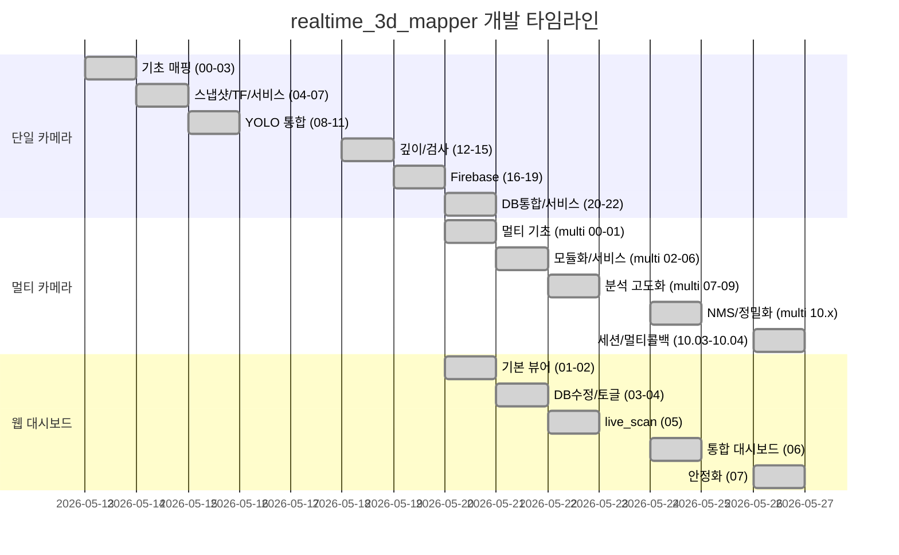

# 📋 realtime_3d_mapper & viewer 전체 버전 변경 이력

> **기간**: 2026년 5월 13일 ~ 5월 26일  
> **대상 파일**: `realtime/realtime_3d_mapper_*.py`, `realtime/realtime_3d_mapper_multi_*.py`, `html/viewer_*.html`

---

## 🔧 1. realtime_3d_mapper (단일 카메라 버전) — 00 ~ 22

| 날짜 | 파일명 | 주요 변경 내용 | 분류 |
|------|--------|---------------|------|
| 2026년 5월 13일 | `realtime_3d_mapper_00.py` | 최초 버전. Open3D + JointState 기반 실시간 3D 매핑. 수동 FK(순기구학) 수식으로 카메라 위치 계산. 키보드 'S' 누르면 PCD 저장. Open3D Visualizer 창에서 실시간 누적 렌더링 | 3D 매핑 기초 |
| 2026년 5월 13일 | `realtime_3d_mapper_01.py` | **Plotly HTML 뷰어 저장 기능 추가**. PCD + HTML 동시 저장. 웹 브라우저용 1cm 다운샘플링 적용. 어두운 배경 테마 | 시각화 개선 |
| 2026년 5월 13일 | `realtime_3d_mapper_02.py` | **ICP(Iterative Closest Point) 정합 알고리즘 추가**. 기구학 수식을 초기값으로 사용 후 ICP로 미세 보정. 탐색 반경 3cm, 최대 30회 반복 수행 | 정밀도 개선 |
| 2026년 5월 13일 | `realtime_3d_mapper_03.py` | **Open3D 완전 제거**, 순수 NumPy 기반 처리. Foxglove/RViz용 `/accumulated_map` 토픽 퍼블리시 추가. PCD 수동 ASCII 포맷 작성 | 경량화 |
| 2026년 5월 14일 | `realtime_3d_mapper_04.py` | **단일 프레임 스냅샷 방식 도입**. 거리 필터 전처리 추가 (0.2m~1.2m). Voxel 3mm 초정밀 설정. Ctrl+C 시 마지막 프레임만 정밀 가공 후 저장 | 스냅샷 모드 |
| 2026년 5월 14일 | `realtime_3d_mapper_05.py` | **터미널 키보드 's' 입력으로 다중 누적 스냅샷 구현**. 여러 위치에서 정지→캡처→누적→최종 통합 저장 방식. `tty.setcbreak` 비동기 키입력 처리 | 누적 매핑 |
| 2026년 5월 14일 | `realtime_3d_mapper_06.py` | **수동 FK 수식 → ROS 2 TF2 좌표계로 전환**. `tf2_ros.Buffer` + `TransformListener` 도입. JointState 구독 제거. 콜백 대신 's'키 시점에만 데이터 파싱 (성능 최적화) | 좌표계 개선 |
| 2026년 5월 14일 | `realtime_3d_mapper_07.py` | **두산 로봇 서비스 API(GetCurrentPosx) 도입**. 비동기 서비스 호출로 X/Y/Z/A/B/C 실시간 취득. 카메라 광학 렌즈 회전 보정(π 회전) 추가. TCP→카메라 오프셋 수동 적용 | 서비스 기반 |
| 2026년 5월 15일 | `realtime_3d_mapper_08.py` | **StaticTransformBroadcaster 도입**. link_6→camera_link 정적 TF를 코드 내에서 자동 퍼블리시. Threading 기반 키보드 리스너로 리팩토링. Open3D 복귀 (PCD + HTML 동시 출력) | TF 자동화 |
| 2026년 5월 15일 | `realtime_3d_mapper_09.py` | **카메라 장착 회전각 보정** (Quaternion -0.5, -0.5, -0.5, 0.5 적용). 카메라가 로봇 아래를 바라보는 물리적 장착 각도 반영. Voxel 2mm로 HTML 해상도 향상 | 축 보정 |
| 2026년 5월 15일 | `realtime_3d_mapper_10.py` | **YOLO 물체 감지 통합 (최초)**. 2D Image 구독 추가. YOLO 추론 → 바운딩 박스 중심 → 3D 인덱스 스케일링 → base_link 좌표 변환. Plotly에 빨간 구슬 마커 + 2D 캡처 이미지 동시 저장 | AI 통합 시작 |
| 2026년 5월 15일 | `realtime_3d_mapper_11.py` | **스마트 주변 탐색 알고리즘 추가** (11×11 픽셀 범위). NaN 도넛 현상 해결 — 중심점 깊이 데이터 유실 시 주변에서 유효점 탐색. 가장 가까운 표면점 자동 선택 | YOLO 정밀도 |
| 2026년 5월 18일 | `realtime_3d_mapper_12.py` | **Aligned Depth + CameraInfo(Pinhole) 기반 정밀 좌표 추출**. `aligned_depth_to_color` 토픽 구독 추가. 카메라 내부 파라미터(fx, fy, cx, cy) 활용. Depth 렌즈와 Color 렌즈의 TF 분리 적용 (시차 보정) | 깊이 정밀화 |
| 2026년 5월 18일 | `realtime_3d_mapper_13.py` | **YOLO 모델을 good/ng 판정 모델로 교체**. 나사 상태를 "good"(녹색) / "ng"(빨간색)으로 분류. 나사 중심부 vs 주변부 깊이 비교 로직 (단차 검출 개념 등장). 검사 결과 파일 naming 변경 | 검사 판정 |
| 2026년 5월 18일 | `realtime_3d_mapper_14.py` | 나사 체결 단차(높이차) 정밀 측정 알고리즘 추가. 3D 표면 높이와 나사 머리 높이의 차이(mm)를 실제 물리 수치로 산출 | 단차 측정 |
| 2026년 5월 18일 | `realtime_3d_mapper_15.py` | 단차 기반 자동 판정 로직 도입 (임계값 기준 good/ng). YOLO 라벨이 아닌 깊이 차이 수치로 판정 전환 | 자동 판정 |
| 2026년 5월 19일 | `realtime_3d_mapper_16.py` | 판정 결과 정리 및 콘솔 출력 포맷 개선. 코드 경량화 | 리팩토링 |
| 2026년 5월 19일 | `realtime_3d_mapper_17.py` | **Firebase Storage 업로드 기능 추가**. HTML 검사 결과를 Firebase Storage에 자동 업로드. Firebase Admin SDK 초기화 코드 포함 | 클라우드 연동 |
| 2026년 5월 19일 | `realtime_3d_mapper_18.py` | Firebase 업로드 헬퍼 함수 분리. 에러 핸들링 강화. HTML 파일만 업로드하는 경량 로직 | Firebase 개선 |
| 2026년 5월 19일 | `realtime_3d_mapper_19__.py` | Firebase 설정 변수 정리. 코드 안정화 작업 | 안정화 |
| 2026년 5월 20일 | `realtime_3d_mapper_20__.py` | **Firebase Realtime Database 연동 추가**. Storage + Realtime DB 동시 사용. 검사 카운트를 DB에서 자동 관리 (`init_capture_count`). JS 배경 파일 업로드 방식 도입 (3D 데이터를 JS 변수로 저장) | DB 통합 |
| 2026년 5월 20일 | `realtime_3d_mapper_21__.py` | Firebase 키 파일 경로를 로컬 개발환경으로 변경. 구조적으로 20__과 동일 | 환경 설정 |
| 2026년 5월 20일 | `realtime_3d_mapper_22.py` | **ROS 2 서비스(SrvDepthPosition) 기반 아키텍처로 전환**. 키보드 트리거 제거 → 외부 서비스 호출로 검사 시작. `od_msg.srv.SrvDepthPosition` 커스텀 서비스 메시지 사용. 좌표 결과를 서비스 응답으로 반환 | 서비스 아키텍처 |

---

## 🔧 2. realtime_3d_mapper_multi (멀티 카메라/통합 버전) — 00 ~ 10_04

| 날짜 | 파일명 | 주요 변경 내용 | 분류 |
|------|--------|---------------|------|
| 2026년 5월 20일 | `realtime_3d_mapper_multi_00.py` | **멀티 카메라 지원 최초 버전**. 단일→멀티 아키텍처 전환. 기본적인 멀티 카메라 포인트클라우드 수집 구조 | 멀티 기초 |
| 2026년 5월 20일 | `realtime_3d_mapper_multi_01.py` | 멀티 카메라 간 좌표계 통합 로직 보강. TF 변환 멀티 적용 | 좌표 통합 |
| 2026년 5월 21일 | `realtime_3d_mapper_multi_02.py` | 멀티 카메라 데이터 동기화 개선. 안정성 향상 | 동기화 |
| 2026년 5월 21일 | `realtime_3d_mapper_multi_03.py` | 멀티 환경에서의 YOLO 감지 통합 및 좌표 병합 처리 | YOLO 멀티 |
| 2026년 5월 21일 | `realtime_3d_mapper_multi_04_00.py` | 나사 단차 분석 + RANSAC 평면 피팅 알고리즘 도입. 나사 높이와 주변 표면 높이차 정밀 계산 | 단차 분석 |
| 2026년 5월 21일 | `realtime_3d_mapper_multi_04_01.py` | **공통 모듈(`common/`) 도입**. `settings`, `db_paths`, `firebase_client` 분리. Firebase 하드코딩 제거 → 중앙 집중 설정 관리. 세션 관리 및 데이터베이스 구조화 | 모듈화 |
| 2026년 5월 21일 | `realtime_3d_mapper_multi_05.py` | **ROS 2 Trigger 서비스 기반 아키텍처로 전환** (`std_srvs.srv.Trigger`). 키보드 트리거 완전 제거 → `/vision_inspect` 서비스로 검사 시작. VisionServerNode 클래스명 도입 | 서비스 전환 |
| 2026년 5월 21일 | `realtime_3d_mapper_multi_06.py` | common 모듈 + Trigger 서비스 통합 버전. `get_db_reference`, `get_storage_bucket` 유틸리티 사용 | 통합 안정화 |
| 2026년 5월 22일 | `realtime_3d_mapper_multi_07.py` | **나사 분석 알고리즘 대폭 강화**. `analyze_screw_with_retry` — 재시도 로직 추가. `calculate_target_pose` — 로봇 접근 자세(ZYZ Euler) 자동 계산. `fit_plane_ransac` — 표면 평면 피팅 함수 추가 | 분석 고도화 |
| 2026년 5월 22일 | `realtime_3d_mapper_multi_08.py` | **Firebase DB 구조 대폭 확장**. 세션 관리, 검사 이력, 디지털 트윈 상태, 인덱스 테이블, 레거시 호환 등 **5개 모듈화 DB 업데이트 함수** 분리. `live_scan/workstations` 실시간 통신 구조 도입. `build_marker_data` / `build_legacy_marker_data` 헬퍼 추가 | DB 구조화 |
| 2026년 5월 22일 | `realtime_3d_mapper_multi_09.py` | multi_08과 구조 동일. `live_screws_data` 딕셔너리 키 포맷 통일 (`screw_00`, `screw_01` ...). 레거시/신규 DB 경로 동시 기록 안정화 | DB 안정화 |
| 2026년 5월 24일 | `realtime_3d_mapper_multi_10_00.py` | 코드 정리 및 안정화. multi_09 기반 리팩토링 | 정리 |
| 2026년 5월 24일 | `realtime_3d_mapper_multi_10_01.py` | 동일 나사에 대한 **중복 바운딩 박스 문제 인식**. 다중 클래스 겹침 현상 발견 | 버그 인식 |
| 2026년 5월 24일 | `realtime_3d_mapper_multi_10_02.py` | **NMS(Non-Maximum Suppression) / IoU 기반 중복 바운딩 박스 필터링 추가**. 같은 나사에 겹치는 박스 중 신뢰도 높은 것만 유지 | 중복 제거 |
| 2026년 5월 24일 | `realtime_3d_mapper_multi_10_03_00.py` | **나사 중심점 정밀 측정 영역 확장**. `get_robust_screw_center` 함수 추가 — 컬러 기반 마스킹, Connected Components, 면적 필터링, HSV 채널 분석으로 나사 머리 정확한 중심좌표 추출 | 중심점 정밀화 |
| 2026년 5월 26일 | `realtime_3d_mapper_multi_10_03_01.py` | 중심점 계산 안정화. `screw_id` 번호를 1-based로 변경 (`screw_1`, `screw_2` ...) | 번호 체계 |
| 2026년 5월 26일 | `realtime_3d_mapper_multi_10_03_02.py` | `live_scan` 초기화 로직 개선 — 세션 시작 시 이전 작업 데이터 자동 삭제. DB 초기화 안정화 | DB 초기화 |
| 2026년 5월 26일 | `realtime_3d_mapper_multi_10_03_03.py` | **멀티 카메라 토픽 콜백 리팩토링** — `topic` 파라미터 추가로 카메라별 데이터 분리 관리. **세션 리셋 서비스 추가** (`/start_new_session`). 새로운 검사 세션 시작 기능 | 멀티 카메라 |
| 2026년 5월 26일 | `realtime_3d_mapper_multi_10_03_04__.py` | multi_10_03_03과 동일 구조. 백업/안정화 버전 | 백업 |
| 2026년 5월 26일 | `realtime_3d_mapper_multi_10_04.py` | **나사 중심점 알고리즘 변경** — `get_robust_screw_center` → `get_highest_point_in_bbox`로 교체. 바운딩 박스 내 가장 높은(가까운) 3D 포인트를 나사 중심으로 사용. 단순화된 중심점 로직 | 중심점 단순화 |

---

## 🌐 3. viewer HTML (Firebase 실시간 대시보드) — 01 ~ 07

| 날짜 | 파일명 | 주요 변경 내용 | 분류 |
|------|--------|---------------|------|
| 2026년 5월 20일 | `viewer_01.html` | **최초 웹 대시보드**. Plotly.js + Firebase Realtime DB 기반. `linestatus` 경로 구독. 나사 3D 위치를 Plotly Scatter3d로 렌더링. 우측 패널에 나사 목록 표시 | 대시보드 기초 |
| 2026년 5월 20일 | `viewer_02.html` | **3D 회전 기능 추가**. 카메라 앵글 초기값 설정. 패널에서 나사 상태 클릭 시 Firebase DB 업데이트 기능 | 3D 인터랙션 |
| 2026년 5월 21일 | `viewer_03.html` | Firebase DB 주소를 정확한 asia-southeast1 리전으로 교체. 3D 상호작용 및 초기 카메라 앵글 완벽 설정. 코드 정리 | DB 연결 수정 |
| 2026년 5월 21일 | `viewer_04.html` | 나사 상태 토글 기능 추가 — 패널에서 클릭 시 `linestatus` DB 값 직접 업데이트. UI 레이아웃 미세 조정 | 상태 토글 |
| 2026년 5월 22일 | `viewer_05.html` | **DB 경로를 `linestatus` → `live_scan/workstations`로 전환**. Firebase 전체 config 적용 (apiKey, storageBucket 등). 최신 작업대(workstation) 자동 선택 로직 | live_scan 전환 |
| 2026년 5월 24일 | `viewer_06.html` | **작업대 누적 버전 대시보드 (대폭 UI 개편)**. 371줄 규모의 풀 대시보드. 좌측 3D Plotly 뷰어 + 우측 상세 패널 분리 레이아웃. 3D 배경(JS 파일) 동적 로드 기능. 작업대별 나사 검사 결과 누적 표시. CSS 대폭 개선 및 반응형 디자인 | 통합 대시보드 |
| 2026년 5월 26일 | `viewer_07.html` | viewer_06 기반 안정화. 세부 렌더링 버그 수정. 최종 배포 버전 | 안정화 |

---

## 📊 전체 흐름 요약 (타임라인)

---

## 🔑 핵심 전환점 (Milestone)

| # | 전환점 | 관련 버전 | 날짜 |
|---|--------|----------|------|
| 1 | Open3D → 순수 NumPy 전환 | `mapper_03` → `mapper_04` | 5월 13~14일 |
| 2 | 수동 FK → ROS 2 TF2 전환 | `mapper_05` → `mapper_06` | 5월 14일 |
| 3 | YOLO 물체 감지 최초 도입 | `mapper_10` | 5월 15일 |
| 4 | Pinhole 카메라 모델 도입 | `mapper_12` | 5월 18일 |
| 5 | Firebase 클라우드 연동 | `mapper_17` | 5월 19일 |
| 6 | 키보드 → 서비스 아키텍처 전환 | `mapper_22` / `multi_05` | 5월 20~21일 |
| 7 | 공통 모듈(common/) 분리 | `multi_04_01` | 5월 21일 |
| 8 | 멀티 모듈 DB 구조화 | `multi_08` | 5월 22일 |
| 9 | NMS 중복 제거 도입 | `multi_10_02` | 5월 24일 |
| 10 | 나사 중심점 정밀화 (컬러 기반) | `multi_10_03_00` | 5월 24일 |
|

2026.05.19

- 워크스페이스 3d 맵으로 불러오기[완]
- 여러장 캡쳐해서 3d맵 환경 만들기[완]

2026.05.20

- 워크스페이스에 있는 나사 채결 상태 확인하기[완]
- 높이로 측정을 진행하였음
- firebase db에 업데이트 하기[완]
- 웹이랑 연동하기[완]

2026.05.22

- 법선 벡터를 이용한 로봇 자세 제어[완]
  

2026.05.24

- 로봇 제어용 코드랑 연동하기 위한 실시간 db(live_scan) 추가 및 연동[완]
- 실시간으로 렌더링 페이지 초기화 작업 적용[완]

2026.05.26

- 나사의 중심점 정확히 찾기 수정[완]
- 나사 불량 판단 수정[완]
- 3d맵 나사를 제외한 부분 평탄화[완]
- 작업대 번호 매김 수정[완]
- 다음 작업 대기 및 작업 경로 저장 방법 수정[완]
