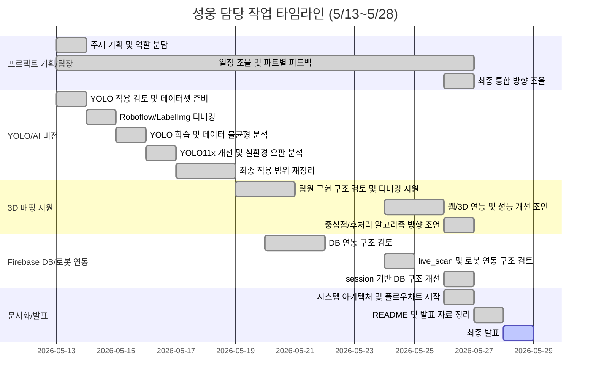

# 📋 성웅 담당 작업 타임라인 및 기여 정리

> **기간**: 2026년 5월 13일 ~ 2026년 5월 28일  
> **역할**: 팀장 / 프로젝트 기획 / 일정 조율 / 파트별 검토 및 피드백 / AI·비전 디버깅 / Firebase DB 구조 개선 / 로봇·DB 연동 검토 / 시스템 아키텍처·플로우차트 제작  
> **주의**: 3D 매핑 파트는 팀원이 주도적으로 구현했으며, 성웅은 팀장으로서 구조 검토, 디버깅 조언, 웹·DB·검사 로직과의 통합 방향 피드백을 수행함

---

<h2>성웅 담당 작업 타임라인 (프로젝트 기획 및 팀장 역할)</h2>

<table>
  <thead>
    <tr>
      <th nowrap>작업명</th>
      <th nowrap>날짜</th>
      <th nowrap>담당자</th>
      <th nowrap>파트</th>
      <th nowrap>단계</th>
      <th nowrap>완료 여부</th>
    </tr>
  </thead>
  <tbody>
    <tr><td nowrap>협동2 프로젝트 전체 주제 기획 및 시스템 방향 설정</td><td nowrap>5월 13일</td><td nowrap>성웅</td><td nowrap>팀장/프로젝트 기획</td><td nowrap>기획</td><td nowrap>완료</td></tr>
    <tr><td nowrap>스마트팩토리형 볼트 검사 자동화 시스템 기획</td><td nowrap>5월 13일</td><td nowrap>성웅</td><td nowrap>팀장/프로젝트 기획</td><td nowrap>기획</td><td nowrap>완료</td></tr>
    <tr><td nowrap>팀원별 역할 분담 및 개발 파트 조율</td><td nowrap>5월 13일</td><td nowrap>성웅</td><td nowrap>팀장/통합 관리</td><td nowrap>역할 분담</td><td nowrap>완료</td></tr>
    <tr><td nowrap>전체 개발 일정 조율 및 작업 우선순위 정리</td><td nowrap>5월 13일</td><td nowrap>성웅</td><td nowrap>팀장/일정 관리</td><td nowrap>일정 조율</td><td nowrap>완료</td></tr>
    <tr><td nowrap>앱/웹/서버/DB/비전/로봇 파트 간 연동 구조 검토</td><td nowrap>5월 13일</td><td nowrap>성웅</td><td nowrap>팀장/통합 설계</td><td nowrap>구조 검토</td><td nowrap>완료</td></tr>
    <tr><td nowrap>팀원별 구현 방향 검토 및 개발 피드백 진행</td><td nowrap>5월 13일</td><td nowrap>성웅</td><td nowrap>팀장/코드 리뷰</td><td nowrap>검토/피드백</td><td nowrap>완료</td></tr>
    <tr><td nowrap>팀원별 구현 파트 충돌 여부 확인 및 수정 방향 피드백</td><td nowrap>5월 26일</td><td nowrap>성웅</td><td nowrap>팀장/통합 관리</td><td nowrap>코드 리뷰</td><td nowrap>완료</td></tr>
    <tr><td nowrap>전체 파트 진행 상황 검토 및 최종 통합 방향 조율</td><td nowrap>5월 26일</td><td nowrap>성웅</td><td nowrap>팀장/통합 관리</td><td nowrap>최종 점검</td><td nowrap>완료</td></tr>
    <tr><td nowrap>팀장 역할, 프로젝트 기획, 일정 조율, 파트별 검토 및 피드백 내용 README 반영</td><td nowrap>5월 27일</td><td nowrap>성웅</td><td nowrap>팀장/문서화</td><td nowrap>역할 정리</td><td nowrap>완료</td></tr>
  </tbody>
</table>

---

<h2>성웅 담당 작업 타임라인 (YOLO 및 AI 비전 디버깅)</h2>

<table>
  <thead>
    <tr>
      <th nowrap>작업명</th>
      <th nowrap>날짜</th>
      <th nowrap>담당자</th>
      <th nowrap>파트</th>
      <th nowrap>단계</th>
      <th nowrap>완료 여부</th>
    </tr>
  </thead>
  <tbody>
    <tr><td nowrap>비전 검사 시스템에서 YOLO 적용 가능성 검토</td><td nowrap>5월 13일</td><td nowrap>성웅</td><td nowrap>AI/비전</td><td nowrap>모델 검토</td><td nowrap>완료</td></tr>
    <tr><td nowrap>Roboflow 기반 데이터셋 구성 및 초기 학습 방향 검토</td><td nowrap>5월 13일</td><td nowrap>성웅</td><td nowrap>AI/비전</td><td nowrap>데이터셋 준비</td><td nowrap>완료</td></tr>
    <tr><td nowrap>Roboflow credit 및 모델 업로드 문제 분석</td><td nowrap>5월 14일</td><td nowrap>성웅</td><td nowrap>AI/비전</td><td nowrap>디버깅</td><td nowrap>완료</td></tr>
    <tr><td nowrap>로컬 LabelImg 기반 라벨링 환경 구축 방향 정리</td><td nowrap>5월 14일</td><td nowrap>성웅</td><td nowrap>AI/비전</td><td nowrap>라벨링 환경</td><td nowrap>완료</td></tr>
    <tr><td nowrap>LabelImg 실행 오류 및 PyQt float 타입 오류 해결 방향 정리</td><td nowrap>5월 14일</td><td nowrap>성웅</td><td nowrap>AI/비전</td><td nowrap>디버깅</td><td nowrap>완료</td></tr>
    <tr><td nowrap>YOLOv8n 초기 학습 결과 분석</td><td nowrap>5월 15일</td><td nowrap>성웅</td><td nowrap>AI/비전</td><td nowrap>모델 학습</td><td nowrap>완료</td></tr>
    <tr><td nowrap>good/ng 데이터 불균형 문제 분석</td><td nowrap>5월 15일</td><td nowrap>성웅</td><td nowrap>AI/비전</td><td nowrap>데이터 분석</td><td nowrap>완료</td></tr>
    <tr><td nowrap>추가 good 데이터 반영 및 데이터셋 균형 개선 방향 정리</td><td nowrap>5월 15일</td><td nowrap>성웅</td><td nowrap>AI/비전</td><td nowrap>데이터셋 개선</td><td nowrap>완료</td></tr>
    <tr><td nowrap>YOLOv8n에서 YOLO11x img960으로 모델 개선 방향 검토</td><td nowrap>5월 16일</td><td nowrap>성웅</td><td nowrap>AI/비전</td><td nowrap>모델 개선</td><td nowrap>완료</td></tr>
    <tr><td nowrap>실제 환경에서 YOLO 오판 문제 분석</td><td nowrap>5월 16일</td><td nowrap>성웅</td><td nowrap>AI/비전</td><td nowrap>실환경 디버깅</td><td nowrap>완료</td></tr>
    <tr><td nowrap>한 객체에 good/ng 박스가 동시에 뜨는 문제 분석</td><td nowrap>5월 16일</td><td nowrap>성웅</td><td nowrap>AI/비전</td><td nowrap>실환경 디버깅</td><td nowrap>완료</td></tr>
    <tr><td nowrap>agnostic_nms 적용을 통한 중복 클래스 박스 완화 방향 정리</td><td nowrap>5월 16일</td><td nowrap>성웅</td><td nowrap>AI/비전</td><td nowrap>추론 옵션 개선</td><td nowrap>완료</td></tr>
    <tr><td nowrap>detector + classifier 2단계 구조 검토</td><td nowrap>5월 17일</td><td nowrap>성웅</td><td nowrap>AI/비전</td><td nowrap>모델 구조 검토</td><td nowrap>완료</td></tr>
    <tr><td nowrap>good/ng 분류 방식의 한계 판단 및 적용 범위 재정리</td><td nowrap>5월 17일</td><td nowrap>성웅</td><td nowrap>AI/비전</td><td nowrap>기술 의사결정</td><td nowrap>완료</td></tr>
    <tr><td nowrap>최종 YOLO 사용 목적을 볼트 존재 여부 및 위치 확인 중심으로 조정</td><td nowrap>5월 18일</td><td nowrap>성웅</td><td nowrap>AI/비전</td><td nowrap>적용 방향 확정</td><td nowrap>완료</td></tr>
    <tr><td nowrap>RealSense 기반 실시간 YOLO 모델 로딩 및 동작 로그 확인</td><td nowrap>5월 18일</td><td nowrap>성웅</td><td nowrap>AI/비전</td><td nowrap>실행 테스트</td><td nowrap>완료</td></tr>
    <tr><td nowrap>YOLO 및 Firebase DB 디버깅 내용을 README 작업 타임라인에 반영</td><td nowrap>5월 27일</td><td nowrap>성웅</td><td nowrap>문서화/디버깅 정리</td><td nowrap>내용 반영</td><td nowrap>완료</td></tr>
  </tbody>
</table>

---

<h2>성웅 담당 작업 타임라인 (3D 매핑 지원 및 통합 검토)</h2>

<table>
  <thead>
    <tr>
      <th nowrap>작업명</th>
      <th nowrap>날짜</th>
      <th nowrap>담당자</th>
      <th nowrap>파트</th>
      <th nowrap>단계</th>
      <th nowrap>완료 여부</th>
    </tr>
  </thead>
  <tbody>
    <tr><td nowrap>팀원 3D 매핑 구현 과정 구조 검토 및 디버깅 조언</td><td nowrap>5월 19일</td><td nowrap>성웅</td><td nowrap>팀장/3D 매핑 지원</td><td nowrap>구조 검토</td><td nowrap>완료</td></tr>
    <tr><td nowrap>RealSense 기반 3D 작업 공간 생성 과정 확인 및 문제 원인 분석 지원</td><td nowrap>5월 19일</td><td nowrap>성웅</td><td nowrap>팀장/3D 매핑 지원</td><td nowrap>디버깅 지원</td><td nowrap>완료</td></tr>
    <tr><td nowrap>볼트 위치 검출 결과가 3D 화면에 반영되는 흐름 검토</td><td nowrap>5월 20일</td><td nowrap>성웅</td><td nowrap>팀장/비전-3D 연동 지원</td><td nowrap>통합 검토</td><td nowrap>완료</td></tr>
    <tr><td nowrap>높이 기반 볼트 상태 측정 방식 적용 방향 검토</td><td nowrap>5월 20일</td><td nowrap>성웅</td><td nowrap>비전/알고리즘</td><td nowrap>검사 로직 검토</td><td nowrap>완료</td></tr>
    <tr><td nowrap>live_scan/workstations 기반 실시간 3D 검사 화면 연동 구조 검토</td><td nowrap>5월 24일</td><td nowrap>성웅</td><td nowrap>팀장/웹-3D 연동 지원</td><td nowrap>통합 검토</td><td nowrap>완료</td></tr>
    <tr><td nowrap>팀원 3D 렌더링 화면에서 발생한 표시 문제 확인 및 수정 방향 조언</td><td nowrap>5월 24일</td><td nowrap>성웅</td><td nowrap>팀장/웹-3D 연동 지원</td><td nowrap>디버깅 지원</td><td nowrap>완료</td></tr>
    <tr><td nowrap>PointCloud 웹 시각화 렉 문제에 대한 원인 분석 및 최적화 방향 조언</td><td nowrap>5월 25일</td><td nowrap>성웅</td><td nowrap>팀장/3D 매핑 지원</td><td nowrap>성능 개선 조언</td><td nowrap>완료</td></tr>
    <tr><td nowrap>Plotly 기반 3D 렌더링 부하 감소 방향 검토 및 팀원 피드백</td><td nowrap>5월 25일</td><td nowrap>성웅</td><td nowrap>팀장/웹-3D 연동 지원</td><td nowrap>피드백</td><td nowrap>완료</td></tr>
    <tr><td nowrap>나사 중심점 검출 정확도 개선 방향 정리</td><td nowrap>5월 26일</td><td nowrap>성웅</td><td nowrap>비전/3D 매핑</td><td nowrap>알고리즘 개선 검토</td><td nowrap>완료</td></tr>
    <tr><td nowrap>나사 불량 판단 기준 수정 및 높이 기반 검사 로직 보완 방향 정리</td><td nowrap>5월 26일</td><td nowrap>성웅</td><td nowrap>비전/알고리즘</td><td nowrap>검사 로직 개선</td><td nowrap>완료</td></tr>
    <tr><td nowrap>3D 맵에서 나사 영역과 작업대 영역이 구분되도록 후처리 방향 조언</td><td nowrap>5월 26일</td><td nowrap>성웅</td><td nowrap>팀장/3D 매핑 지원</td><td nowrap>알고리즘 조언</td><td nowrap>완료</td></tr>
    <tr><td nowrap>3D 매핑 파트 기여 내용을 팀원 구현 지원 및 디버깅 조언 중심으로 수정</td><td nowrap>5월 27일</td><td nowrap>성웅</td><td nowrap>팀장/3D 매핑 지원</td><td nowrap>기여도 정리</td><td nowrap>완료</td></tr>
  </tbody>
</table>

---

<h2>성웅 담당 작업 타임라인 (Firebase DB 및 로봇 연동 구조)</h2>

<table>
  <thead>
    <tr>
      <th nowrap>작업명</th>
      <th nowrap>날짜</th>
      <th nowrap>담당자</th>
      <th nowrap>파트</th>
      <th nowrap>단계</th>
      <th nowrap>완료 여부</th>
    </tr>
  </thead>
  <tbody>
    <tr><td nowrap>검사 결과 Firebase Realtime Database 저장 구조 연동 검토</td><td nowrap>5월 20일</td><td nowrap>성웅</td><td nowrap>Firebase/DB</td><td nowrap>DB 연동</td><td nowrap>완료</td></tr>
    <tr><td nowrap>Firebase 검사 결과와 웹 화면 연동 구조 확인</td><td nowrap>5월 20일</td><td nowrap>성웅</td><td nowrap>웹/DB 연동</td><td nowrap>통합 테스트</td><td nowrap>완료</td></tr>
    <tr><td nowrap>KJH 웹 화면의 실시간 검사 데이터 기준 검토</td><td nowrap>5월 21일</td><td nowrap>성웅</td><td nowrap>웹/DB 연동</td><td nowrap>구조 검토</td><td nowrap>완료</td></tr>
    <tr><td nowrap>실시간 화면은 live_scan 기준으로 처리하도록 방향 정리</td><td nowrap>5월 21일</td><td nowrap>성웅</td><td nowrap>웹/DB 연동</td><td nowrap>데이터 기준 정리</td><td nowrap>완료</td></tr>
    <tr><td nowrap>검사 이력 화면은 indexes → sessions 기준으로 조회하도록 방향 정리</td><td nowrap>5월 21일</td><td nowrap>성웅</td><td nowrap>웹/DB 연동</td><td nowrap>데이터 기준 정리</td><td nowrap>완료</td></tr>
    <tr><td nowrap>defect / defective / ng / failed 상태값을 모두 불량으로 처리하는 조건 정리</td><td nowrap>5월 21일</td><td nowrap>성웅</td><td nowrap>웹/DB 연동</td><td nowrap>상태값 정규화</td><td nowrap>완료</td></tr>
    <tr><td nowrap>DB 필드를 추가하지 않고 기존 구조를 유지하는 수정 방향 조율</td><td nowrap>5월 21일</td><td nowrap>성웅</td><td nowrap>팀장/DB 조율</td><td nowrap>코드 수정 방향</td><td nowrap>완료</td></tr>
    <tr><td nowrap>로봇 제어와 연동하기 위한 실시간 DB 구조 live_scan 추가 방향 정리</td><td nowrap>5월 24일</td><td nowrap>성웅</td><td nowrap>로봇/DB 연동</td><td nowrap>실시간 DB</td><td nowrap>완료</td></tr>
    <tr><td nowrap>Firebase DB 구조를 captures 중심에서 session 기반 구조로 재설계</td><td nowrap>5월 26일</td><td nowrap>성웅</td><td nowrap>Firebase/DB</td><td nowrap>DB 구조 개선</td><td nowrap>완료</td></tr>
    <tr><td nowrap>inspections/{site_id}/sessions/{session_id}/workstations/{workstation_id}/captures 구조 적용</td><td nowrap>5월 26일</td><td nowrap>성웅</td><td nowrap>Firebase/DB</td><td nowrap>DB 구조 개선</td><td nowrap>완료</td></tr>
    <tr><td nowrap>session_id를 실제 검사 시작 시점 기준으로 생성하도록 수정</td><td nowrap>5월 26일</td><td nowrap>성웅</td><td nowrap>Firebase/DB</td><td nowrap>세션 관리</td><td nowrap>완료</td></tr>
    <tr><td nowrap>ensure_session_started 로직 추가 및 세션 누적 관리 구조 정리</td><td nowrap>5월 26일</td><td nowrap>성웅</td><td nowrap>Firebase/DB</td><td nowrap>세션 관리</td><td nowrap>완료</td></tr>
    <tr><td nowrap>session_total_captures / session_total_markers / normal_count / defect_count 누적 구조 추가</td><td nowrap>5월 26일</td><td nowrap>성웅</td><td nowrap>Firebase/DB</td><td nowrap>통계 관리</td><td nowrap>완료</td></tr>
    <tr><td nowrap>workstation_id 자동 생성 및 작업대별 capture 분리 저장 구조 적용</td><td nowrap>5월 26일</td><td nowrap>성웅</td><td nowrap>Firebase/DB</td><td nowrap>작업대 관리</td><td nowrap>완료</td></tr>
    <tr><td nowrap>capture metadata에 session_id / workstation_id / robot_id / camera_id 포함</td><td nowrap>5월 26일</td><td nowrap>성웅</td><td nowrap>Firebase/DB</td><td nowrap>메타데이터 개선</td><td nowrap>완료</td></tr>
    <tr><td nowrap>기존 flat captures 경로 mirror 저장 유지로 구형 GUI 호환성 확보</td><td nowrap>5월 26일</td><td nowrap>성웅</td><td nowrap>Firebase/DB</td><td nowrap>하위 호환성</td><td nowrap>완료</td></tr>
    <tr><td nowrap>Firebase Storage 경로를 session/workstation/capture 기준으로 변경</td><td nowrap>5월 26일</td><td nowrap>성웅</td><td nowrap>Firebase Storage</td><td nowrap>파일 경로 개선</td><td nowrap>완료</td></tr>
    <tr><td nowrap>indexes/latest, capture_lookup, captures_by_date, captures_by_workstation 구조 추가</td><td nowrap>5월 26일</td><td nowrap>성웅</td><td nowrap>Firebase/DB</td><td nowrap>조회 최적화</td><td nowrap>완료</td></tr>
    <tr><td nowrap>indexes/defects_by_status/unresolved 구조 추가</td><td nowrap>5월 26일</td><td nowrap>성웅</td><td nowrap>Firebase/DB</td><td nowrap>불량 추적</td><td nowrap>완료</td></tr>
    <tr><td nowrap>sites/latest_session_id 및 latest_capture_id 업데이트 구조 추가</td><td nowrap>5월 26일</td><td nowrap>성웅</td><td nowrap>Firebase/DB</td><td nowrap>사이트 상태 관리</td><td nowrap>완료</td></tr>
    <tr><td nowrap>robots/current_session_id / current_workstation_id / current_capture_id 업데이트 구조 추가</td><td nowrap>5월 26일</td><td nowrap>성웅</td><td nowrap>로봇/DB 연동</td><td nowrap>로봇 상태 연동</td><td nowrap>완료</td></tr>
    <tr><td nowrap>twin_state/current_session 및 current_inspection 업데이트 구조 추가</td><td nowrap>5월 26일</td><td nowrap>성웅</td><td nowrap>디지털트윈/DB</td><td nowrap>최신 상태 표시</td><td nowrap>완료</td></tr>
    <tr><td nowrap>Firebase DB 연결 및 Storage bucket 연결 상태 확인</td><td nowrap>5월 26일</td><td nowrap>성웅</td><td nowrap>Firebase/DB</td><td nowrap>디버깅</td><td nowrap>완료</td></tr>
    <tr><td nowrap>markers None 저장 문제 원인 분석 및 YOLO 감지 결과 0개 케이스 확인</td><td nowrap>5월 26일</td><td nowrap>성웅</td><td nowrap>Firebase/DB</td><td nowrap>디버깅</td><td nowrap>완료</td></tr>
    <tr><td nowrap>session 구조 적용 중 SyntaxError 발생 후 Git restore로 정상 버전 복구</td><td nowrap>5월 26일</td><td nowrap>성웅</td><td nowrap>코드 통합/DB</td><td nowrap>디버깅</td><td nowrap>완료</td></tr>
    <tr><td nowrap>py_compile / import 테스트 / 경로 생성 테스트로 DB 코드 정적 검증</td><td nowrap>5월 26일</td><td nowrap>성웅</td><td nowrap>코드 통합/DB</td><td nowrap>검증</td><td nowrap>완료</td></tr>
    <tr><td nowrap>GUI/API/Robot이 session 구조를 우선 조회하고 flat 구조를 fallback으로 사용하도록 방향 정리</td><td nowrap>5월 26일</td><td nowrap>성웅</td><td nowrap>통합 관리/DB</td><td nowrap>호환성 설계</td><td nowrap>완료</td></tr>
    <tr><td nowrap>DATABASE_STRUCTURE.md 및 API_USAGE.md 문서화 방향 정리</td><td nowrap>5월 26일</td><td nowrap>성웅</td><td nowrap>문서화/DB</td><td nowrap>문서화</td><td nowrap>완료</td></tr>
    <tr><td nowrap>external_exports 및 legacy fallback 구조 검토</td><td nowrap>5월 26일</td><td nowrap>성웅</td><td nowrap>Firebase/DB</td><td nowrap>확장 구조 검토</td><td nowrap>완료</td></tr>
  </tbody>
</table>

---

<h2>성웅 담당 작업 타임라인 (문서화, GitHub, 발표 준비)</h2>

<table>
  <thead>
    <tr>
      <th nowrap>작업명</th>
      <th nowrap>날짜</th>
      <th nowrap>담당자</th>
      <th nowrap>파트</th>
      <th nowrap>단계</th>
      <th nowrap>완료 여부</th>
    </tr>
  </thead>
  <tbody>
    <tr><td nowrap>협동2 시스템 아키텍처 자료 제작</td><td nowrap>5월 26일</td><td nowrap>성웅</td><td nowrap>문서화/설계 자료</td><td nowrap>시스템 구조 시각화</td><td nowrap>완료</td></tr>
    <tr><td nowrap>협동2 전체 동작 흐름 플로우차트 제작</td><td nowrap>5월 26일</td><td nowrap>성웅</td><td nowrap>문서화/설계 자료</td><td nowrap>프로세스 시각화</td><td nowrap>완료</td></tr>
    <tr><td nowrap>시스템 아키텍처와 플로우차트의 선 배치, 박스 구조, 흐름 방향 정리</td><td nowrap>5월 26일</td><td nowrap>성웅</td><td nowrap>문서화/설계 자료</td><td nowrap>자료 보완</td><td nowrap>완료</td></tr>
    <tr><td nowrap>발표용 공통 구조와 각자 PPT 제작 방향 조율</td><td nowrap>5월 26일</td><td nowrap>성웅</td><td nowrap>팀장/발표 조율</td><td nowrap>발표 자료 조율</td><td nowrap>완료</td></tr>
    <tr><td nowrap>팀원별 폴더 구조 CEY / KJH / YJH / YSW 확인 및 통합 기준 정리</td><td nowrap>5월 26일</td><td nowrap>성웅</td><td nowrap>팀장/GitHub</td><td nowrap>협업 관리</td><td nowrap>완료</td></tr>
    <tr><td nowrap>GitHub collaborator main push 권한 및 VS Code push 오류 해결 지원</td><td nowrap>5월 26일</td><td nowrap>성웅</td><td nowrap>팀장/GitHub</td><td nowrap>협업 관리</td><td nowrap>완료</td></tr>
    <tr><td nowrap>GitHub README용 성웅 담당 작업 타임라인 최종 정리</td><td nowrap>5월 27일</td><td nowrap>성웅</td><td nowrap>GitHub/문서화</td><td nowrap>README 정리</td><td nowrap>완료</td></tr>
    <tr><td nowrap>GitHub README 표 형식 수정 및 표시 오류 개선</td><td nowrap>5월 27일</td><td nowrap>성웅</td><td nowrap>GitHub/문서화</td><td nowrap>문서 표시 개선</td><td nowrap>완료</td></tr>
    <tr><td nowrap>최종 발표 전 시스템 아키텍처, 플로우차트, DB 구조, YOLO 디버깅 내용 점검</td><td nowrap>5월 27일</td><td nowrap>성웅</td><td nowrap>발표 준비/최종 점검</td><td nowrap>발표 준비</td><td nowrap>완료</td></tr>
    <tr><td nowrap>최종 발표 자료 흐름 및 팀원별 발표 내용 조율</td><td nowrap>5월 27일</td><td nowrap>성웅</td><td nowrap>팀장/발표 조율</td><td nowrap>발표 리허설 준비</td><td nowrap>완료</td></tr>
    <tr><td nowrap>협동2 최종 발표 진행 및 시스템 구현 내용 설명</td><td nowrap>5월 28일</td><td nowrap>성웅</td><td nowrap>최종 발표</td><td nowrap>발표</td><td nowrap>예정</td></tr>
    <tr><td nowrap>YOLO 기반 볼트 인식, Firebase DB 구조 개선, 로봇/DB 연동 구조 발표</td><td nowrap>5월 28일</td><td nowrap>성웅</td><td nowrap>최종 발표/기술 설명</td><td nowrap>기술 발표</td><td nowrap>예정</td></tr>
    <tr><td nowrap>시스템 아키텍처 및 플로우차트 기반 전체 시스템 흐름 발표</td><td nowrap>5월 28일</td><td nowrap>성웅</td><td nowrap>최종 발표/시스템 설명</td><td nowrap>구조 발표</td><td nowrap>예정</td></tr>
    <tr><td nowrap>최종 발표 질의응답 대응 및 프로젝트 기여 내용 설명</td><td nowrap>5월 28일</td><td nowrap>성웅</td><td nowrap>최종 발표/Q&A</td><td nowrap>질의응답</td><td nowrap>예정</td></tr>
  </tbody>
</table>

---

## 📊 타임라인

---

## 🔑 핵심 전환점

| # | 전환점 | 관련 내용 | 날짜 |
|---|--------|----------|------|
| 1 | 프로젝트 방향 설정 | 스마트팩토리형 볼트 검사 자동화 시스템으로 기획 | 5월 13일 |
| 2 | 팀장 역할 확정 | 역할 분담, 일정 조율, 전체 파트 검토 및 피드백 담당 | 5월 13일 |
| 3 | Roboflow → 로컬 라벨링 전환 | Roboflow credit 및 업로드 문제로 LabelImg 기반 로컬 라벨링 방향 정리 | 5월 14일 |
| 4 | YOLOv8n → YOLO11x 검토 | 정확도 개선을 위해 YOLO11x img960 기반 모델 개선 방향 검토 | 5월 16일 |
| 5 | good/ng 분류 범위 재정리 | 실환경 오판 문제로 최종 사용 목적을 볼트 존재 여부 및 위치 확인 중심으로 조정 | 5월 18일 |
| 6 | 3D 매핑 기여 범위 정리 | 팀원 주도 구현 파트로 명시하고, 성웅은 구조 검토 및 디버깅 조언 중심으로 정리 | 5월 19~27일 |
| 7 | 웹/DB 데이터 기준 정리 | live_scan은 실시간 화면, indexes → sessions는 검사 이력 화면 기준으로 정리 | 5월 21일 |
| 8 | Firebase DB 구조 개선 | captures 중심 구조에서 sessions/workstations/captures/markers 구조로 재설계 | 5월 26일 |
| 9 | 조회 최적화 구조 추가 | latest, capture_lookup, captures_by_date, captures_by_workstation, defects_by_status 추가 | 5월 26일 |
| 10 | 문서화 및 발표 구조 정리 | 시스템 아키텍처, 플로우차트, README, 발표 흐름 정리 | 5월 26~27일 |

---

## 🧩 담당 역할 요약

성웅은 협동2 프로젝트에서 팀장 역할을 맡아 전체 프로젝트 기획, 일정 조율, 역할 분담, 파트별 구현 방향 검토 및 피드백을 담당하였다.

직접 담당한 주요 기술 파트는 YOLO 기반 볼트 인식 디버깅, Firebase DB 구조 개선, 로봇/DB 연동 구조 검토, 시스템 아키텍처 및 플로우차트 제작이다.

3D 매핑 파트는 팀원이 주도적으로 구현하였고, 성웅은 구현 과정을 확인하면서 구조 검토, 디버깅 조언, 웹/DB/검사 로직과의 통합 방향 피드백을 수행하였다.

PPT는 팀원별로 각자 제작하되, 발표용 공통 구조와 시스템 흐름 정리는 성웅이 조율하였다.

YOLO는 초기에는 good/ng 분류까지 검토했으나, 실제 환경 오판 문제와 프로젝트 적용 범위를 고려하여 최종적으로는 볼트 존재 여부 및 위치 확인 중심으로 활용하였다.

---

## ✅ 최종 정리

성웅의 주요 기여는 단일 기능 구현에만 한정되지 않고, 프로젝트 전체 방향 설정, 팀원별 파트 조율, 기술 선택 검토, 디버깅 방향 제시, DB 구조 개선, 발표 구조화까지 포함한다.

특히 YOLO 디버깅 과정에서는 Roboflow, LabelImg, 데이터셋 불균형, 실환경 오판 문제를 검토했고, Firebase DB 작업에서는 단순 저장 구조를 session 기반 운영 구조로 개선하였다.

또한 팀원이 주도한 3D 매핑 파트에 대해서는 구현 과정에서 발생한 문제를 함께 확인하고, 웹/DB/검사 로직과 연결될 수 있도록 구조 검토와 디버깅 조언을 수행하였다.
